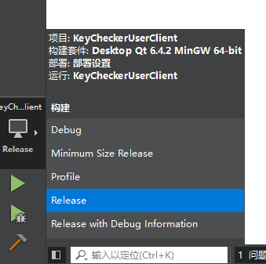

# 打包

## 直接
直接选择Release就行了



## 下面都是废话

## 命令
```
windeployqt.exe -release --dir=E:\Produce\GameAIAssistSystem\yolo_5_fps\output KeyCheckerUserClient.exe
```

## 注意点

[幻化成风~的博客-CSDN博客](https://blog.csdn.net/memorywithyou/article/details/128747080)

注意要根据环境决定用什么打包，并且，windeployqt也不是一个地方有，要确定将正确的那个其放到了环境变量。

chatgpt:
```
Qt打包工具windeployqt需要将以下内容添加到系统环境变量中：

Qt的bin目录，例如C:\Qt\Qt{version}\{compiler}\bin，其中{version}是Qt的版本号，{compiler}是编译器名称（如msvc2019或mingw81_64）。该目录中包含了windeployqt工具所需的一些Qt库和工具。

MSVC的bin目录，例如C:\Program Files (x86)\Microsoft Visual Studio\{version}\{edition}\VC\bin，其中{version}是Visual Studio的版本号，{edition}是Visual Studio的版本（如Community或Professional）。如果使用的是MinGW，则不需要添加该路径。

如果使用的是MinGW，则需要添加MinGW的bin目录，例如C:\MinGW\bin。

添加这些路径到环境变量中，可以让系统在任何地方都能够找到windeployqt所需的库和工具，并且能够正确地打包Qt应用程序。

-------------------

如果在使用windeployqt打包应用程序时遇到了“找不到platform plugin”错误，通常是因为缺少Qt的平台插件所致。

平台插件是Qt中的一种组件，它负责与底层操作系统交互，处理窗口系统、事件、字体等操作。通常情况下，Qt会自动加载与当前操作系统相应的平台插件，但是在使用windeployqt进行打包时，需要手动将所需的平台插件复制到应用程序的目录中，以便应用程序能够正确加载它们。

平台插件位于Qt的plugins/platforms目录中。在使用windeployqt打包应用程序时，可以将该目录中所有的平台插件一起复制到应用程序的目录中，这样就可以确保应用程序能够正确加载所需的平台插件了。

因此，除了将Qt的bin目录、MSVC的bin目录和MinGW的bin目录添加到环境变量中之外，还应该将Qt的plugins目录添加到环境变量中，或者将platforms目录复制到应用程序的目录中，这样就可以避免“找不到platform plugin”错误了。

------------------------

当将Qt的plugins目录添加到环境变量中时，windeployqt工具会自动查找所有的插件，并将其复制到应用程序的目录中。因此，不需要手动将plugins目录的子目录（例如platforms、imageformats等）添加到环境变量中。

如果你希望手动复制插件到应用程序的目录中，那么需要将plugins目录中的所有插件和子目录一起复制，以确保应用程序能够正确地加载所有的插件。具体来说，需要将plugins目录中的platforms、imageformats、iconengines等子目录以及其中的所有文件一起复制到应用程序的目录中。

综上所述，如果使用windeployqt工具进行打包，可以将Qt的bin目录和plugins目录添加到环境变量中；如果手动复制插件到应用程序的目录中，需要将plugins目录及其所有子目录一起复制。
```

