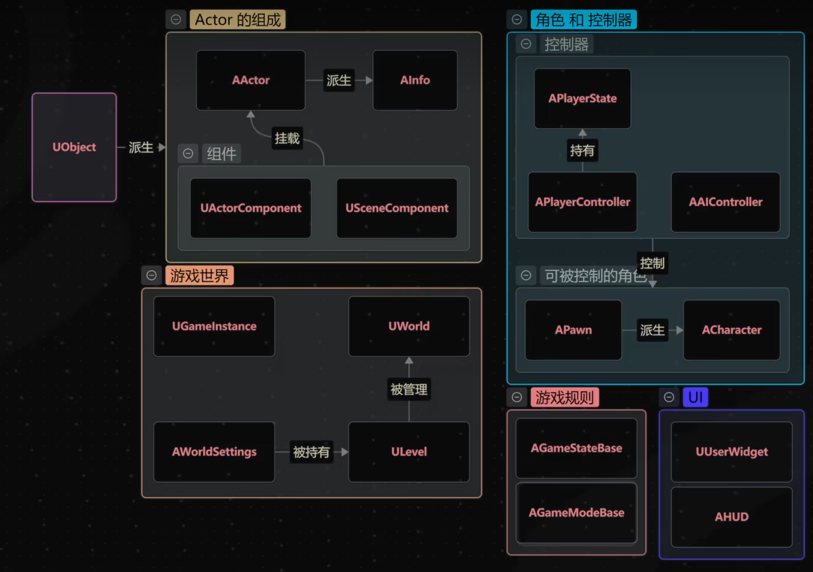
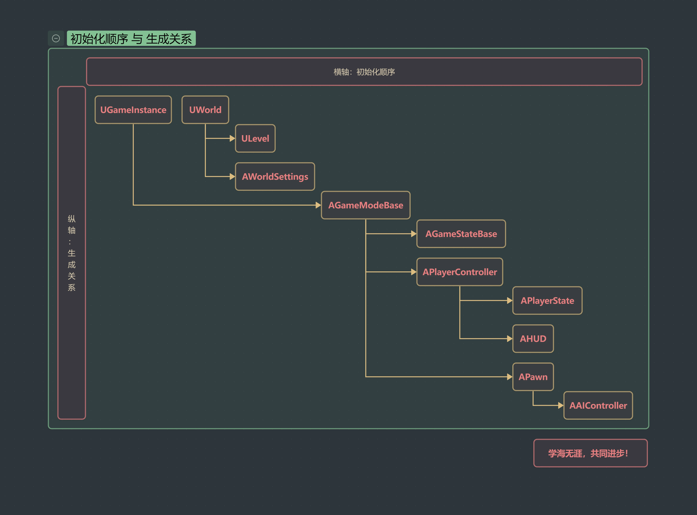
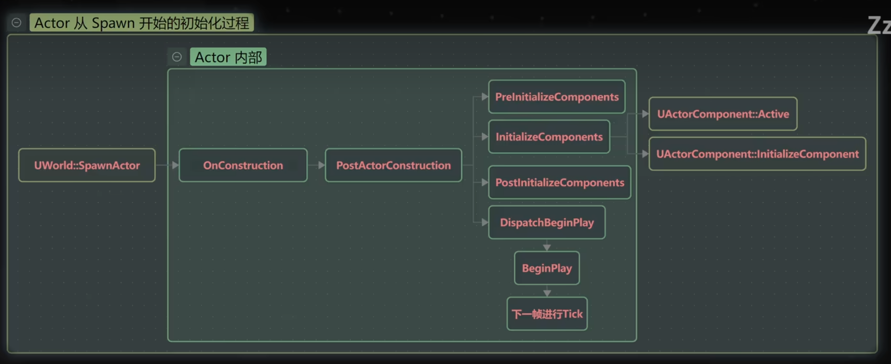
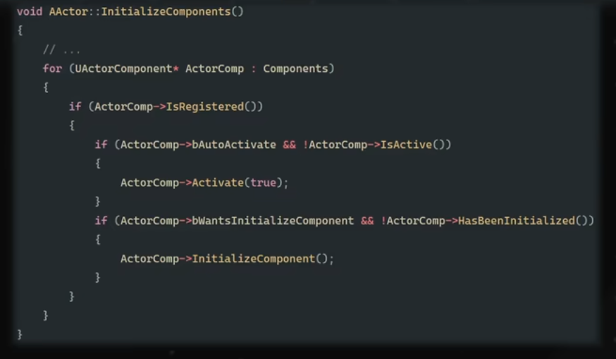
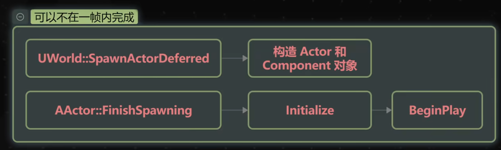
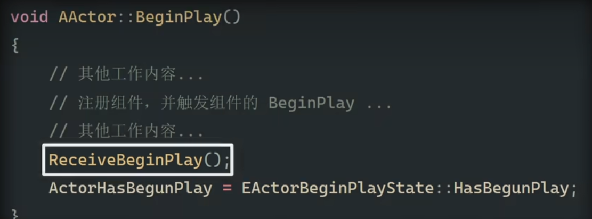
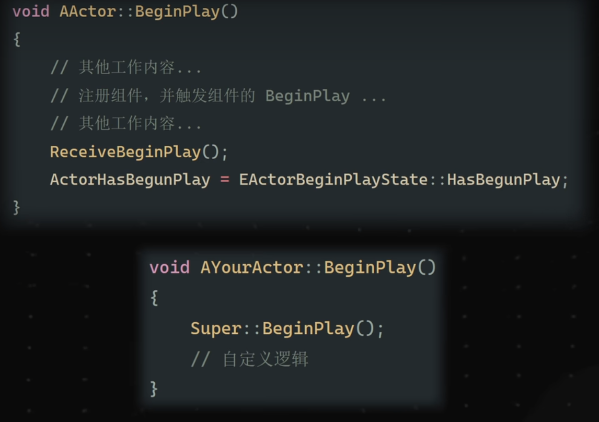
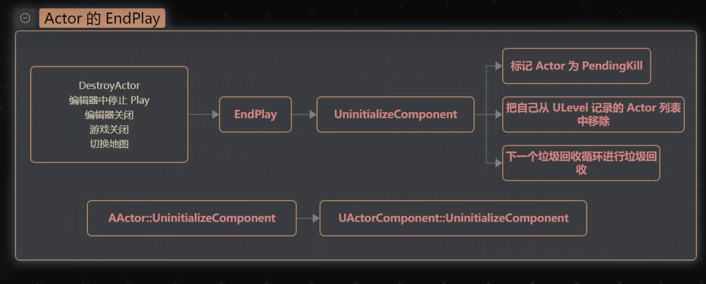
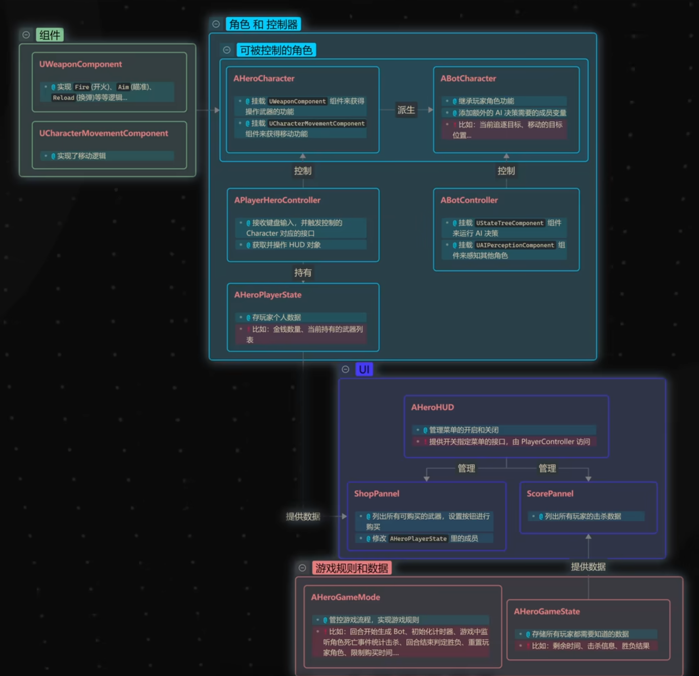

# Gameplay框架入门指南

- [1. 完整知识结构](#1-完整知识结构)
  - [1.1. 简要图](#11-简要图)
  - [1.2. 详细图](#12-详细图)
- [2. 知识补充点](#2-知识补充点)
  - [2.1. UHT](#21-uht)
  - [2.2. UBrainComponent](#22-ubraincomponent)
  - [2.3. PIE World](#23-pie-world)
  - [2.4. HUD](#24-hud)
  - [2.5. initialize BeginPlay](#25-initialize-beginplay)
  - [2.6. XX和ReceiveXX](#26-xx和receivexx)
  - [2.7. uninitialize EndPlay](#27-uninitialize-endplay)
- [3. 案例: 单机CSGO](#3-案例-单机csgo)

## 1. 完整知识结构

[UE Gameplay 框架入门指北](https://www.bilibili.com/video/BV1a54MzFEew/?spm_id_from=333.1387.favlist.content.click&vd_source=6beebf17d5aa6fb3d9fb4b629d0b319a)

### 1.1. 简要图



### 1.2. 详细图




## 2. 知识补充点

### 2.1. UHT

UHT是Unreal Header Tool, UHT在编译 C++ 项目前会预处理源代码，读取所有使用 UE 反射系统的宏和标记，然后生成引擎所需的中间代码。其核心职能包括：

1. 解析UE特有的反射宏

例如：

* UCLASS
* USTRUCT
* UENUM
* UPROPERTY
* UFUNCTION

UHT会扫描这些宏，构建类型描述信息，使相关类在运行时可被蓝图、序列化系统、GC系统、网络复制系统等使用。

2. 自动生成中间代码

UHT生成 .generated.h 文件。构建系统会将其包含进最终编译单元中，用于：

* 注册类和对象
* 构建反射元数据
* 处理序列化代码
* 添加虚函数表扩展、静态注册函数等内部代码

3. 与UBT配合工作

UHT由 Unreal Build Tool (UBT) 在编译前自动调用。流程简化如下：
```
Developer edits C++ file
        ↓
UBT 调用 UHT
        ↓
UHT 解析宏并生成 *.generated.h
        ↓
UBT 继续构建完整 C++ 工程
```

### 2.2. UBrainComponent

这个类只存在于UE4, UE5已经取消了，下面的类直接继承自父类UActorComponent。

### 2.3. PIE World

Play In Editor

### 2.4. HUD

Heads-Up Display，就是让人不要低头即可获取关键信息的显示方式。

### 2.5. initialize BeginPlay
 


Pre和Post是可override的。

先激活后初始化：



Spawn -> Initialize -> BeginPlay 多数在同一帧完成，但是用`UWorld::SpawnActorDeferred`，就只构造，不初始化。



### 2.6. XX和ReceiveXX

后者是蓝图用的多半。先ReceiveXX再XX，而且ReceiveXX就在XX里。



注意我们重写BeginPlay常常先`super`，所以会先执行蓝图的ReceiveBeginPlay，即



Tick同理。

### 2.7. uninitialize EndPlay



## 3. 案例: 单机CSGO

