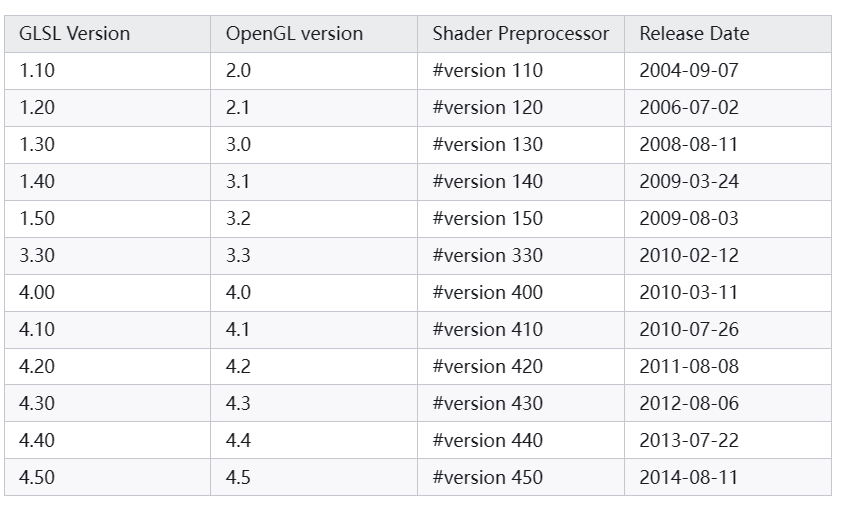
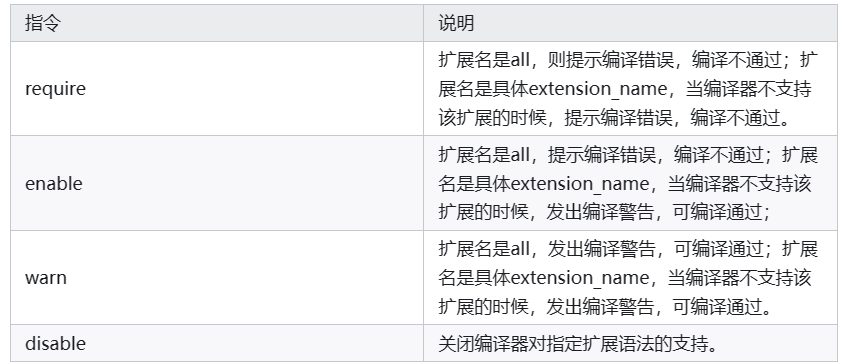
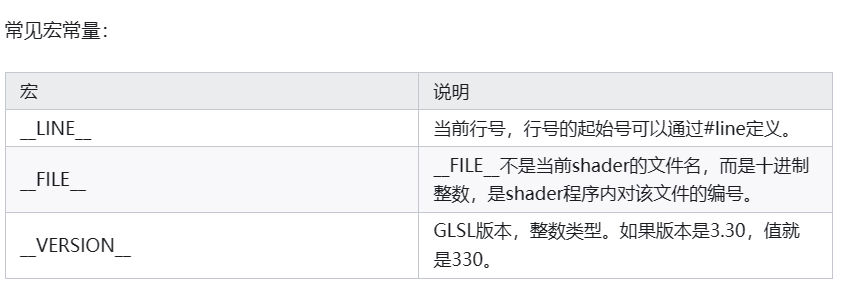
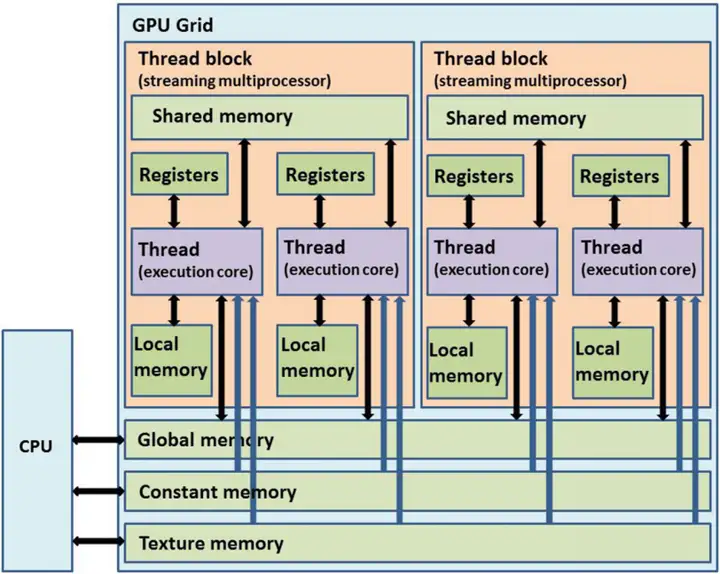
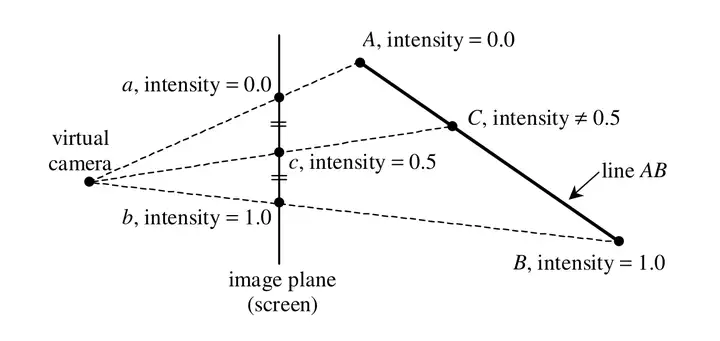
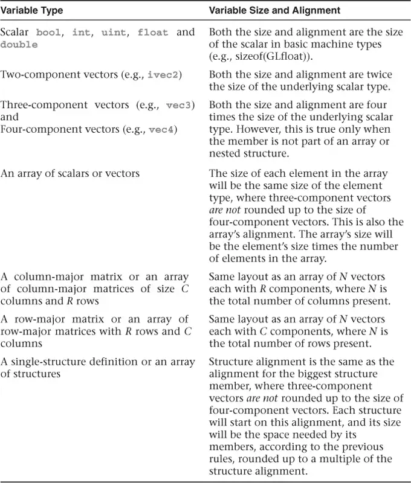

# GLSL基本语法

- [1. 版本声明](#1-版本声明)
  - [1.1. 版本](#11-版本)
  - [1.2. 扩展语法](#12-扩展语法)
- [2. 入口函数](#2-入口函数)
- [3. 输入和输出（更多见限定符类型里）](#3-输入和输出更多见限定符类型里)
- [4. 变量命名规则](#4-变量命名规则)
- [5. 执行单位](#5-执行单位)
- [6. GLSL宏](#6-glsl宏)
- [7. 数据类型](#7-数据类型)
  - [7.1. 基本类型](#71-基本类型)
    - [7.1.1. swizzle](#711-swizzle)
  - [7.2. 结构体](#72-结构体)
  - [7.3. 数组](#73-数组)
  - [7.4. opaque类型](#74-opaque类型)
  - [7.5. 接口块类型](#75-接口块类型)
  - [7.6. 变量初始化](#76-变量初始化)
- [8. 常量表达式和dynamically uniform表达式](#8-常量表达式和dynamically-uniform表达式)
- [9. 控制流](#9-控制流)
- [10. 函数](#10-函数)
  - [10.1. 返回值](#101-返回值)
  - [10.2. subroutine (子例程)](#102-subroutine-子例程)
- [11. 限定符](#11-限定符)
  - [11.1. 顺序问题：](#111-顺序问题)
  - [11.2. 输入输出](#112-输入输出)
  - [11.3. 精度](#113-精度)
  - [11.4. 可变性](#114-可变性)
    - [11.4.1. invariant作用](#1141-invariant作用)
  - [11.5. 读写](#115-读写)
  - [11.6. 插值](#116-插值)
  - [11.7. 块内存对齐](#117-块内存对齐)
  - [11.8. 其他layout限定符](#118-其他layout限定符)
- [12. 内置函数](#12-内置函数)
- [13. 参考](#13-参考)


## 1. 版本声明

```c
#version 330 core
#extension GL_ARB_shading_language_include : require
```
### 1.1. 版本


### 1.2. 扩展语法

```c
#extension extension_name|all : behavior
```
#extension后可以是扩展名，也可以是关键字all，all用于表示所有扩展。扩展名后的behavior值参考下表：



## 2. 入口函数
main

## 3. 输入和输出（更多见限定符类型里）
着色器通常需要输入数据（如顶点位置、颜色等）并输出数据（如最终像素颜色）。

* 输入: 可以通过`in`关键字定义，顶点着色器和片元着色器之间也可以传递数据。`in`，`uniform`，`buffer`类型的变量**传入**数据。
* 输出: 顶点着色器的主要输出是`gl_Position`，而片元着色器的输出通常是颜色。`out`，`buffer`**输出**数据。

顶点着色器会计算一些数据，然后通过`out`关键字传递给其他着色器。其他着色器则通过`in`关键字接收这些数据。

`in`和`out`旧版本的GLSL中使用`attribute`和`varying`关键字。

传递顺序：
1. 顶点着色器（Vertex Shader）
    * 处理每个顶点的基本属性，如坐标变换、光照计算等。
2. 曲面细分控制着色器（Tessellation Control Shader, TCS）
    * 这是曲面细分阶段的第一部分，负责处理顶点数据，通常用来设置细分程度和其它曲面细分相关的参数。
3. 曲面细分求值着色器（Tessellation Evaluation Shader, TES）
    * 这是曲面细分阶段的第二部分，根据TCS的输出和细分参数，生成更多的顶点。
4. 几何着色器（Geometry Shader）
    * 接收来自曲面细分求值着色器的顶点（如果使用了曲面细分）或直接来自顶点着色器的顶点（如果未使用曲面细分），并可以生成新的图元或者对顶点进行进一步的处理。
5. 片元着色器（Fragment Shader）
    * 处理由前面图形管线阶段生成的每个片元，计算最终的颜色和其他像素级特性。

PS：
* 曲面细分：在需要高度细节的模型上，如字符皮肤或复杂模型的细节增强。
* 几何着色器：用于实现特殊效果，如爆炸效果、粒子系统，或在渲染时动态创建更多的图元。

## 4. 变量命名规则

不能用`gl_`开头

## 5. 执行单位

GLSL程序在GPU上执行，GPU上程序的执行单位是**invocation**；GLSL程序并不是按照GLSL代码顺序执行，而是在不影响程序输出结果的情况下，经过编译期指令重排、运行期指令乱序发射的方式乱序执行；在不考虑循环的情况下，CPU端的程序执行一次，而GLSL程序执行次数与它的用途有关，如果是顶点shader，则执行顶点数次；如果是片元shader则执行片元数次；invocation之间通过全局内存区进行通信，**通过barrier实现同步**。

## 6. GLSL宏

1. 和C语言用法相同的指令：#define，#undef，#if，#ifdef，#ifndef，#else，#elif，#endif，#pragma，#error。注意GLSL没有提供#include指令。
2. 不同于C语言的指令：#extension，#version，#line 。

```c
#line line
#line line source-string-number
//举例
#line 3		//3是下一行的行号
#line 3 40	//3是下一行的行号，40是当前shader文件的编号
```



## 7. 数据类型

### 7.1. 基本类型

* 标量类型
    * float
    * double
    * int
    * uint
    * bool
* 二维向量
  * vec2
  * dvec2 (double)
  * ivec2
  * uvec2 (unsigned int)
  * bvec2 (bool)
* 三维向量
  * vec3
  * dvec3
  * ivec3
  * uvec3
  * bvec3
* 四维向量
  * vec4
  * dvec4
  * ivec4
  * uvec4
  * bvec4
* 矩阵
  * mat2 mat3 mat4
  * mat2x2 mat2x3 mat2x4
  * mat3x2 mat3x3 mat3x4
  * mat4x2 mat4x3 mat4x4
  * dmat2 dmat3 dmat4
  * dmat2x2 dmat2x3 dmat2x4
  * dmat3x2 dmat3x3 dmat3x4
  * dmat4x2 dmat4x3 dmat4x4

#### 7.1.1. swizzle

```c
vec4 v = vec4(1.0, 2.0, 3.0, 4.0);
vec2 v2 = v.xy;
vec3 v3 = v.zyx;
vec2 someVec;
vec4 otherVec = someVec.xyxx;
vec3 thirdVec = otherVec.zyy;
vec4 someVec;
someVec.rgba = vec4(1.0, 2.0, 3.0, 4.0);
someVec.zx = vec2(3.0, 5.0);
```

### 7.2. 结构体

```c
struct Light {
    vec3 position;
    vec3 color;
    float intensity;
};

Light light; // 不用struct关键字

struct Material {
    vec3 ambient;
    vec3 diffuse;
    vec3 specular;
    float shininess;
} variablename;
```

### 7.3. 数组

float myArray[10];

1. GLSL version 3.30之前不支持opaque类型数组
2. 3.30支持sampler类型（该版本仅有的opaque类型），但是索引必须是常量表达式
3. GLSL version 4.00及以上支持opaque数组，但是opaque数组索引必须是dynamically uniform表达式

### 7.4. opaque类型

代表着色器以某种方式引用的一些外部对象，比如纹理、图像、原子计数器

1. 纹理
   1. sampler1D
   2. sampler2D
   3. sampler3D
   4. samplerCube
   5. sampler1DArry
   6. sampler2DArry
   7. sampler1DShadow (用于阴影映射)
2. 图像
   1. image1D
   2. image2D
   3. image3D
   4. imageCube
   5. image1DArry
   6. image2DArry
3. 原子计数器
   1. atomic_uint
   2. 任何invocation对原子计数器的操作都是原子的，对其他所有invocation是可见的

**纹理只读，且读操作过程会进行纹理过滤(最近邻过滤、线性过滤、三线性过滤等)，而图像则是可读写的，不会进行过滤。**

### 7.5. 接口块类型

interface block 是成组的输入输出变量

```c
storage_qualifier block_name
{
    <define members here>
} instance_name;
```
`storage_qualifier`可以是`in`, `out`, `uniform`, `buffer`, `shared`, `patch`, `subroutine`, `readonly`, `writeonly`, `coherent`, `volatile`, `restrict`, `readonly`, `writeonly`, `coherent`, `volatile`, `restrict`, `layout`等。

```c
uniform MatrixBlock
{
    mat4 model;
    mat4 view;
    mat4 projection;
} matrices;
```

它和结构体的区别是结构体内的成员是供shader程序内部使用的，接口块内的成员是用于shader程序输入输出的。

### 7.6. 变量初始化

```c
struct Data{
  float first;
  vec2 second;
};

//构造器
bool val = bool(true);
const float array[3] = float[3](2.5, 7.0, 1.5);
Data dataValue = Data(1.4, vec2(16.0, 22.5));

//初始化列表
bool val = {true};
const float array[3] = {2.5, 7.0, 1.5};
Data dataValue = {1.0, {-19.0, 4.5};
```

**用作输入输出的变量不允许初始化。**

## 8. 常量表达式和dynamically uniform表达式

1. 常量表达式: 在编译时就能确定的表达式
    ```c
    1.0;//literal
    1.0+2.0;//operator
    vec2(2.0,1.0);//constructor
    const float val = {1.0};//const
    //实参为常量表达式的内置函数
    ```
2. dynamically uniform表达式
   1. 如果一个表达式在所有invocation上产生相同的输出值，那么它被称为 "dynamically uniform"。
   2. opaque数组的索引只能是dynamically uniform类型；
   3. uniform block、shader storage block类型的数组索引必须是dynamically uniform；
   4. compute shader条件语句或者循环语句内有barrier()的时候，条件表达式必须是dynamically uniform。
   5. recap: uniform是只读的

## 9. 控制流

1. 条件语句：if-else ，switch-case；循环语句：for，while，do-while；跳转语句：break，continue， return，discard。
2. 上面有个特殊的：**discard**。discoard仅用于片元着色器，用于丢弃当前片元，不会执行后续的片元着色器代码。
   1. 调用discard和在main函数内使用**return**都会引起程序退出，区别是前者退出后不会输出片元值，后者会输出片元值。

## 10. 函数

1. 不支持递归
2. 参数限定符:
   1. in:缺省时默认限定符，表示参数通过值传递，只读
   2. inout:表示参数通过引用传递，可以读写
   3. out:表示参数不可读，但在函数返回时可以写
   4. const in:表示参数通过值传递，但不可修改，给编译器提供更多优化空间

举例：

```c
void foo(in vec3 a, out vec3 b, inout vec3 c);
```

### 10.1. 返回值

1. out的参数可以作为返回值，可以返回多个值
2. return语句可以返回一个值，也可以不返回值

```c
vec3 foo(in vec3 a, out vec3 b, inout vec3 c)
{
    b = a;
    c = a;
    return a;
}

void main()
{
    vec3 a = vec3(1.0, 2.0, 3.0);
    vec3 b;
    vec3 c = vec3(4.0, 5.0, 6.0);
    vec3 d = foo(a, b, c);
}
```

### 10.2. subroutine (子例程)

1. 定义Subroutine类型（注意是类型，不是一个函数）
    ```c
    // 定义一个子程序类型
    subroutine vec4 ColorType(vec3, vec3);
    ```
2. 实现Subroutine
    ```c
    // 实现子程序类型
    subroutine(ColorType)
    vec4 ColorRed(vec3 lightDir, vec3 normal) {
        return vec4(1.0, 0.0, 0.0, 1.0); // 红色
    }

    subroutine(ColorType)
    vec4 ColorGreen(vec3 lightDir, vec3 normal) {
        return vec4(0.0, 1.0, 0.0, 1.0); // 绿色
    }
    ```
    理解：相当于`subroutine`是一个注解（实际是函数指针）。
    不推荐写法：
    ```c
    subroutine (ColorType) vec4 ColorRed(vec3 lightDir, vec3 normal) {
        return vec4(1.0, 0.0, 0.0, 1.0); // 红色
    }
    ```
3. 声明subroutine uniform
    在GLSL程序中声明一个子程序uniform，这将用于在运行时选择具体的子程序实现。即通过OpenGL的API动态地指定哪个子程序（shader函数）在着色器中被调用。
    ```c
    // 子程序uniform变量
    subroutine uniform ColorType myColor;
    ```
    1. 在main部分调用
        ```c
        // 在main部分调用
        vec3 lightDir = normalize(vec3(1.0, 1.0, 1.0));
        vec3 normal = normalize(vec3(1.0, 0.0, 0.0));
        vec4 color = myColor(lightDir, normal);
        ```
    2. 在OpenGL程序中设置
        ```c
        GLuint program = glCreateProgram();
        // 编译、链接着色器程序...

        // 在渲染之前，获取子程序索引并设置
        GLuint indexRed = glGetSubroutineIndex(program, GL_FRAGMENT_SHADER, "ColorRed");
        GLuint indexGreen = glGetSubroutineIndex(program, GL_FRAGMENT_SHADER, "ColorGreen");

        // 根据需要设置子程序
        glUniformSubroutinesuiv(GL_FRAGMENT_SHADER, 1, &indexRed); // 使用红色
        // 或
        glUniformSubroutinesuiv(GL_FRAGMENT_SHADER, 1, &indexGreen); // 使用绿色

        // 绘制对象...
        ```

## 11. 限定符

|分类|限定符|
|---|---|
|输入输出|in, out, uniform, buffer, shared|
|精度|highp, mediump, lowp|
|可变性|invariant, const|
|读写|coherent, volatile, restrict, readonly, writeonly|
|插值|flat, noperspective, smooth|
|layout内存对齐相关|packed, shared, std140, std430, row_major, column_major|
|layout其他限定符|location, set, binding, offset, index, xfd_buffer, xfb_buffer, local_size ...|
|函数参数|in, out, inout, const in|

```c
layout(location = 0) out vec4 fragColor;
precision mediump vec3;
invariant out vec3 Color;
out flat int flatValue;
```

### 11.1. 顺序问题：
1. invariant-qualifier
2. interpolation-qualifier
3. layout-qualifier
4. other-storage-qualifier
5. precision-qualifier

### 11.2. 输入输出

这些关键字可指定变量的在显存中的存放位置，常用于在shader程序内指定输入输出，或者用于实现invocation之间通信。

限定符  | 说明
--------|-------------------------------------------------------------------
in out  | 不可用于opaque类型、结构体类型，数据存放在本地内存，in用于获取渲染管线上阶段的数据，out用于把数据传递给渲染管线下一阶段。
uniform | 可用于修饰基本类型、接口块类型，表示数据来自常量内存或者纹理内存，是常量值，不可修改。
buffer  | 用于修饰接口块类型，表示数据来自全局内存，可读写。
shared  | 只能用在compute shader，表明变量的值在work group内的所有invocation共享。

GPU内存模型：



### 11.3. 精度

这些关键字可用于标量类型、矢量类型、矩阵类型、图像类型、纹理类型。highp、mediump 和 lowp 是精度限定符，用于表示浮点数的不同精度级别。

限定符  | 说明
--------|-----------------------
highp   | 高精度，具体的位数和范围可能会因硬件而异。
mediump | 中等精度，具体的位数和范围可能会因硬件而异。
lowp    | 低精度，具体的位数和范围可能会因硬件而异。

### 11.4. 可变性
* `invariant`关键字只用于`out`变量（其实也可以用于`in`，但没什么用）。编译器编译shader时，可能会进行优化，从而导致指令重新排序。这种指令重排意味着两个shader之间的等价计算不能保证产生完全相同的结果。invariant关键字用来修饰顶点shader的输出变量，指明用来计算输出变量的相同计算过程产生的值必须完全相同。该关键字可以在变量声明时使用，也可以用于已经声明的变量。
* const修饰的变量必须在声明的时候初始化，且值不可更改，用于把运行期的计算转化为编译期计算，优化运行效率。
    
```c
invariant gl_Position; // make existing gl_Position be invariant
out vec3 Color;
invariant Color; // make existing Color be invariant
```

#### 11.4.1. invariant作用
在现代图形渲染中，尤其是在使用复杂的渲染技术如阴影映射、延迟渲染或使用多个渲染目标（MRT）时，相同的顶点着色器输出可能会被用于多个不同的渲染过程。例如：
1. 多遍渲染：在第一遍中计算光照信息，在第二遍中使用这些信息来渲染阴影。如果第一遍和第二遍中顶点的位置经过的计算不完全相同，可能会导致视觉上的错误，如阴影接缝。
2. 硬件并行化：相同的顶点数据在GPU的不同部分可能并行处理。如果每个单元的优化级别或指令重排方式不同，没有 invariant 保证，同一顶点的计算结果可能会有细微差异。

### 11.5. 读写

* readonly
* writeonly
* coherent: 不同invocation在读写同一个变量的时候，读写的都是自己cache内的数据，也就是不同地方的数据，所以可能不一致。coherent变量，保证某一个invocation对变量的修改，对其它invocation可见。
* restrict: GLSL规定结前面代码对数据的写操作，需要对后面的读操作可见；编译器编译shader时，可能会进行优化，从而导致指令重新排序。restrict告诉编译器，该变量是invocation内唯一对该变量进行写操作的变量，从而让编译器实现更好的重排序优化。比如C++里可以表示只有这个指针指向的内存区域是唯一的，不会被其它指针指向，以此让编译器执行更激进的优化。
* volatile: 可以任何时刻对变量进行读写，不需考虑变量同步和一致性问题。

### 11.6. 插值

* smooth: 这是默认的插值方式，计算三角形内的片元属性，在屏幕空间进行插值，并以透视校正的方式进行插值。相当于在三维空间进行插值。
* noperspective: 计算三角形内的片元属性，在屏幕坐标空间中线性插值。即在屏幕空间进行插值，但不进行透视校正。
* flat: 计算三角形内的片元属性，不进行插值，换句话说就是三角形内所有片元属性值相同。

smooth是右边的线段插值，noperpective是中间的线段插值



### 11.7. 块内存对齐

限定符       | 说明
-------------|---------------------------------------------------------------------------------
shared       | 块内成员按照变量的实际大小，在内存中按照声明的顺序紧凑排放；
packed       | 块内active成员按照变量的实际大小，在内存中按照声明的顺序紧凑排放，active成员指的是有被使用的变量，未被使用的变量编译过后，会从块内移除，不占用内存。
std140       | OpenGL 2.1时期引入的标准，它规定了变量的对齐和填充规则，以实现跨平台。
std430       | 在OpenGL 4.3时期引入的标准，它规定了变量的对齐和填充规则，对齐规则和std140差不多，但更紧凑一点，减少了内存浪费。
row_major    | 矩阵在内存中以行优先顺序布局。
column_major | 矩阵在内存中以列优先顺序布局。

* std140标准里引入了对齐系数的概念，它规定结构体成员相对于结构体首地址的偏移必须是其对齐系数的整数倍，且占用内存大小为内存系数大小。各种类型的对齐系数参考下表。
* std430中，数据的首地址必须为内存系数的整数倍，但内存占用大小不必等于内存系数大小，而是可以等于数据实际大小。相比于std140的优势是内存占用更小，举个例子：在std140中vec3的对齐系数是4，占用空间是4，如果后面紧跟着一个float数据，那么float数据地址会在vec3的基础上+4；而在std430中，float数据地址则在vec3的基础上+3。

std140:


### 11.8. 其他layout限定符

理解：layout是用来指定变量的存储位置的

Layout的限定符比较多，大部分用于绑定外部数据对象，剩余用于指定内存对齐规则、图像格式等。

```c
//用在compute shader，指定group大小
layout(local_size_x = X, local_size_y = Y, local_size_z = Z) in;
//用在vertex shader和，指定输入输出
layout(location = 2) in vec3 values[4];
layout(location = 2) out vec4 outColor;
//绑定uniform变量
layout(binding = 3) uniform sampler2D mainTexture;
//绑定UBO
layout(binding = 1, std140) uniform MainBlock
{
  vec3 data;
};
//绑定SSBO
layout(std430, binding = 3) buffer layoutName
{
    int data_SSBO[];
};
//指定image通道格式为32位float类型
layout(rg32f, binding = 0)
//绑定原子计数器
layout(binding = 0, offset = 12) uniform atomic_uint one;
//绑定transform feedback
layout(xfb_buffer = 1, xfb_stride = 32) out;
//用在曲面细分着色器
layout(vertices = vertex_count) out;
//用在几何着色器
layout(primitive type, max_vertices = integer value) out;
//绑定subroutine
layout(location = 1) subroutine uniform SubroutineTypeName subroutineVariableName;
```

## 12. 内置函数

* 三角函数：sin、cos、tan、asin、acos、atan；
* 指数函数：pow、exp、log、exp2、log2；
* 平方根和立方根函数：sqrt、inversesqrt；
* 绝对值函数：abs；
* 取整函数：floor、ceil、round；
* 分段函数：step、smoothstep；
* 矢量运算函数：length、distance、dot、cross、normalize；
* 向量构造函数：vec2、vec3、vec4；
* 矩阵构造函数：mat2、mat3、mat4；
* 条件函数：mix、clamp；
* 几何函数：reflect、refract；

## 13. 参考
[知乎-图形学[GLSL]入门小结](https://zhuanlan.zhihu.com/p/662618726)