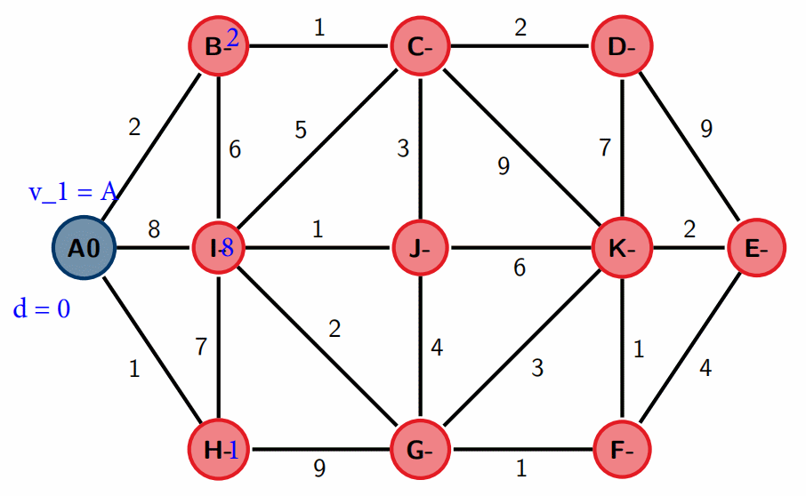
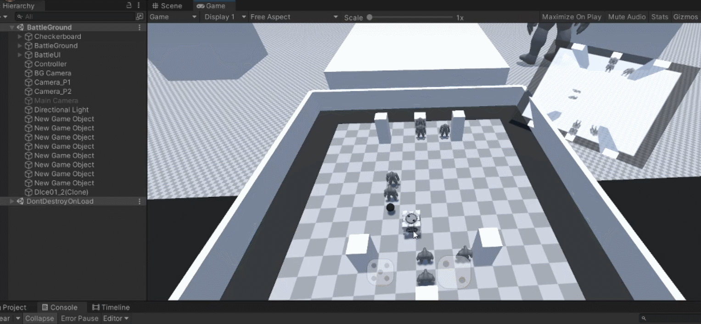
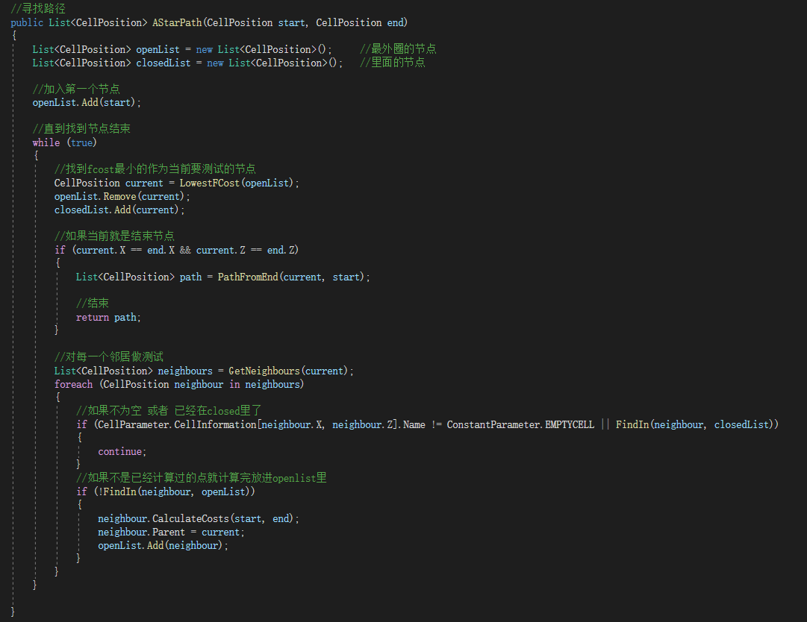
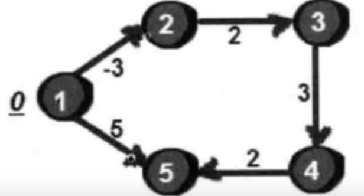

# Dijkstra and Bellman-Ford algorithm

They are both used in finding **Single-Source Shortest Paths**.

1. [Dijkstra algorithm](#dijkstra-algorithm)
   1. [Assumption](#assumption)
   2. [Flow](#flow)
   3. [Example](#example)
   4. [Developed Algrithm of Dijkstra - A Star (Use case)](#developed-algrithm-of-dijkstra---a-star-use-case)
2. [Bellman-Ford algorithm](#bellman-ford-algorithm)
   1. [Assumption](#assumption-1)
   2. [Flow](#flow-1)
   3. [Example](#example-1)
   4. [Application example - RIP](#application-example---rip)
3. [PS - comparison of DVR and LSR](#ps---comparison-of-dvr-and-lsr)


## Dijkstra algorithm
In our course, it is used in **Link State Routing** (LSR).

### Assumption
We are targeting a weighted directed graph, in which the weight of each edge is a **non-negative** real number. i.e.: We are given a weighted directed graph G single-source shortest path problem.

### Flow
Take the starting point as the center and expand to the outer layer according to the increasing length (the idea of **BFS**) until it reaches the end point.


**Step 1** 
1. Set $v1 = A$ and assign to this vertex the permanent label `0`.
2. Assign every other vertex a temporary label `∞`.

**Step 2** 
Until no temporary labels are changed in (a) or (b), do the following.
**(a)** Take the vertex vi which most recently acquired a permanent label, say $d$. For each vertex v which is adjacent to vi and has not yet received a permanent label, if $d + w(v_iv) < t$, the current temporary label of $v$, change the temporary label of $v$ to $d + w(v_iv)$.
**(b)** Take a vertex v which has a smallest temporary label in the graph. Set $v_{i+1} = v$ and make its temporary label permanent.

### Example

In this gif above, I use blue number to show which is the distance to the beginning vertex. The blue node is the vertex have passed, the red node is the node havn't passed. Each step, it will choose the next shortest path.

### Developed Algrithm of Dijkstra - A Star (Use case)
In my study experience, I once make a Wargame [(The link of video of my game)](https://www.bilibili.com/video/BV1mq4y1o7ww). The item in the chess need find the shortest path when player click a target grid.



It has enemy (obstacle) in the map.

It not only calculate by **the distance from start vertex to candidate vertex**, but also **the estimated distance from the current vertex to the end point**.

The code screenshot in C# (Unity Game Engine):



## Bellman-Ford algorithm
In our course, it is used in **Distance Vector Routing** (DVR) protocols like RIP and RIPv2.

### Assumption
It is **slower than Dijkstra's algorithm** for the same problem, but more **versatile**, as it is capable of handling graphs in which some of the edge **weights are negative** numbers.

### Flow
Set `s` as start point, `dis[v]` is the shortest distance from `s` to `v`, `prev[v]` is the predecessor. `w[j]` is the length of edge `j` where j link `u` and `v`.

pseudocode：
```c++
dis[j] = 0, dis[v] = ∞ (v != s), pre[s] = 0

for(i = 1; i <= n - 1; i++)
    for(j = 1; j <= E; j++)
        if(dis[u] + w[j] < dis[v])
        {
            dis[v] = dis[u] + w[j];
            pre[v] = u;
        }
```

### Example


We use this as an example. Below is the sequence of edge gaven:

|  id   | from v | to v  | weight |
| :---: | :----: | :---: | :----: |
|   1   |   2    |   3   |   2    |
|   2   |   1    |   2   |   -3   |
|   3   |   1    |   5   |   5    |
|   4   |   4    |   5   |   2    |
|   5   |   3    |   4   |   3    |

Each turn of relax should be like this:

```shell
# first row: id of vertex
# first col: id of loop
# value: the shortest distance from vertex 1
    1   2   3   4   5
0   0   ∞   ∞   ∞   ∞
1   0   -3  ∞   ∞   5
2   0   -3  -1  2   5
3   0   -3  -1  2   4
4   0   -3  -1  2   4
```

**Why it has n-1 turns of relax?**

Because it has `n` vertex which means the shortest path between `2` nodes will contain `n-1` edges at most.

### Application example - RIP
The algorithm is **distributed** because it involves a number of routers within an **AS**.

Steps:
1. Each node calculates the distances between itself and all other nodes within the AS and stores this information as a table.
2. Each node sends its table to all neighboring nodes.
3. When a node receives distance tables from its neighbors, it calculates the shortest routes to all other nodes and updates its own table to reflect any changes.

## PS - comparison of DVR and LSR
(Material come from lecture 10 - 12)

| Basis for comparison   | Distance vector routing                               | Link state routing                           |
| ---------------------- | ----------------------------------------------------- | -------------------------------------------- |
| Algorithm              | Bellman-Ford                                          | Dijsktra                                     |
| Network view           | Topology information from the neighbour point of view | Complete information on the network topology |
| Best path calculation  | Based on the least number of hops                     | Based on the cost                            |
| Updates                | Full routing table                                    | Link state updates                           |
| Updates frequency      | Periodic updates                                      | Triggered updates                            |
| CPU and memory         | Low utilisation                                       | Intensive                                    |
| Simplicity             | Relatively simple                                     | Relatively complicated                       |
| Convergence time       | Moderate                                              | Short                                        |
| Hierarchical structure | No                                                    | Yes                                          |
| Intermediate Nodes     | No                                                    | Yes                                          |