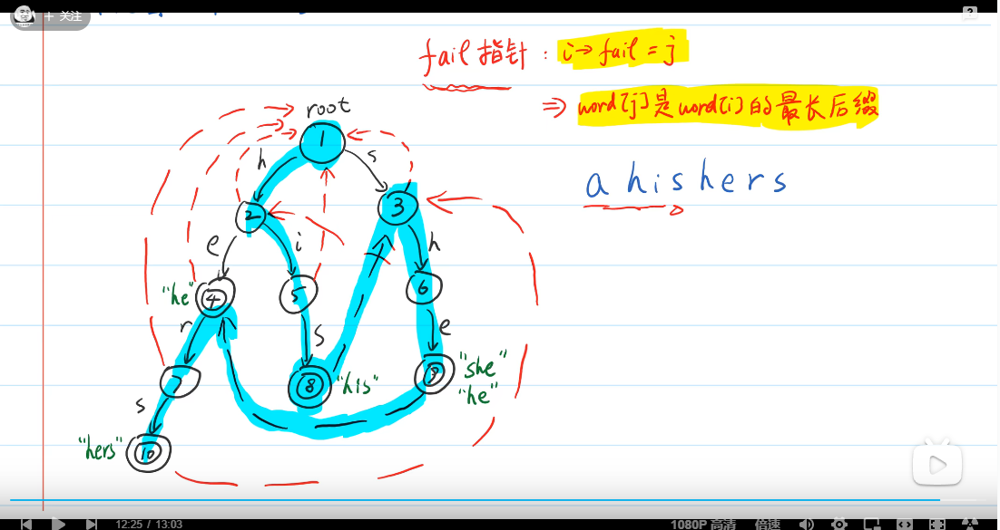
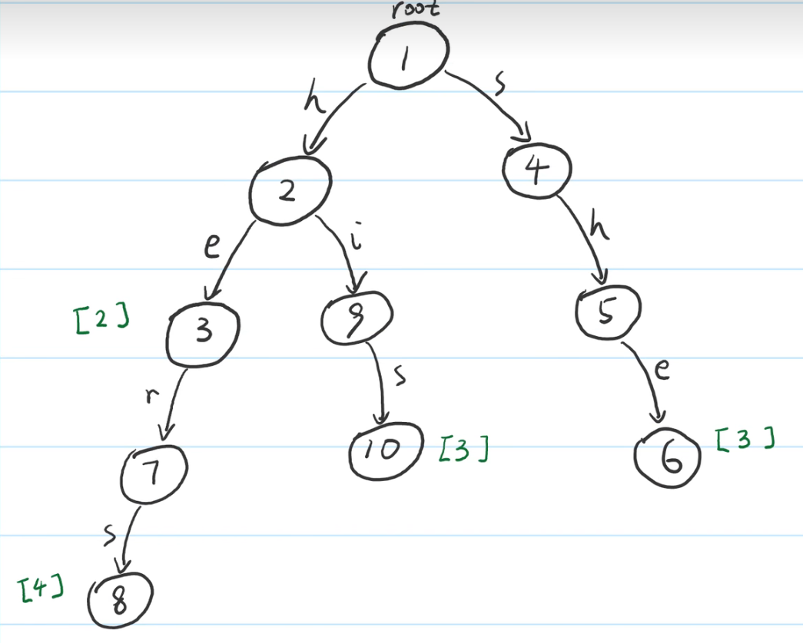
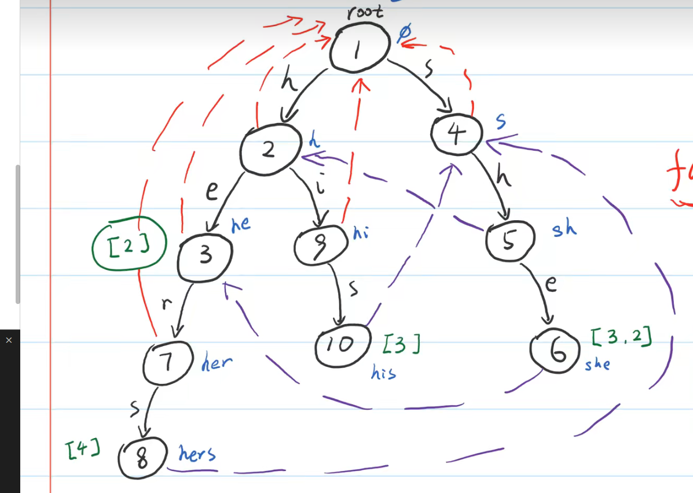

# AC自动机

[字典树](Tire_前缀树_字典树.md)

[算法_轻松掌握ac自动机](https://www.bilibili.com/video/BV1uJ411Y7Eg?p=4&vd_source=6beebf17d5aa6fb3d9fb4b629d0b319a)



注意节点9同时包含she和he



数字是单词长度

`fail指针`：`i->fail = j`,word[j]是word[i]的最长后缀 

助于理解: `ahishers`
1. `his`之后`hish`不成立，即fail了，点10转点4继续，即**相同后缀**s
2. `she`之后`sher`不成立，点6跳转点3。

```cpp
#define ALPHABET 26

struct Node
{
    Node* child[ALPHABET];
    Node* fail = nullptr;
    vector<int>exist;
};

void trie_insert(Node* root, string word)
{
    Node* tmp = root;
    
    int n = word.size();
    for(int i = 0; i < n;i++)
    {
        int c = word[i] - 'a';
        if(tmp->child[c] == nullptr)
            tmp->child[c] = new Node();
        tmp = tmp->child[c];
    }
    tmp->exist.push_back(n);
}

void ac_build(Node* root, vector<string>& P)
{
    int n = P.size();
    for(int i = 0; i <n; i++)
    {
        trie_insert(root, P[i]);
    }

    queue<Node*> q;

    // 将第一层的fail直接设置为root
    for(int i = 0; i < ALPHABET;i++ )
    {
        if(root->child[i])
        {
            root->child[i]->fail = root;
            q.push(root->child[i]);
        }
    }

    while(!q.empty())
    {
        Node* x = q.front();
        q.pop();
        for(int i = 0;i < ALPHABET; i++)
        {
            if(x->child[i])
            {
                Node* y = x->child[i];
                Node* fafail = x->fail;
                // x儿子的fail指针是x的fail下同样的儿子，如果不存在一样的儿子，就x的fail的fail直至root。
                //    ▼ 这里是为了root没有fail
                while(fafail && fafail->child[i] == nullptr)
                {
                    fafail = fafail->fail;
                }
                if(fafail == nullptr)
                    y -> fail = root;
                else
                    y -> fail = fafail -> child[i];

                if(y->fail->exist.size())
                {
                    // y的fail和y同后缀，且y包含y的fail，所以
                    for(int j = 0; j < y->fail->exist.size();j++)
                    {
                        y->exist.push_back(y->fail->exist[j]);
                    }
                }
                q.push(y);
            }
        }
    }
}

void ac_query(Node* root, string T)
{
    Node* tmp = root;
    for (int i = 0; i< T.size();i++)
    {
        int c = T[i] - 'a';
        //没有c就一直向上找， 直至找到；或者到了root都没找不到就放弃
        while(tmp->child[c] == nullptr && tmp->fail)
            tmp = tmp->fail;
        if(tmp -> child[c])
            tmp = tmp->child[c];
        else
            continue;
        
        if(tmp->exist.size())
        {
            for(int& j : tmp->exist)
            {
                cout << T << " " << i- j + 1 << " " << j << T.substr(i- j + 1, j) << endl;
            }
        }        
    }
}

int main()
{
    vector<string>P = {"he", "she", "hers", "his", "is"}; 
    string T = "ahishersheishiser";
    Node* root = new Node();
    ac_build(root, P);
    ac_query(root, T);
}
```  


## C++ class风格
```cpp
#define ALPHABET 26

class ACM
{
public:
    struct Node
    {
        Node* child[ALPHABET];
        Node* fail = nullptr;
        vector<int>exist;
    };

    Node* root;
    ACM(vector<string> &P)
    {
        root = new Node();
        int n = P.size();
        for (int i = 0; i < n; i++)
        {
            trie_insert(P[i]);
        }

        queue<Node*> q;

        // 将第一层的fail直接设置为root
        for (int i = 0; i < ALPHABET; i++)
        {
            if (root->child[i])
            {
                root->child[i]->fail = root;
                q.push(root->child[i]);
            }
        }

        while (!q.empty())
        {
            Node* x = q.front();
            q.pop();
            for (int i = 0; i < ALPHABET; i++)
            {
                if (x->child[i])
                {
                    Node* y = x->child[i];
                    Node* fafail = x->fail;
                    // x儿子的fail指针是x的fail下同样的儿子，如果不存在一样的儿子，就x的fail的fail直至root。
                    //    ▼ 这里是为了root没有fail
                    while (fafail && fafail->child[i] == nullptr)
                    {
                        fafail = fafail->fail;
                    }
                    if (fafail == nullptr)
                        y->fail = root;
                    else
                        y->fail = fafail->child[i];

                    if (y->fail->exist.size())
                    {
                        // y的fail和y同后缀，且y包含y的fail，所以
                        for (int j = 0; j < y->fail->exist.size(); j++)
                        {
                            y->exist.push_back(y->fail->exist[j]);
                        }
                    }
                    q.push(y);
                }
            }
        }
    }

    void trie_insert(string word)
    {
        Node* tmp = root;

        int n = word.size();
        for (int i = 0; i < n; i++)
        {
            int c = word[i] - 'a';
            if (tmp->child[c] == nullptr)
                tmp->child[c] = new Node();
            tmp = tmp->child[c];
        }
        tmp->exist.push_back(n);
    }

    void ac_query(string T)
    {
        Node* tmp = root;
        for (int i = 0; i < T.size(); i++)
        {
            int c = T[i] - 'a';
            //没有c就一直向上找， 直至找到；或者到了root都没找不到就放弃
            while (tmp->child[c] == nullptr && tmp->fail)
                tmp = tmp->fail;
            if (tmp->child[c])
                tmp = tmp->child[c];
            else
                continue;

            if (tmp->exist.size())
            {
                for (int& j : tmp->exist)
                {
                    cout << T << " " << i - j + 1 << " " << j << T.substr(i - j + 1, j) << endl;
                }
            }
        }
    }
};

int main()
{
    vector<string> P = { "he", "she", "hers", "his", "is" };
    string T = "ahishersheishiser";
    ACM a(P);
    a.ac_query(T);
}
```