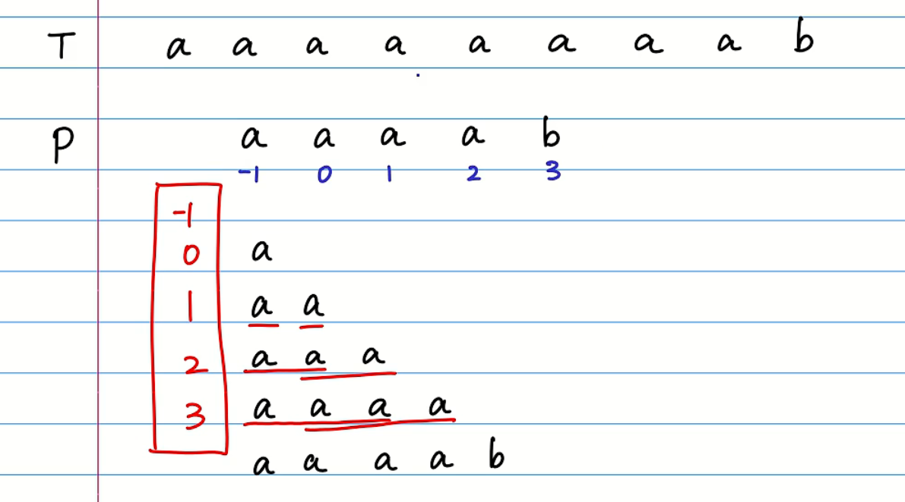
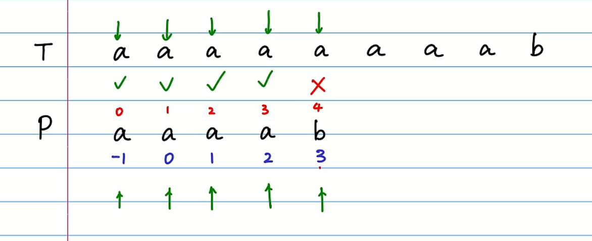
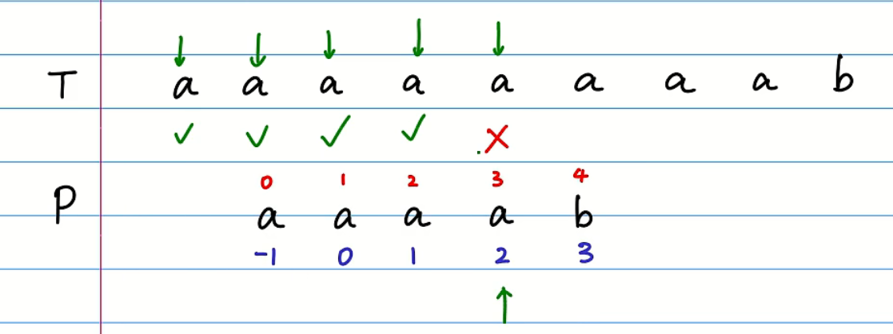
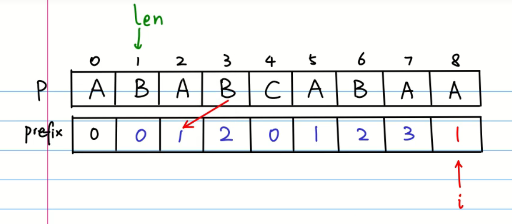

# KMP

c++ 直接`words[j].find(words[i]) != string::npos`

[KMP字符串匹配算法1](https://www.bilibili.com/video/BV1Px411z7Yo?spm_id_from=333.1007.top_right_bar_window_history.content.click&vd_source=6beebf17d5aa6fb3d9fb4b629d0b319a)

1. 找最长相同前后缀
2. 列出该表
3. -1为开头，后面对齐
4. 进行匹配





原理：因为前后缀相同，并且=列表时错开过一位，所以在移动相同后缀，对准前缀时，首先去掉了不匹配的后缀，然后将相同前缀对齐不用回溯到开头进行匹配。


如果不一样该怎么寻找新的匹配位置呢？：



当前错误的len（匹配点）前一个点的匹配点就是新的匹配点，如果还不是，就继续递归直至回溯到-1的索引，即匹配的极限

举例：
```
A B C A B C D A B C A B C E
            ! ----------- !
      !             ----- ! 
```
其实就是当前节点E前面的最长相同前后缀`ABCABC`的最长相同前后缀，这样就可以是`ABCA`和`ABCE`比较了。`ABCA`的`ABC`取得是相同前后缀的前缀，`ABCE`的`ABC`取的是后缀。

```c
void prefix(string pattern, vector<int>& prefix)
{
    int n = pattern.size();
    prefix = vector<int>(n);
    prefix[0] = 0;
    int len = 0;
    int i = 1;

    while(i < n)
    {
        if(pattern[i] == pattern[len])
        {
            len++;
            prefix[i] = len;
            i++;
        }
        else
        {
            if(len>0)
                len = prefix[len-1];
            else //递归到-1时   
            {
                prefix[i] = 0;
                i++;
            }
        }
    }
}

然后还要将它向后移动一位
循环实现
prefix[i] = prefix[i-1]
i--
```

```c
//---------------
下面是不用移动一位的直接写法
void prefix(string pattern, vector<int>& prefix)
{
    int n = pattern.size();
    prefix = vector<int>(n);
    prefix[0] = -1;
    int len = -1;
    int i = 0;

    while(i < n-1)
    {
        if(len == -1 || pattern[i] == pattern[len])
        {
            i++;len++;    // prefix[1] 记录的是前后缀表在索引0的情况
            prefix[i] = len;
        }
        else
        {
            len = prefix[len];
        }
    }
}
```

## 字符串匹配
```cpp
int KMP(string text, string pattern)
{
    int n = pattern.size();
    int m = text.size();
    vector<int>p;
    prefix(pattern, p);
    int j = 0;
    int i = 0;
    while (i < m)
    {
        if (j == n)
            return i - n;
        if (text[i] == pattern[j])
        {
            i++;
            j++;
        }
        else
        {
            j = p[j];
            if (j == -1)
            {
                j = 0;
                i++;
            }
        }
    }
    if (j == n)
        return i - n;
    return -1;
}
```