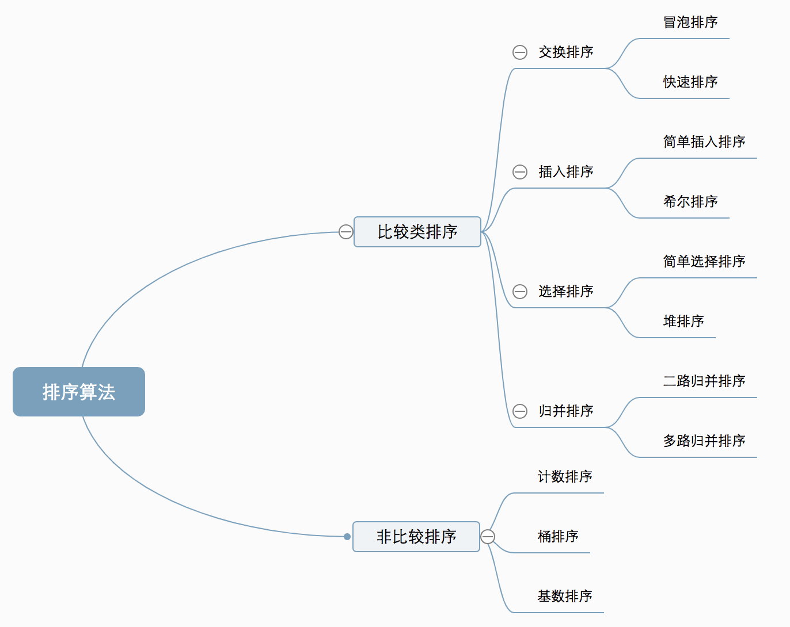

# 排序算法

1. [算法和其复杂度](#算法和其复杂度)
2. [冒泡排序（Bubble Sort）](#冒泡排序bubble-sort)
3. [选择排序（Selection Sort）](#选择排序selection-sort)
4. [插入排序（Insertion Sort）](#插入排序insertion-sort)
5. [希尔排序（Shell Sort）](#希尔排序shell-sort)
6. [归并排序（Merge Sort）](#归并排序merge-sort)
7. [快速排序（Quick Sort）](#快速排序quick-sort)
8. [堆排序（Heap Sort）](#堆排序heap-sort)
9. [计数排序（Counting Sort）](#计数排序counting-sort)
10. [桶排序](#桶排序)
11. [基数排序（Radix Sort）](#基数排序radix-sort)

## 算法和其复杂度
[十种常见排序算法_一去不复返go的博客-CSDN博客_排序算法有哪些](https://blog.csdn.net/liyongchunscr/article/details/121350704)

## 冒泡排序（Bubble Sort）

冒泡排序是一种简单的排序算法。它重复地走访过要排序的数列，一次比较两个元素，如果它们的顺序错误就把它们交换过来。走访数列的工作是重复地进行直到没有再需要交换，也就是说该数列已经排序完成。这个算法的名字由来是因为越小的元素会经由交换慢慢“浮”到数列的顶端。 

## 选择排序（Selection Sort）
选择排序(Selection-sort)是一种简单直观的排序算法。它的工作原理：首先在未排序序列中找到最小（大）元素，存放到排序序列的起始位置，然后，再从剩余未排序元素中继续寻找最小（大）元素，然后放到已排序序列的末尾。以此类推，直到所有元素均排序完毕。 

## 插入排序（Insertion Sort）
插入排序（Insertion-Sort）的算法描述是一种简单直观的排序算法。它的工作原理是通过构建有序序列，对于未排序数据，在已排序序列中从后向前扫描，找到相应位置并插入。

## 希尔排序（Shell Sort）
1959年Shell发明，第一个突破O(n2)的排序算法，是简单插入排序的改进版。它与插入排序的不同之处在于，它会优先比较距离较远的元素。希尔排序又叫缩小增量排序。

## 归并排序（Merge Sort）
归并排序是建立在归并操作上的一种有效的排序算法。该算法是采用分治法（Divide and Conquer）的一个非常典型的应用。将已有序的子序列合并，得到完全有序的序列；即先使每个子序列有序，再使子序列段间有序。若将两个有序表合并成一个有序表，称为2-路归并。 

## 快速排序（Quick Sort）
快速排序的基本思想：通过一趟排序将待排记录分隔成独立的两部分，其中一部分记录的关键字均比另一部分的关键字小，则可分别对这两部分记录继续进行排序，以达到整个序列有序。

## 堆排序（Heap Sort）
堆排序（Heapsort）是指利用堆这种数据结构所设计的一种排序算法。堆积是一个近似完全二叉树的结构，并同时满足堆积的性质：即子结点的键值或索引总是小于（或者大于）它的父节点。

## 计数排序（Counting Sort）
计数排序不是基于比较的排序算法，其核心在于将输入的数据值转化为键存储在额外开辟的数组空间中。 作为一种线性时间复杂度的排序，计数排序要求输入的数据必须是有确定范围的整数。

1. 找出待排序的数组中最大和最小的元素；
2. 统计数组中每个值为i的元素出现的次数，存入数组C的第i项；
3. 对所有的计数累加（从C中的第一个元素开始，每一项和前一项相加）；
4. 反向填充目标数组：将每个元素i放在新数组的第C(i)项，每放一个元素就将C(i)减去1。

## 桶排序
桶排序是计数排序的升级版。它利用了函数的映射关系，高效与否的关键就在于这个映射函数的确定。桶排序 (Bucket sort)的工作的原理：假设输入数据服从均匀分布，将数据分到有限数量的桶里，每个桶再分别排序（有可能再使用别的排序算法或是以递归方式继续使用桶排序进行排）。

## 基数排序（Radix Sort）
基数排序是按照低位先排序，然后收集；再按照高位排序，然后再收集；依次类推，直到最高位。有时候有些属性是有优先级顺序的，先按低优先级排序，再按高优先级排序。最后的次序就是高优先级高的在前，高优先级相同的低优先级高的在前。

(有点像线段树)