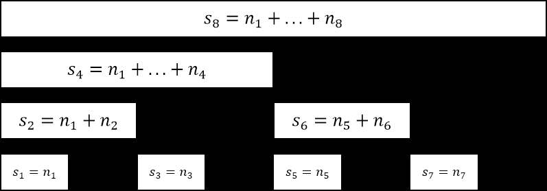

# 树状数组

树状数组的功能包含于线段树功能

[力扣307-树状数组法讲解](https://leetcode-cn.com/problems/range-sum-query-mutable/solution/by-fenjue-ewfb/)

[307.区域检索-数组可修改](../../LeetCode/307.区域和检索-数组可修改.cpp)


我们列出一下的表格

| x         | 1   | 2   | 3   | 4   | 5   | 6   | 7   | 8   | 9   |
| --------- | --- | --- | --- | --- | --- | --- | --- | --- | --- |
| lowbit(x) | 1   | 2   | 1   | 4   | 1   | 2   | 1   | 8   | 1   |



求前7项和：preSum(7)=s(7)+s(6)+s(4)

二进制规律：
```
每个数加自身的lowbit会得到一个新的数，新的数减去自身lowbit会向前跳过所有不停加lowbit得到新数的元素
```

## 认识
```

就以这一题为例:
设有：
数组nums:         1  3  2  4   5

前缀和数组prefix：1  4  6  10  15

正常一个线性数组的修改元素的时间复杂度为O(1),
求区间和的时间复杂度为O(right-left),最坏的时间复杂度为O(n)(即从1到n之间进行累加)

而如果用前缀和数组,那么修改某个某个元素的时间复杂度变成O(n)
(即在前缀和数组中,从这个元素后面的所有元素都得更新)
而求区间和的时间复杂度则为O(1)
举例：如修改nums[2]=0,那么prefix[2]=4,prefix[3]=8,prefix[4]=13

显然，上面两种办法修改元素和查询区间和的时间复杂度无法得到一个比较好的平衡,
而这时候有个叫树形数组的数据结构可以非常好地应对这么个情况。

树形数组可以使得：

1.修改元素时间复杂度O(logn)

2.区间和查询时间复杂度O(logn)

-----------------------------------------------------------

二进制

1=(001)      C[1]=A[1];
2=(010)      C[2]=A[1]+A[2];
3=(011)      C[3]=A[3];
4=(100)      C[4]=A[1]+A[2]+A[3]+A[4];
5=(101)      C[5]=A[5];
6=(110)      C[6]=A[5]+A[6];
7=(111)      C[7]=A[7];
8=(1000)     C[8]=A[1]+A[2]+A[3]+A[4]+A[5]+A[6]+A[7]+A[8];

这么说吧，这棵树的规律就是找出相应结点的二进制最后一位的1并该位后面的0也截出(后面会讲的lowBit函数)。
如5(101),最后一个1截出为1，那么它只有一个结点，那么他就是叶子结点。
如6(110),最后一个1截出为10，那么它这棵子树上有两个结点

非常重要：而某元素的父结点为该结点加上此结点的二进制截出最后一位的1(后面会讲的lowBit函数)。
如6(110)+2(010)=8(1000)
```

## lowbit
[求最后一个1后面的后缀](求最后一个1后面的后缀.md)
```cpp
    int lowBit(int x) {
        return x & -x;
    }
```

## 单点元素修改
```
结合上图： 
当更新A[1]时(设新的A[1]比原来增加了d),需要自下向上更新C[1],C[2],C[4],C[8]

写为二进制：C[(001)],C[(010)],C[(100)],C[(1000)]
 
lowBit(1)=001   1+lowBit(1)=2(010)     C[2]+=d
lowBit(2)=010   2+lowBit(2)=4(100)     C[4]+=d
lowBit(4)=100   4+lowBit(4)=8(1000)    C[8]+=d

总结规律：即找到1所在结点，然后用lowBit函数依次自下而上更新其所有父结点
```

## 求区间和
```
以求5-7之间的区间和为例，设区间和presum:

先求1-7之间的和，即7的前缀和。

                     7(111)            presum+=C[7]
lowBit(7)=001    7-lowBit(7)=6(110)    presum+=C[6]
lowBit(6)=010    6-lowBit(6)=4(100)    presum+=C[4]
lowBit(4)=100    4-lowBit(4)=0(000) 

总结规律：找到7所在结点，用lowBit函数不断消去最后一个1，并进行累加

再求1-5之间的和。

                     5(101)            presum+=C[5]
lowBit(5)=001    5-lowBit(5)=4(100)    presum+=C[4]
lowBit(4)=100    4-lowBit(4)=0(000) 

最后将两个前缀和相减就得到区间和了。
```


## code
### 官方
```cpp
class NumArray {
private:
    vector<int> tree;
    vector<int> &nums;

    int lowBit(int x) {
        return x & -x;
    }

    void add(int index, int val) {
        while (index < tree.size()) {
            tree[index] += val;
            index += lowBit(index);
        }
    }

    int prefixSum(int index) {
        int sum = 0;
        while (index > 0) {
            sum += tree[index];
            index -= lowBit(index);
        }
        return sum;
    }

public:
    NumArray(vector<int>& nums) : tree(nums.size() + 1), nums(nums) {
        for (int i = 0; i < nums.size(); i++) {
            add(i + 1, nums[i]);
        }
    }

    void update(int index, int val) {
        add(index + 1, val - nums[index]);
        nums[index] = val;
    }

    int sumRange(int left, int right) {
        return prefixSum(right + 1) - prefixSum(left);
    }
};

作者：LeetCode-Solution
链接：https://leetcode-cn.com/problems/range-sum-query-mutable/solution/qu-yu-he-jian-suo-shu-zu-ke-xiu-gai-by-l-76xj/
来源：力扣（LeetCode）
著作权归作者所有。商业转载请联系作者获得授权，非商业转载请注明出处。
```

### 讲解里
```cpp
class NumArray {
public:

    vector<int> A;// 原数组
    vector<int> C;   // 树状数组

    int lowBit(int x) {
        return x & (-x);
    }

    NumArray(vector<int>& nums):A(nums) {
        C = vector<int> (A.size() + 1, 0);
        //构造树形数组
        for(int i = 1; i<=A.size(); i ++) {
            C[i] += A[i - 1];
            //父结点要加上子结点的值
            if(i + lowBit(i) <= A.size()) C[i + lowBit(i)] += C[i];
        }
    }
    
    void update(int index, int val) {
        int&& d=val - A[index];
        for(int i = index + 1; i <= C.size() - 1; i += lowBit(i)) 
            C[i] += d; // 更新树状数组       
        A[index] = val; // 更新原数组
    }
    
    int sumRange(int left, int right) {
        int r = 0, l = 0;
        //求right的前缀和
        for(int i = right + 1; i >= 1; i -= lowBit(i)) r += C[i];
        //求left的前缀和
        for(int i = left; i >= 1; i -= lowBit(i)) l += C[i];
        return r - l;
    }
};

作者：fenjue
链接：https://leetcode-cn.com/problems/range-sum-query-mutable/solution/by-fenjue-ewfb/
来源：力扣（LeetCode）
著作权归作者所有。商业转载请联系作者获得授权，非商业转载请注明出处。
```