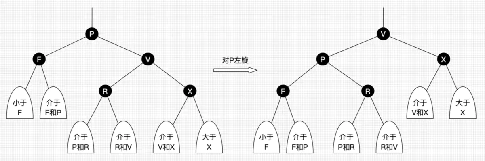
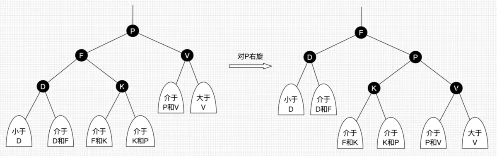
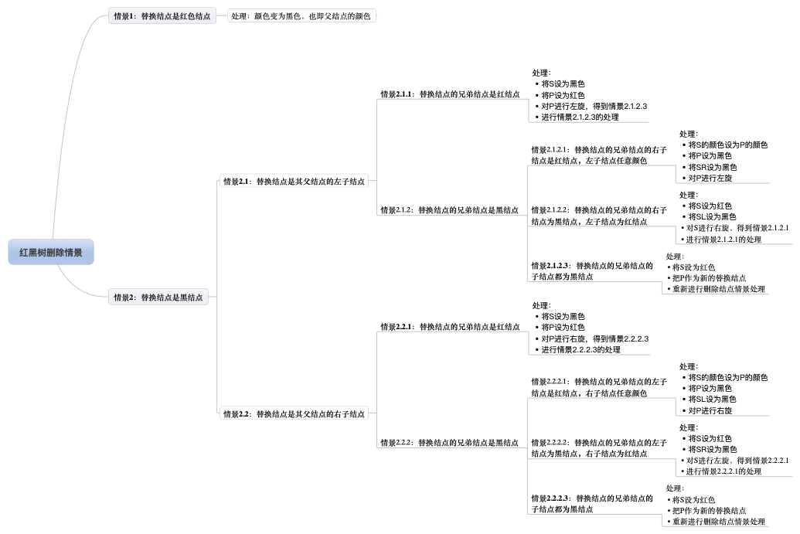
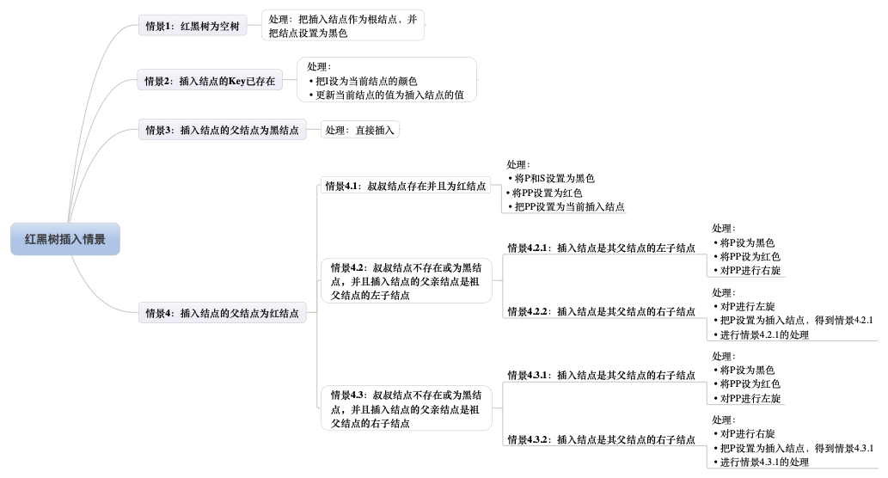

# 红黑树

[30张图带你彻底理解红黑树](https://www.jianshu.com/p/e136ec79235c)

## 要求
性质1：每个节点要么是黑色，要么是红色。
性质2：根节点是黑色。
性质3：每个叶子节点（NIL）是黑色。
性质4：每个红色结点的两个子结点一定都是黑色。
性质5：任意一结点到每个叶子结点的路径都包含数量相同的黑结点。

## 基本操作
左旋：以某个结点作为支点(旋转结点)，其右子结点变为旋转结点的父结点，右子结点的左子结点变为旋转结点的右子结点，左子结点保持不变。如图3。
右旋：以某个结点作为支点(旋转结点)，其左子结点变为旋转结点的父结点，左子结点的右子结点变为旋转结点的左子结点，右子结点保持不变。如图4。
变色：结点的颜色由红变黑或由黑变红

## 查找
就是简单的搜索二叉树的查找

## 删除节点
极其复杂

## 添加节点

