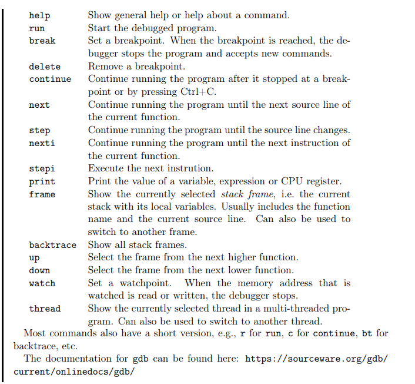

# gdb

vscode:`launch.json`
```json
{
	// Use IntelliSense to learn about possible attributes.
	// Hover to view descriptions of existing attributes.
	// For more information, visit: https://go.microsoft.com/fwlink/?linkid=830387
	"version": "0.2.0",
	"configurations": [
		{
			"name": "(gdb) Launch",
			"type": "cppdbg",
			"request": "launch",
			"program": "${workspaceRoot}/Server/server.out",
			"args": [],
			"stopAtEntry": false,
			"cwd": "${fileDirname}",
			"environment": [],
			"externalConsole": false,
			"MIMode": "gdb",
			"setupCommands": [
				{
					"description": "Enable pretty-printing for gdb",
					"text": "-enable-pretty-printing",
					"ignoreFailures": true
				},
				{
					"description": "Set Disassembly Flavor to Intel",
					"text": "-gdb-set disassembly-flavor intel",
					"ignoreFailures": true
				}
			]
		}
	]
}
```

```sh
$ clang++ -g -std=c++23 -o hello2 hello2.cpp
$ gdb ./hello2
(gdb) run
Program received signal SIGSEGV, Segmentation fault.
(gdb) backtrace
// ...
#16 in main (argc=0x1, argv=0x7fffffffe868) at hello2.cpp:3
(gdb) up 16
(gdb) print argc
1
(gdb) quit
```

