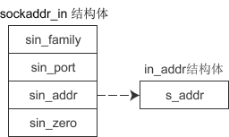
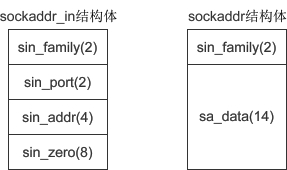

# sockaddr和sockaddr_in和in_addr

## sockaddr_in



```c
struct sockaddr_in{
    sa_family_t     sin_family;   //地址族（Address Family），也就是地址类型
    uint16_t        sin_port;     //16位的端口号
    struct in_addr  sin_addr;     //32位IP地址
    char            sin_zero[8];  //不使用，一般用0填充
};
```

1. sin_family 和 socket() 的第一个参数的含义相同，取值也要保持一致。

2. sin_prot 为端口号。uint16_t 的长度为两个字节，理论上端口号的取值范围为 0~65536，但 0~1023 的端口一般由系统分配给特定的服务程序，例如 Web 服务的端口号为 80，FTP 服务的端口号为 21，所以我们的程序要尽量在 1024~65536 之间分配端口号。

端口号需要用 [htons()](htons().md) 函数转换。

1. sin_addr 是 struct in_addr 结构体类型的变量，下面会详细讲解。

2. `sin_zero[8]` 是多余的8个字节，没有用，一般使用 memset() 函数填充为 0。上面的代码中，先用 memset() 将结构体的全部字节填充为 0，再给前3个成员赋值，剩下的 sin_zero 自然就是 0 了。

### in_addr

```c
struct in_addr{
    in_addr_t  s_addr;  //32位的IP地址
};
```

in_addr_t 在头文件 `<netinet/in.h>` 中定义，等价于 `unsigned long`，长度为4个字节。也就是说，`s_addr` 是一个整数，而IP地址是一个字符串，所以需要 `inet_addr()` 函数进行转换，例如：
```c
unsigned long ip = inet_addr("127.0.0.1");
printf("%ld\n", ip);
//运行结果：
//16777343
//00000001 00000000 00000000 01111111
//127.0.0.1
//01111111 00000000 00000000 00000001
```

## sockaddr

```c
struct sockaddr{
	sa_family_t sa_family;  //地址族（Address Family），也就是地址类型
	char        sa_data[14];  //14字节的协议地址
};
```

下图是 sockaddr 与 sockaddr_in 的对比（括号中的数字表示所占用的字节数）：



**sockaddr 和 sockaddr_in 的长度相同，都是16字节**，只是将IP地址和端口号合并到一起，用一个成员 `sa_data` 表示。要想给 sa_data 赋值，必须同时指明IP地址和端口号，例如"127.0.0.1:80"，遗憾的是，没有相关函数将这个字符串转换成需要的形式，也就很难给 sockaddr 类型的变量赋值，所以使用 sockaddr_in 来代替。这两个结构体的长度相同，强制转换类型时不会丢失字节，也没有多余的字节。

**可以认为，sockaddr 是一种通用的结构体，可以用来保存多种类型的IP地址和端口号，而 sockaddr_in 是专门用来保存 IPv4 地址的结构体。另外还有 sockaddr_in6，用来保存 IPv6 地址，它的定义如下：**

## sockaddr_in6

```c
struct sockaddr_in6 { 
    sa_family_t sin6_family;  //(2)地址类型，取值为AF_INET6
    in_port_t sin6_port;  //(2)16位端口号
    uint32_t sin6_flowinfo;  //(4)IPv6流信息
    struct in6_addr sin6_addr;  //(4)具体的IPv6地址
    uint32_t sin6_scope_id;  //(4)接口范围ID
};
```

**正是由于通用结构体 sockaddr 使用不便，才针对不同的地址类型定义了不同的结构体。**