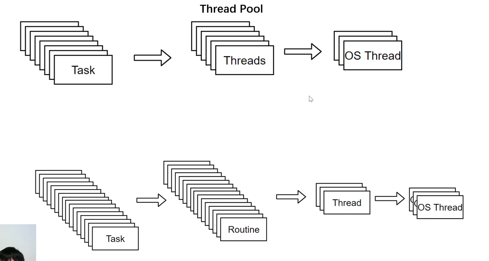

# 进程_线程_协程

## 进程
应用程序的执行副本

## 线程
状态：
就绪-运行-阻塞

**多线程**时候：
CPU会**时间片轮转**。多核CPU就多个核在轮转。

但是轮转很快，linux：5ms-800ms。这就是多线程本质。

现在CPU可以提供***虚拟CPU***给每个线程，每个线程都以为自己独占CPU,就**不需要考虑时间片轮转**了。

## 进程，线程和操作系统关系

**每个进程都包含一个主线程。**

**操作系统不用建立进程包含线程的模型，完全可以两用两张不同的表独立存储，进程管拿资源，线程执行程序。**

⭐⭐⭐**打开软件->出现进程，进程向操作系统注册一个主线程，或者之后比如java创建了一个线程只是一个Object就需要挂靠到操作系统线程表中的一个新线程上执行(可以使用线程池等手段见少线程表中的真线程)，只有操作系统的线程表里的线程才是真线程（Kernel Thread），程序员写的都是虚拟线程（User Thread），两者关系可以是 1:1(Java),1:n,n:m。**

## 协程
Coroutine协程 就是 routine（理解为轻量级的线程） 的一种实现

Go语言就是Routine。

## 线程，协程

一百万个Task->一百万个Routine->share线程->share线程(也有可能不share就是创建一个新线程)
