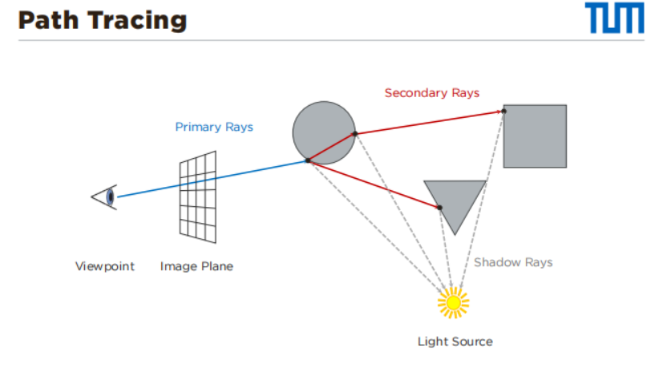
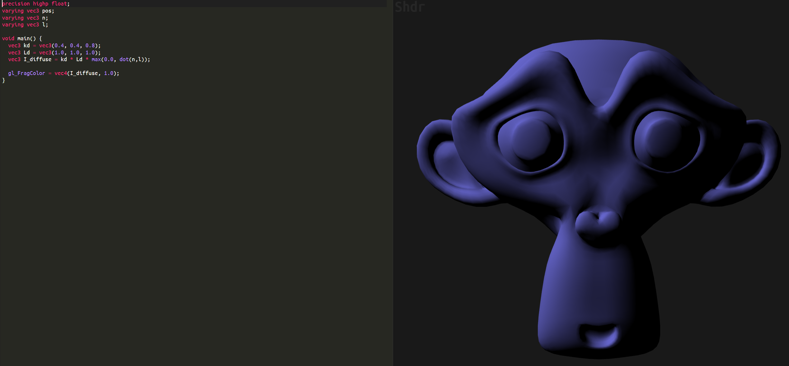
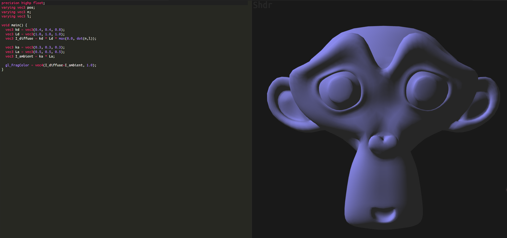
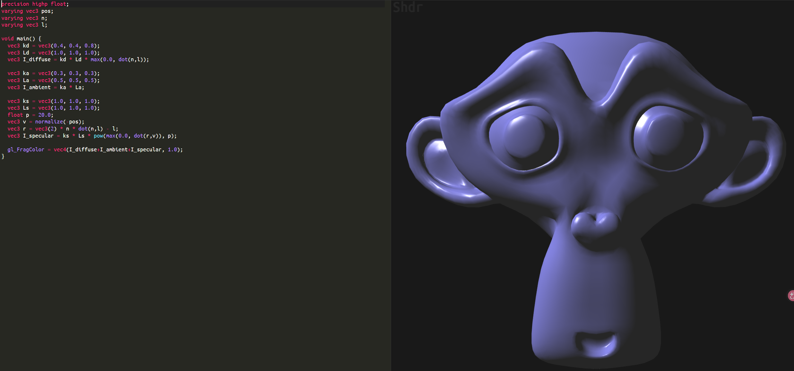
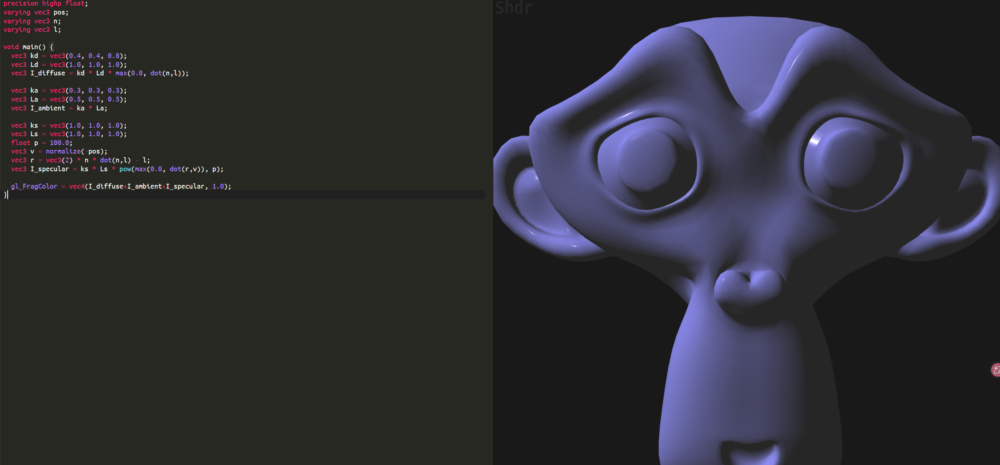
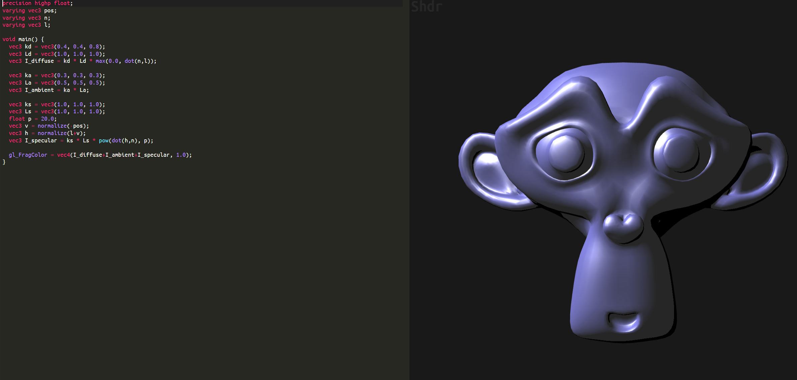

# 01-1 Outlook & Recap I

- [0. 总览：两种渲染范式（必考对比）](#0-总览两种渲染范式必考对比)
  - [Ray Tracing](#ray-tracing)
  - [Rasterization](#rasterization)
- [1. Illumination（“光照/照明”）概念澄清（考试常问）](#1-illumination光照照明概念澄清考试常问)
- [2. Ray Tracing](#2-ray-tracing)
  - [2.1 Ray Casting / Ray Tracing Principle（伪代码结构）](#21-ray-casting--ray-tracing-principle伪代码结构)
  - [2.2 射线参数方程（你必须会解释每一项）](#22-射线参数方程你必须会解释每一项)
  - [2.3 Naïve Ray Tracing 成本（复杂度必考）](#23-naïve-ray-tracing-成本复杂度必考)
- [3. Path Tracing（全局光照的典型实现）](#3-path-tracing全局光照的典型实现)
  - [3.1 三类射线（概念必会）](#31-三类射线概念必会)
  - [3.2 Bounce（反弹次数）与效果](#32-bounce反弹次数与效果)
  - [3.3 “Samples=512”是什么意思（常见误解点）](#33-samples512是什么意思常见误解点)
  - [3.4 “如果路径没碰到光源怎么办？”](#34-如果路径没碰到光源怎么办)
- [4. Rendering Equation（渲染方程，整章核心公式）](#4-rendering-equation渲染方程整章核心公式)
  - [4.1 单色（monochromatic）形式](#41-单色monochromatic形式)
  - [4.2 波长（wavelength）扩展](#42-波长wavelength扩展)
  - [4.3 实践中的 RGB（三刺激）近似](#43-实践中的-rgb三刺激近似)
  - [4.4 递归的来源（必须理解）](#44-递归的来源必须理解)
- [5. BRDF（你要求：全名必须完整）](#5-brdf你要求全名必须完整)
  - [5.1 全名与含义](#51-全名与含义)
- [6. Rasterization（光栅化）](#6-rasterization光栅化)
  - [6.1 Rasterization Principle（伪代码结构）](#61-rasterization-principle伪代码结构)
  - [6.2 数据流（必会）](#62-数据流必会)
  - [6.3 Rendering Pipeline（两阶段）](#63-rendering-pipeline两阶段)
- [7. Vertex Shader（必考特性）](#7-vertex-shader必考特性)
  - [7.1 执行粒度](#71-执行粒度)
  - [7.2 能做什么（常见）](#72-能做什么常见)
  - [7.3 不能做什么（爱考）](#73-不能做什么爱考)
- [8. Coordinate Systems（坐标系链条，必背）](#8-coordinate-systems坐标系链条必背)
  - [8.1 空间链](#81-空间链)
  - [8.2 矩阵链（顺序必会）](#82-矩阵链顺序必会)
  - [8.3 Clip → NDC（透视除法）](#83-clip--ndc透视除法)
  - [8.4 Viewport Transform（NDC → Screen，常考）](#84-viewport-transformndc--screen常考)
- [9. Framebuffer（必考组件）](#9-framebuffer必考组件)
  - [9.1 Depth Test（核心）](#91-depth-test核心)
  - [9.2 Double Buffering（防闪烁/撕裂）](#92-double-buffering防闪烁撕裂)
- [10. Local Illumination（Phong / Blinn-Phong）](#10-local-illuminationphong--blinn-phong)
  - [10.1 经验观察（Phong 1975）](#101-经验观察phong-1975)
  - [10.2 Diffuse（Lambert）](#102-diffuselambert)
  - [10.3 Ambient](#103-ambient)
  - [10.4 Specular（Phong）](#104-specularphong)
    - [(1) 反射向量 r（你要求：不能漏）](#1-反射向量-r你要求不能漏)
    - [(2) 镜面项公式](#2-镜面项公式)
  - [10.5 Blinn-Phong（halfway vector）](#105-blinn-phonghalfway-vector)
  - [10.6 总和（Phong illumination model）](#106-总和phong-illumination-model)
- [11. 高频考点清单（快速复习）](#11-高频考点清单快速复习)


## 0. 总览：两种渲染范式（必考对比）

### Ray Tracing
- **Image-based rendering（按像素驱动）**
- 从相机出发穿过像素发射射线：解决可见性（visibility）与光传输（light transport）
- **Global Illumination（全局光照）**：可模拟间接光、多次反射、颜色传递等
- 通常离线（offline），质量高但昂贵

### Rasterization
- **Object-based rendering（按物体驱动）**
- 3D 几何投影到屏幕 + 光栅化 + 深度测试
- **Local Illumination（局部光照）**：通常只算直接光/经验模型（Phong/Blinn-Phong/PBR-材质模型）
- 通常实时（realtime），效率高但不物理完整

---

## 1. Illumination（“光照/照明”）概念澄清（考试常问）
- Illumination：计算某点在某方向的出射光（radiance）
- **Local Illumination**：只考虑直接光（以及人为加的 ambient 等近似），不追踪多次反射
- **Global Illumination**：考虑多次反射/间接光/颜色传递（color bleeding）等，目标是近似/求解渲染方程

> PBR（Physically Based Rendering）通常是 **更物理合理的 BRDF/材质模型**，本身仍属于“局部反射模型”范畴；是否 global 取决于是否做多次光传输（path tracing 等）。

---

## 2. Ray Tracing

相关阅读 [Ray Tracing基础](../计算机图形学知识积累/RayTracing基础.md)

理解用关键词: blender 软件里参数包含 Ray Per Pixel, Secondary Rays, Light Sources

### 2.1 Ray Casting / Ray Tracing Principle（伪代码结构）
对每个像素：
1) 生成视线射线  
2) 与场景求交（intersection）  
3) 在交点计算着色（shading），写入图像

---

### 2.2 射线参数方程（你必须会解释每一项）
射线表示一条从相机出发的半直线：

$$
\mathbf{r}(t) = \mathbf{o} + t\,\mathbf{d}, \quad t \ge 0
$$

- $\mathbf{o}$：ray origin（通常是 camera position / viewpoint）
- $\mathbf{d}$：ray direction（单位向量，指向像素在成像平面上的点）
- $t$：沿着方向 $\mathbf{d}$ 走的“距离参数”（不是时间）。  
  - $t=0$ 在相机位置  
  - $t$ 增大表示沿射线前进

**为什么从相机/像素方向出发？**  
因为我们只关心“进入相机、影响像素”的光。若从光源向全空间发射，绝大多数光线不会进入相机，计算浪费巨大。  
这种“从相机出发”常称 **Backward Ray Tracing / Adjoint 视角**：计算顺序反向，但目标仍是求 $L_o(x,\omega_o)$（朝相机方向的出射光）。

---

### 2.3 Naïve Ray Tracing 成本（复杂度必考）
朴素求交：每条 ray 测试所有三角形

- $m$：像素数量
- $n$：三角形数量

时间复杂度：

$$
O(m \cdot n)
$$

瓶颈通常是 **intersection tests**，而不是 shading。

---

## 3. Path Tracing（全局光照的典型实现）



### 3.1 三类射线（概念必会）
- **Primary Rays**：相机 → 像素方向 → 场景
- **Shadow Rays**：交点 → 光源方向（测试遮挡，计算直接光）
- **Secondary Rays**：交点 → 采样方向（用于间接光，多次反射/折射等）

### 3.2 Bounce（反弹次数）与效果
- Bounce=0：只直接光（阴影区域很黑、缺少颜色传递）
- Bounce 增加：出现间接光、color bleeding、软阴影等，图像更真实
- 能量会衰减：反射率 < 1，因此高阶反射贡献快速变小

### 3.3 “Samples=512”是什么意思（常见误解点）
- **512 samples 通常指每个像素生成 512 条独立路径（paths）**，最后平均得到该像素颜色
- 不是“每个 bounce 发 512 条射线”
- 在经典 path tracing 中，每条路径每个 bounce 通常只继续 **1 条** next-direction 的 secondary ray（+ 可能再额外发 1 条 shadow ray 用于 direct lighting）

### 3.4 “如果路径没碰到光源怎么办？”
- 一条路径可能最终不连接到光源，贡献可以是 0
- Monte Carlo 积分允许大量样本为 0，只要样本数足够会统计收敛
- 实际渲染通常用 **direct light sampling / Next Event Estimation** 和 **importance sampling** 降噪、加快收敛（概念理解即可）

---

## 4. Rendering Equation（渲染方程，整章核心公式）

### 4.1 单色（monochromatic）形式
$$
L_o(x,\omega_o) = L_e(x,\omega_o) + \int_{\Omega} f(x,\omega_i,\omega_o)\,\cos\theta \, L_i(x,\omega_i)\, d\omega_i
$$

解释每项（必会）：
- $L_o(x,\omega_o)$：出射辐射亮度（从点 $x$ 朝方向 $\omega_o$ 出去的光）
- $L_e(x,\omega_o)$：自发光（点 $x$ 自己发出的光；非光源通常为 0）
- $\Omega$：点 $x$ 上方半球方向集合（对所有入射方向积分）
- $f(x,\omega_i,\omega_o)$：**BRDF**（见下节）
- $\cos\theta$：Lambert cosine term，$\theta$ 为入射方向与法线夹角
- $L_i(x,\omega_i)$：入射辐射亮度（从方向 $\omega_i$ 进入 $x$ 的光）

### 4.2 波长（wavelength）扩展
$$
L_o(x,\omega_o,\lambda) = L_e(x,\omega_o,\lambda) + \int_{\Omega} f(x,\omega_i,\omega_o,\lambda)\,\cos\theta \, L_i(x,\omega_i,\lambda)\, d\omega_i
$$

### 4.3 实践中的 RGB（三刺激）近似
通常只算三通道（R/G/B），分别一套方程：
$$
R(x,\omega_o)=L_e(x,\omega_o,R)+\int_{\Omega} f(\cdot,R)\cos\theta\,L_i(\cdot,R)\,d\omega_i
$$
$$
G(x,\omega_o)=L_e(x,\omega_o,G)+\int_{\Omega} f(\cdot,G)\cos\theta\,L_i(\cdot,G)\,d\omega_i
$$
$$
B(x,\omega_o)=L_e(x,\omega_o,B)+\int_{\Omega} f(\cdot,B)\cos\theta\,L_i(\cdot,B)\,d\omega_i
$$

> 为什么 shading 返回 RGB？  
> 物理上光是连续光谱 $\lambda$，但显示器/人眼通常用三通道近似表示，因此渲染系统输出 RGB。

### 4.4 递归的来源（必须理解）
$L_i(x,\omega_i)$ 通常等于射线沿方向 $\omega_i$ 命中的下一个点 $x'$ 的出射光：
$$
L_i(x,\omega_i) = L_o(x', -\omega_i)
$$
因此形成递归光传输问题；Path Tracing 用 Monte Carlo 采样近似积分并递归估计。

---

## 5. BRDF（你要求：全名必须完整）

### 5.1 全名与含义
**BRDF = Bidirectional Reflectance Distribution Function（双向反射分布函数）**

$$
f(x,\omega_i,\omega_o)
$$

描述在点 $x$：
- 光从方向 $\omega_i$ 入射
- 有多少会被反射到方向 $\omega_o$

BRDF 决定材料反射特性（漫反射/镜面反射/粗糙度等），也是 PBR 的核心组成之一。

---

## 6. Rasterization（光栅化）

### 6.1 Rasterization Principle（伪代码结构）
对每个 object：
1) 投影到屏幕（project）
2) 光栅化为 fragments（rasterize）
3) fragment shading
4) 写入 framebuffer（经过测试后成为 pixels）

### 6.2 数据流（必会）
**Vertices → Primitives → Fragments → Pixels**

- **Fragment ≠ Pixel**  
  Fragment 是“像素候选”，还要经过 depth test / stencil / blending 等才能成为最终像素。

### 6.3 Rendering Pipeline（两阶段）
- **Geometry Stage**：处理几何（顶点变换等）
- **Rasterization Stage**：生成 fragments 并处理像素相关操作

---

## 7. Vertex Shader（必考特性）

### 7.1 执行粒度
- vertex shader 对 **每个顶点** 执行一次

### 7.2 能做什么（常见）
- 顶点/法线几何变换
- 光照计算（可做 Gouraud）
- 纹理坐标生成/变换
- 法线归一化
- 自定义裁剪等

### 7.3 不能做什么（爱考）
- 不能访问相邻顶点
- 不能改变顶点数量（不能生成/删除顶点）
- 输出必须包含最终顶点 clip 坐标，例如：
$$
gl\_Position = \text{vec4}(...)
$$

---

## 8. Coordinate Systems（坐标系链条，必背）

### 8.1 空间链
Local → World → View → Clip → Screen

### 8.2 矩阵链（顺序必会）
$$
\mathbf{v}_{clip} = M_p \, M_v \, M_m \, \mathbf{v}_{local}
$$

- $M_m$：Model matrix（local → world）
- $M_v$：View matrix（world → view/camera）
- $M_p$：Projection matrix（view → clip）

### 8.3 Clip → NDC（透视除法）
给定 clip 坐标 $(x_c,y_c,z_c,w_c)$：
$$
x_{ndc} = \frac{x_c}{w_c},\quad y_{ndc}=\frac{y_c}{w_c},\quad z_{ndc}=\frac{z_c}{w_c}
$$

### 8.4 Viewport Transform（NDC → Screen，常考）
屏幕宽 $W$、高 $H$：
$$
x_{screen} = \frac{x_{ndc}+1}{2}\,W
$$
$$
y_{screen} = \frac{y_{ndc}+1}{2}\,H
$$
深度通常映射到 $[0,1]$ 供 depth buffer 使用。

---

## 9. Framebuffer（必考组件）

Framebuffer 是一组按像素对齐的缓冲区（同分辨率）：
- **Color buffer**（存 RGBA）
- **Depth buffer / Z-buffer**（存深度，用于可见性）
- **Stencil buffer**（模板测试/特效等）

### 9.1 Depth Test（核心）
- 同一像素可能产生多个 fragments
- depth test 保留最近的那个（解决遮挡/可见性）

### 9.2 Double Buffering（防闪烁/撕裂）
- **Front buffer**：正在显示
- **Back buffer**：后台渲染下一帧
- 渲染完成后交换（swap），避免显示半渲染帧造成 flicker/tearing

---

## 10. Local Illumination（Phong / Blinn-Phong）

### 10.1 经验观察（Phong 1975）
反射现象：
- 依赖观察者位置（specular）
- 依赖材料属性
- 包含 diffuse + specular（常再加 ambient）

### 10.2 Diffuse（Lambert）
$$
I_{diffuse} = \mathbf{k_d} \cdot \mathbf{L} \cdot \max(0, \mathbf{l}\cdot \mathbf{n})
$$
- $\mathbf{k_d}$：漫反射材料系数（可为 RGB）
- $\mathbf{L}$：光源强度（可为 RGB）
- $\mathbf{n}$：法线（单位向量）
- $\mathbf{l}$：指向光源方向（单位向量）
- $\max(0,\cdot)$：背面不发光（Lambert）



```c
precision highp float;
varying vec3 pos;
varying vec3 n;
varying vec3 l;

void main() {
  vec3 kd = vec3(0.4, 0.4, 0.8);
  vec3 Ld = vec3(1.0, 1.0, 1.0);
  vec3 I_diffuse = kd * Ld * max(0.0, dot(n,l));
  
  gl_FragColor = vec4(I_diffuse, 1.0);
}
```


### 10.3 Ambient
$$
I_{ambient} = \mathbf{k_a} \cdot \mathbf{L_a}
$$
- 模拟“房间整体亮度”的粗糙近似（非物理全局光）




```c
precision highp float;
varying vec3 pos;
varying vec3 n;
varying vec3 l;

void main() {
  vec3 kd = vec3(0.4, 0.4, 0.8);
  vec3 Ld = vec3(1.0, 1.0, 1.0);
  vec3 I_diffuse = kd * Ld * max(0.0, dot(n,l));
  
  vec3 ka = vec3(0.3, 0.3, 0.3);
  vec3 La = vec3(0.5, 0.5, 0.5);
  vec3 I_ambient = ka * La;
  
  gl_FragColor = vec4(I_diffuse+I_ambient, 1.0);
}
```


### 10.4 Specular（Phong）
#### (1) 反射向量 r（你要求：不能漏）
给定单位向量 $\mathbf{n},\mathbf{l}$：
$$
\mathbf{r} = 2(\mathbf{n}\cdot \mathbf{l})\mathbf{n} - \mathbf{l}
$$

#### (2) 镜面项公式
$$
I_{specular} = \mathbf{k_s} \cdot \mathbf{L} \cdot \max(0,\mathbf{r}\cdot \mathbf{v})^{p}
$$
- $\mathbf{k_s}$：镜面材料系数（可为 RGB）
- $\mathbf{v}$：指向观察者方向（单位向量）
- $p$：specular exponent（控制高光尖锐程度，$p$ 越大高光越小越尖）



```c
precision highp float;
varying vec3 pos;
varying vec3 n;
varying vec3 l;

void main() {
  vec3 kd = vec3(0.4, 0.4, 0.8);
  vec3 Ld = vec3(1.0, 1.0, 1.0);
  vec3 I_diffuse = kd * Ld * max(0.0, dot(n,l));
  
  vec3 ka = vec3(0.3, 0.3, 0.3);
  vec3 La = vec3(0.5, 0.5, 0.5);
  vec3 I_ambient = ka * La;
  
  vec3 ks = vec3(1.0, 1.0, 1.0);
  vec3 Ls = vec3(1.0, 1.0, 1.0);
  float p = 20.0;
  vec3 v = normalize(-pos);
  vec3 r = vec3(2) * n * dot(n,l) - l;
  vec3 I_specular = ks * Ls * pow(max(0.0, dot(r,v)), p);
  
  gl_FragColor = vec4(I_diffuse+I_ambient+I_specular, 1.0);
}
```

对比 `p=100`:

* Blinn-Phong 的 p = 100 也是一样的
* 并没有更亮，只是更小更尖了（高光范围更小了）



### 10.5 Blinn-Phong（halfway vector）
Halfway vector：
$$
\mathbf{h} = \frac{\mathbf{l} + \mathbf{v}}{\|\mathbf{l} + \mathbf{v}\|}
$$
镜面项：
$$
I_{specular} = \mathbf{k_s}\cdot \mathbf{L}\cdot \max(0,\mathbf{n}\cdot \mathbf{h})^{p}
$$

### 10.6 总和（Phong illumination model）
$$
I = I_{ambient} + I_{diffuse} + I_{specular}
$$



```c
precision highp float;
varying vec3 pos;
varying vec3 n;
varying vec3 l;

void main() {
  vec3 kd = vec3(0.4, 0.4, 0.8);
  vec3 Ld = vec3(1.0, 1.0, 1.0);
  vec3 I_diffuse = kd * Ld * max(0.0, dot(n,l));
  
  vec3 ka = vec3(0.3, 0.3, 0.3);
  vec3 La = vec3(0.5, 0.5, 0.5);
  vec3 I_ambient = ka * La;
  
  vec3 ks = vec3(1.0, 1.0, 1.0);
  vec3 Ls = vec3(1.0, 1.0, 1.0);
  float p = 20.0;
  vec3 v = normalize(-pos);
  vec3 h = normalize(l+v);
  vec3 I_specular = ks * Ls * pow(dot(h,n), p);
  
  gl_FragColor = vec4(I_diffuse+I_ambient+I_specular, 1.0);
}
```

---

## 11. 高频考点清单（快速复习）
1. Ray Tracing vs Rasterization：image-based vs object-based；global vs local
2. Naïve ray tracing 复杂度 $O(mn)$，瓶颈是 intersection
3. Path tracing：samples=像素路径数；bounce=最大递归深度；大量路径可为 0
4. Rendering equation 各项物理意义；为什么是积分；为什么递归
5. BRDF 全名与含义：Bidirectional Reflectance Distribution Function
6. Rasterization pipeline：vertices→primitives→fragments→pixels；fragment≠pixel
7. 坐标链：$v_{clip}=M_p M_v M_m v_{local}$；viewport transform 公式
8. Framebuffer：color/depth/stencil；depth test 解决可见性；double buffering 防闪烁/撕裂
9. Phong/Blinn-Phong：diffuse/ambient/specular；反射向量 $\mathbf{r}$；指数 $p$ 的作用

