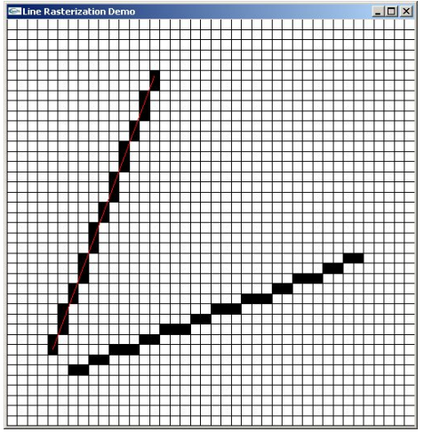
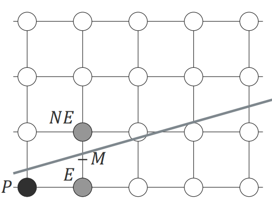
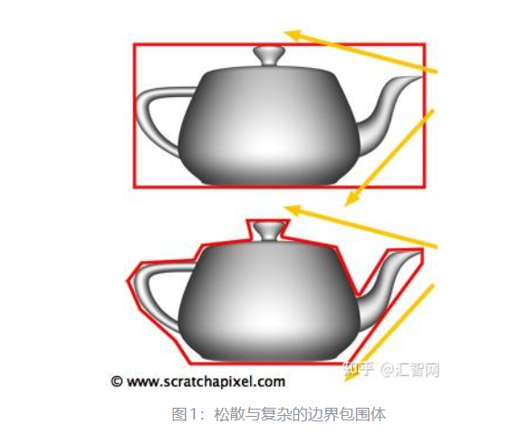
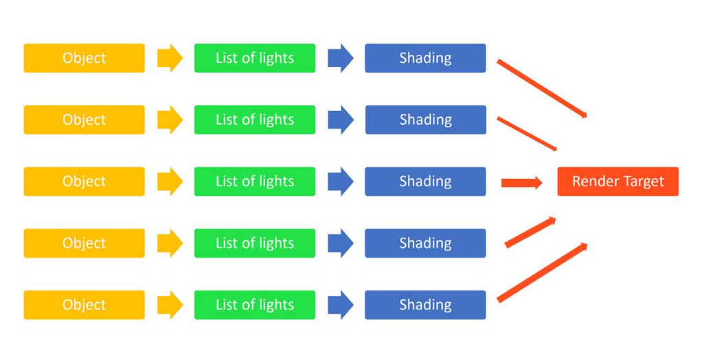
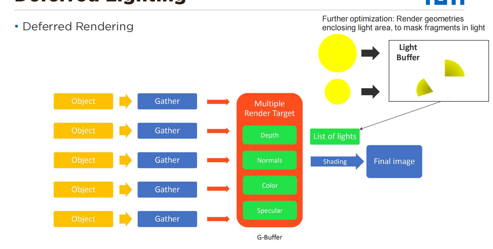

# 01-2 Recap II

- [1. Line Rasterization](#1-line-rasterization)
  - [目标](#目标)
  - [质量标准](#质量标准)
  - [Naïve 方法](#naïve-方法)
  - [DDA](#dda)
  - [Midpoint / Bresenham](#midpoint--bresenham)
- [2. Triangle Rasterization](#2-triangle-rasterization)
  - [三个步骤](#三个步骤)
  - [Scanline 方法](#scanline-方法)
- [3. Vertex Attribute Interpolation](#3-vertex-attribute-interpolation)
  - [双线性插值（Scanline）](#双线性插值scanline)
  - [重心坐标插值](#重心坐标插值)
- [4. Shading](#4-shading)
  - [定义](#定义)
  - [Flat Shading](#flat-shading)
  - [Gouraud Shading](#gouraud-shading)
  - [Phong Shading](#phong-shading)
- [5. GPUs 与并行模型](#5-gpus-与并行模型)
  - [GPU 特性](#gpu-特性)
- [6. Ray Tracing 成本](#6-ray-tracing-成本)
- [7. Acceleration Structures](#7-acceleration-structures)
  - [Bounding Volume](#bounding-volume)
  - [BVH](#bvh)
- [8. Deferred Shading](#8-deferred-shading)
  - [Forward Rendering](#forward-rendering)
  - [Deferred Pipeline](#deferred-pipeline)
    - [Geometry Pass](#geometry-pass)
    - [Lighting Pass](#lighting-pass)
- [9. Texturing](#9-texturing)
  - [定义](#定义-1)
  - [采样](#采样)
    - [Nearest](#nearest)
    - [Bilinear](#bilinear)
  - [Minification 问题](#minification-问题)
  - [MIP Mapping](#mip-mapping)

## 1. Line Rasterization

### 目标
给定两个整数端点 $(x_0,y_0)$ 和 $(x_1,y_1)$，绘制 1 像素宽直线。

### 质量标准
- 若 $|m| \le 1$：每列一个像素
- 若 $|m| \ge 1$：每行一个像素
- 线宽与斜率无关

### Naïve 方法
使用直线方程：

$$
y = mx + B
$$

问题：
- 不能处理 $x_0 = x_1$
- $|m| > 1$ 会出现空洞
- 浮点运算
- rounding 破坏可逆性

### DDA
利用增量：

$$
(x,y) \to (x+1, y+m)
$$

仍存在：
- 浮点
- rounding
- $|m|>1$ 需交换 $x,y$

### Midpoint / Bresenham
- 仅整数运算
- 比较中点 $M$ 在直线的上/下
  - $x_{next} = x + 1$
  - E（east）：$y_{next} = y$
  - NE（northeast）：$y_{next} = y + 1$
- 每步只加减
- 通过轴交换统一处理任意斜率

---

## 2. Triangle Rasterization

### 三个步骤
1. 确定三条边
2. 填充内部
3. 插值顶点属性

### Scanline 方法

顶点按 $y$ 排序：

$$
y_0 \le y_1 \le y_2
$$

分为：
- 下半部分（$E_{01}, E_{02}$）
- 上半部分（$E_{02}, E_{12}$）

边斜率：

$$
\Delta_{02} = \frac{x_2 - x_0}{y_2 - y_0}
$$

$$
\Delta_{01} = \frac{x_1 - x_0}{y_1 - y_0}
$$

$$
\Delta_{12} = \frac{x_2 - x_1}{y_2 - y_1}
$$

扫描线填充：
- 每行求 $x_{left}, x_{right}$
- 填充区间

---

## 3. Vertex Attribute Interpolation

### 双线性插值（Scanline）

沿边插值：

$$
z_{left} = z_0 + \frac{y_s - y_0}{y_2 - y_0}(z_2 - z_0)
$$

沿扫描线插值：

$$
z = z_{left} + \frac{x - x_{left}}{x_{right} - x_{left}}(z_{right} - z_{left})
$$

---

### 重心坐标插值

点表示为：

$$
\mathbf{p} = \lambda_a \mathbf{a} + \lambda_b \mathbf{b} + \lambda_c \mathbf{c}
$$

$$
\lambda_a + \lambda_b + \lambda_c = 1
$$

面积比：

$$
\lambda_a = \frac{Area(PBC)}{Area(ABC)}
$$

属性插值：

$$
f(P) = \lambda_a f_a + \lambda_b f_b + \lambda_c f_c
$$

---

## 4. Shading

### 定义
Shading = 在片元上应用 illumination model 计算颜色。

### Flat Shading
- 每三角形一次光照计算
- 整个三角形常量颜色
- 易出现分面感

---

### Gouraud Shading
- 顶点运行 illumination model
- 插值强度
- 高光可能丢失
- 依赖顶点法线

顶点法线：
- 相邻面法线加权平均
- 归一化

---

### Phong Shading
- 插值法线
- 每像素运行 illumination model
- 需归一化法线

$$
\mathbf{n} = \frac{\mathbf{n}}{\|\mathbf{n}\|}
$$

优点：
- 高光正确
- 像素级精度

缺点：
- 计算量大

---

## 5. GPUs 与并行模型

### GPU 特性
- SIMD / SIMT
- 大规模并行
- 同一指令流处理多数据

Warp：
- 同一 warp 内线程 lock-step 执行
- 分支发散（divergence）降低效率

Rasterization 适合 GPU：
- 相同 shader
- 数据独立
- 无递归

---

## 6. Ray Tracing 成本

Naïve 复杂度：

$$
O(m \cdot n)
$$

$m$ = 像素数  
$n$ = 三角形数  

例如：

$$
512^2 \times 21248 \approx 2\times 10^9
$$

---

## 7. Acceleration Structures

### Bounding Volume

用简单几何体包围复杂物体：
- Sphere
- AABB
- OBB
- Slabs

Ray–Slab 求交：
计算 $t$ 区间并取交集。

---

### BVH

树结构：
- 内节点：包围体
- 叶节点：几何体

平均复杂度：

$$
O(\log n)
$$

构建复杂度：

$$
O(n \log n)
$$

---

## 8. Deferred Shading

### Forward Rendering

$$
\text{triangles} \times \text{lights}
$$

大量无效 shading。

---

### Deferred Pipeline

#### Geometry Pass
写入 G-Buffer：
- Depth
- Normal
- Albedo
- Glossiness

#### Lighting Pass
- 屏幕空间计算光照
- 只对可见 fragment

优点：
- 几何与光照解耦
- 多光源高效

缺点：
- 内存开销大
- 透明物体需 forward

---

## 9. Texturing

### 定义
Texture = 多维图像数据  
Texel = 纹理元素  

纹理坐标 $(s,t)$ ∈ $[0,1]$。

---

### 采样

#### Nearest
- 最近 texel
- 易 aliasing

#### Bilinear

对四个 texel 加权：

$$
f(s,t) = (1-\beta)f_0 + \beta f_1
$$

---

### Minification 问题
缩小时：
- 一个 pixel 覆盖多个 texel
- 产生 aliasing

---

### MIP Mapping

构建纹理金字塔：

Level 0：

$$
2^N \times 2^N
$$

Level $k$：

$$
2^{N-k} \times 2^{N-k}
$$

内存增加约：

$$
33\%
$$