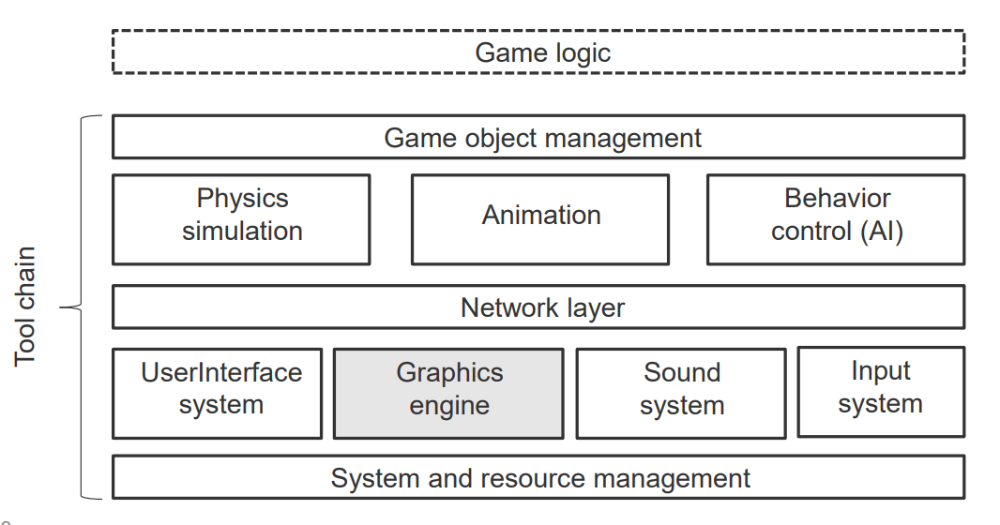
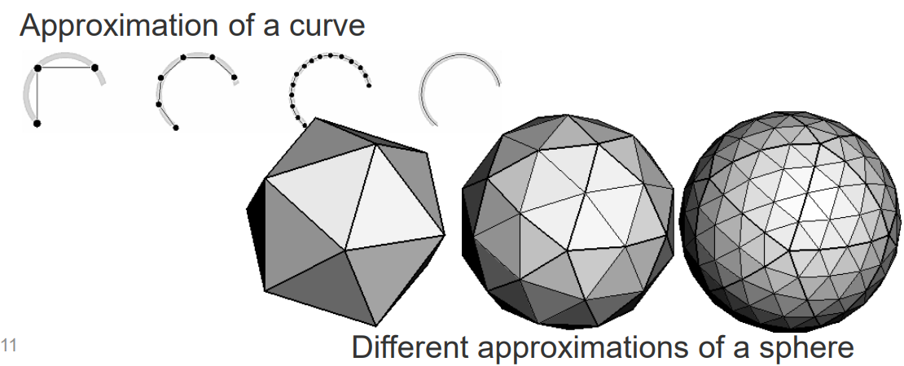
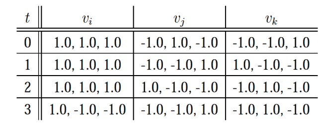
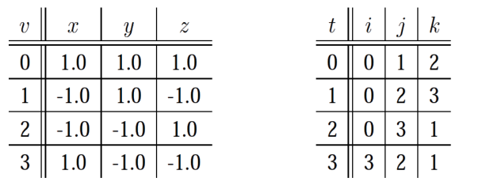

# 01 Geometry

## Introduction

### Game Engine Components

### Data in game engine
- Level data(关卡数据)：关卡中的物体在哪里，它们如何在关卡中移动
- Object configuration data(物体配置数据)： 物体的物理属性和行为控制数据
- User interface configuration data(用户界面配置数据)：输入设备和如何映射到游戏
- Engine configuration data(引擎配置数据)：驱动，分辨率
- Media assets(媒体资源): **geometric objects(几何对象)**，纹理，动画，声音

## Geometry Objects
* 通常通过所谓的几何建模工具创建几何游戏对象
* 建模Modelling可以分为两部分：
  * **Shape modelling 形状建模**：放置几何原语以良好地表示模型的形状
  * **Appearance modelling 外观建模**：为对象分配材料属性，如颜色，反射属性，纹理等​

## Geometry model representation (几何模型表示)

模型通常是连续对象的多边形近似，即接近真实世界的类似物​
1. 什么是**多边形**
    * 它由点组成，通常在三维空间ℝ3中
    * 点由其x/y/z坐标表示；它称为顶点
    * 点通过线段（边）连接
    * 线段以其端点处的顶点来指定
    * 多边形是**封闭**平面连接线段系列的内部
    * 边不交叉，每个顶点恰好有两条边相遇
    * 分类
        * Convex: 凸多边形
        * Concave: 凹多边形
2. 什么是**多边形网格(mesh)**
    * 表面由多边形（面）组成
      * **不一定封闭**，但如果封闭，则假定对象为空心​
3. polygonal approximation
   1. 多边形近似是用多边形网格对连续表面的近似
   2. 
   3. 多边形近似通常是由连续表面的离散点集组成，这些点通过边连接。
   4. 构建给定点集的连通性（边）称为三角化 - **Triangulation**
   5. 多边形近似通常是自适应的，即在高曲率区域使用更多/更小的多边形。
4. Valence of a vertex is the number of adjacent edges 
   1. 翻译：顶点的价是相邻边的数量
5. 存储
   1. 高冗余
      1. 几何：顶点在3D空间中的位置。 - **Geometry**
      2. 拓扑：顶点/多边形如何连接。 - **Topology**
      3. 显式表示：为每个三角形存储三个顶点。 - **Explicit** representation
         1. F个三角形就有3F个顶点，F*3*3个浮点数
      4. 
   2. 低冗余
      1. Shared vertex 共享顶点（“索引面集”）表示。
      2. 比如OBJ, OFF 文件格式。
      3. Array of coordinates of all vertices (3V floats)
      4. Array of triangles with indices into the vertex list (3F integers)
      5. 
      6. Use, eg. Meshlab, to view .obj files [http://meshlab.sourceforge.net/](http://meshlab.sourceforge.net/)

## 几何建模软件

使用建模软件如Blender、Maya、3Ds-Max等。​