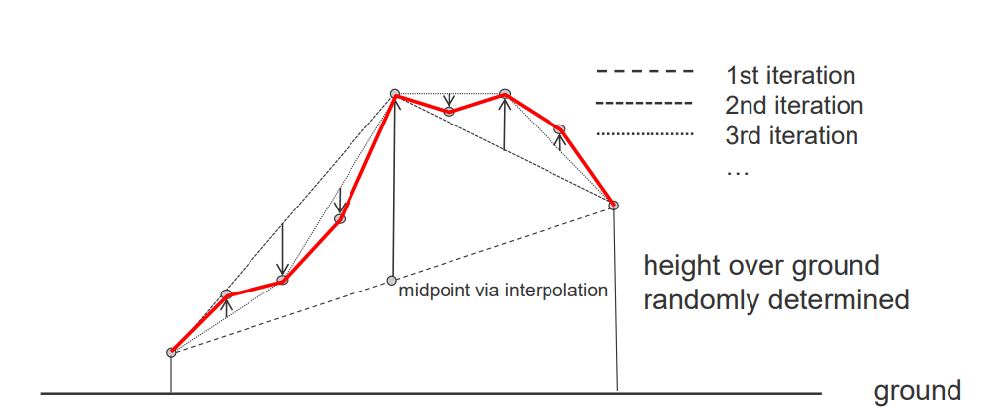
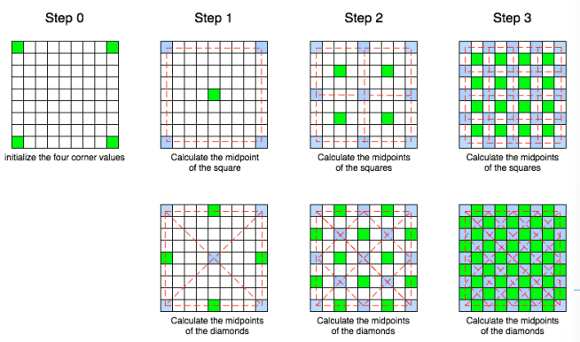

# 02 Procedure Modeling

## 1. Introduction

wiki：程序建模是计算机图形学中多项技术的总称，用于根据规则集**自动**创建 3D 模型和纹理。

## 2. Terrain modeling

创建height field。

1. 噪声
   1. Perlin Noise
   2. Simplex Noise
   3. Worley Noise
2. random midpoint displacements （RMD，随机中点位移）
   1. 
3. Random displacements - $D_i$(i是refinement iteration(细化迭代))
   - 随机位移 $ D_i $（i 表示细化迭代）通过正态分布的随机数建模，期望值 $ \mu[D_i] $ 为 0，标准差 $ \sigma[D_i] $ 为 $ \sigma_i $。
   - 从第一级的 $ \sigma_0 $ 开始，我们希望在后续迭代中生成越来越小的随机位移。
   - 通过标准差 $ \sigma_i $ 建模，其中 $ \sigma[D_i] = \sigma_{i-1} / 2^H $，H 控制衰减，从而控制地形的粗糙度。
   - 通过从 $ N(0,1) $ 分布的随机数计算得 $ N(0, \sigma^2) = \sigma N(0,1) $。
   - Java 类 Random 提供了 `nextGaussian()` 方法，它返回从这个随机数生成器序列中的下一个伪随机、高斯（"正态"）分布的双精度值，均值为 0.0，标准差为 1.0。
4. Diamond-Square Algorithm
   1. Assign random values to corners
   2. Repeat until all points are assigned
      1. Diamond step: 将四个角的值的平均值加上一个random displacement赋给中间点
      2. Square step: 将菱形的四个点的平均值加上一个random displacement赋给菱形的中心点
      3. 注意绿色的点代表此次迭代的中心点
      4. 

### 2.1. 代码实现

这里不仅包含了地形的生成，还包含了顶点法线和纹理坐标的生成。

```java
package com.tumcg;

import java.util.Random;
import java.io.PrintWriter;
import java.nio.charset.StandardCharsets;

class Heightmap {
    public Heightmap(int size, float xScale, float yScale, float heightScale, float roughness) {
        assert IsPowerOfTwo(size);
        this.size = size;
        this.xScale = xScale;
        this.yScale = yScale;
        this.heightScale = heightScale;
        this.roughness = roughness;
        heightmap = new float[size][size];
        rand = new Random();
    }

    static private boolean IsPowerOfTwo(int x) {
        return (x != 0) && ((x & (x - 1)) == 0);
    }

    private final int size;
    private final float xScale;
    private final float yScale;
    private final float heightScale;
    private final float roughness;
    private final float[][] heightmap;
    Random rand;

    public void initializeCorners() {
        heightmap[0][0] = rand.nextFloat();
        heightmap[0][size - 1] = rand.nextFloat();
        heightmap[size - 1][0] = rand.nextFloat();
        heightmap[size - 1][size - 1] = rand.nextFloat();
    }

    public void diamondStep(int x, int y, int step, float scale) {
        int hs = step / 2; //< half step

        int total = 0;
        float value = 0;

        boolean left = x - hs >= 0;
        boolean right = x + hs < size;
        boolean up = y - hs >= 0;
        boolean down = y + hs < size;

        if (up && left) {
            total++;
            value += heightmap[y - hs][x - hs];
        }
        if (up && right) {
            total++;
            value += heightmap[y - hs][x + hs];
        }
        if (down && left) {
            total++;
            value += heightmap[y + hs][x - hs];
        }
        if (down && right) {
            total++;
            value += heightmap[y + hs][x + hs];
        }

        heightmap[y][x] = value / total + (float)rand.nextGaussian() * scale;
    }

    public void squareStep(int x, int y, int step, float scale) {
        int hs = step / 2; //< half step

        int total = 0;
        float value = 0;
        if (x - hs >= 0) {
            value += heightmap[y][x - hs];
            total++;
        }
        if (x + hs < size) {
            value += heightmap[y][x + hs];
            total++;
        }
        if (y - hs >= 0) {
            value += heightmap[y - hs][x];
            total++;
        }
        if (y + hs < size) {
            value += heightmap[y + hs][x];
            total++;
        }
        heightmap[y][x] = value / total + (float)rand.nextGaussian() * scale;
    }

    public void generate() {
        initializeCorners();

        float scale = 1.0f;
        for (int step = size - 1; step > 1; step /= 2) {
            int halfstep = step / 2;

            for (int y = halfstep; y < size; y += step) {
                for (int x = halfstep; x < size; x += step) {
                    diamondStep(x, y, step, scale);
                }
            }

            // Two for loops since the diamond centers are offset every second row
            for (int y = 0; y < size; y += step) {
                for (int x = halfstep; x < size; x += step) {
                    squareStep(x, y, step, scale);
                }
            }
            for (int y = halfstep; y < size; y += step) {
                for (int x = 0; x < size; x += step) {
                    squareStep(x, y, step, scale);
                }
            }

            if (roughness == 1.0f) {
                scale /= 2.0f;
            } else {
                scale /= Math.pow(2.0, roughness);
            }
        }
    }

    public void writeVertexPositions(PrintWriter writer) {
        for (int y = 0; y < size; y++) {
            for (int x = 0; x < size; x++) {
                float xpos = xScale * ((float)x / (float)(size - 1) * 2.0f - 1.0f);
                float ypos = yScale * ((float)y / (float)(size - 1) * 2.0f - 1.0f);
                float zpos = heightScale * heightmap[y][x];
                writer.println("v " + xpos + " " + ypos + " " + zpos);
            }
        }
    }

    public void writeVertexNormals(PrintWriter writer) {
        float scalingX = heightScale / xScale * (size - 1.0f) / 2.0f;
        float scalingY = heightScale / yScale * (size - 1.0f) / 2.0f;

        for (int y = 0; y < size; y++) {
            for (int x = 0; x < size; x++) {
                float dx, dy;
                float left, right, top, bottom;
                if (x > 0) {
                    left = heightmap[y][x - 1];
                    dx = 2.0f;
                } else {
                    left = heightmap[y][x];
                    dx = 1.0f;
                }
                if (x < size - 1) {
                    right = heightmap[y][x + 1];
                    dx = 2.0f;
                } else {
                    right = heightmap[y][x];
                    dx = 1.0f;
                }
                if (y > 0) {
                    top = heightmap[y - 1][x];
                    dy = 2.0f;
                } else {
                    top = heightmap[y][x];
                    dy = 1.0f;
                }
                if (y < size - 1) {
                    bottom = heightmap[y + 1][x];
                    dy = 2.0f;
                } else {
                    bottom = heightmap[y][x];
                    dy = 1.0f;
                }
                float nx = -(right - left) / dx * scalingX;
                float ny = -(bottom - top) / dy * scalingY;
                float nz = 1.0f;
                float normalLength = (float)Math.sqrt(nx * nx + ny * ny + nz * nz);
                nx /= normalLength;
                ny /= normalLength;
                nz /= normalLength;
                writer.println("vn " + nx + " " + ny + " " + nz);
            }
        }
    }

    public void writeVertexTexCoords(PrintWriter writer) {
        for (int y = 0; y < size; y++) {
            for (int x = 0; x < size; x++) {
                float u = (float)x / (float)(size - 1);
                float v = (float)y / (float)(size - 1);
                writer.println("vt " + u + " " + v);
            }
        }
    }

    public void writeToFile(String filename) {
        try {
            PrintWriter writer = new PrintWriter(filename, StandardCharsets.US_ASCII);
            writeVertexPositions(writer);

            // Write all triangle indices. Indices in the .obj format start at 1.
            for (int y = 0; y < size - 1; y++) {
                for (int x = 0; x < size - 1; x++) {
                    int idx0 = y * size + x + 1;
                    int idx1 = y * size + (x + 1) + 1;
                    int idx2 = (y + 1) * size + (x + 1) + 1;
                    int idx3 = (y + 1) * size + x + 1;
                    writer.println("f " + idx0 + " " + idx1 + " " + idx2);
                    writer.println("f " + idx0 + " " + idx2 + " " + idx3);
                }
            }

            writer.close();
        } catch (Exception e) {
            e.printStackTrace();
        }
    }

    public void writeToFileWithNormals(String filename) {
        try {
            PrintWriter writer = new PrintWriter(filename, StandardCharsets.US_ASCII);
            writeVertexPositions(writer);
            writeVertexNormals(writer);

            // Write all triangle indices. Indices in the .obj format start at 1.
            for (int y = 0; y < size - 1; y++) {
                for (int x = 0; x < size - 1; x++) {
                    int idx0 = y * size + x + 1;
                    int idx1 = y * size + (x + 1) + 1;
                    int idx2 = (y + 1) * size + (x + 1) + 1;
                    int idx3 = (y + 1) * size + x + 1;
                    writer.println(
                            "f " + idx0 + "//" + idx0 +
                            " " + idx1 + "//" + idx1 +
                            " " + idx2 + "//" + idx2);
                    writer.println(
                            "f " + idx0 + "//" + idx0 +
                            " " + idx2 + "//" + idx2 +
                            " " + idx3 + "//" + idx3);
                }
            }

            writer.close();
        } catch (Exception e) {
            e.printStackTrace();
        }
    }

    public void writeToFileWithNormalsAndTexCoords(String filename) {
        try {
            PrintWriter writer = new PrintWriter(filename, StandardCharsets.US_ASCII);
            writeVertexPositions(writer);
            writeVertexNormals(writer);
            writeVertexTexCoords(writer);

            // Write all triangle indices. Indices in the .obj format start at 1.
            for (int y = 0; y < size - 1; y++) {
                for (int x = 0; x < size - 1; x++) {
                    int idx0 = y * size + x + 1;
                    int idx1 = y * size + (x + 1) + 1;
                    int idx2 = (y + 1) * size + (x + 1) + 1;
                    int idx3 = (y + 1) * size + x + 1;
                    writer.println(
                            "f " + idx0 + "/" + idx0 + "/" + idx0 +
                            " " + idx1 + "/" + idx1 + "/" + idx1 +
                            " " + idx2 + "/" + idx2 + "/" + idx2);
                    writer.println(
                            "f " + idx0 + "/" + idx0 + "/" + idx0 +
                            " " + idx2 + "/" + idx2 + "/" + idx2 +
                            " " + idx3 + "/" + idx3 + "/" + idx3);
                }
            }

            writer.close();
        } catch (Exception e) {
            e.printStackTrace();
        }
    }
};

public class DiamondSquare {
    public static void main(String[] args) {
        Heightmap heightmap = new Heightmap(257, 4.0f, 4.0f, 1.0f, 1.0f);
        heightmap.generate();
        heightmap.writeToFileWithNormalsAndTexCoords("terrain.obj");
    }
}
```
