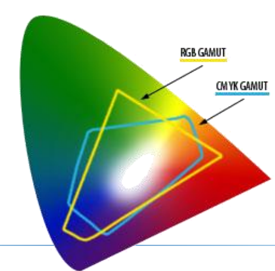
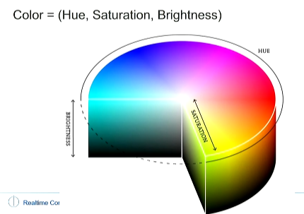
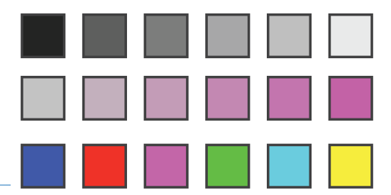
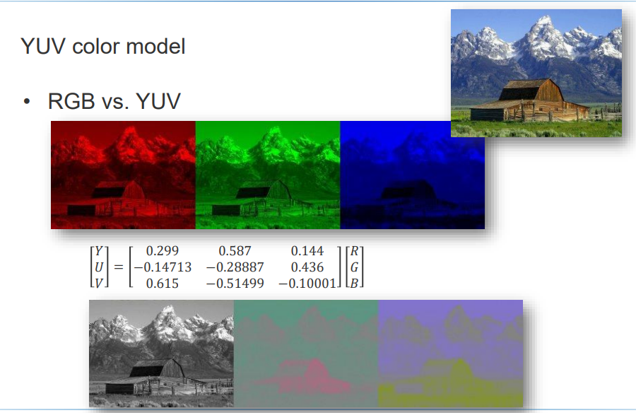
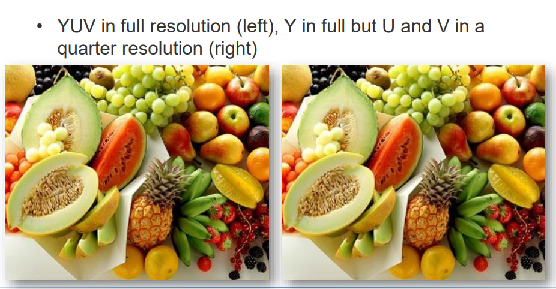

# 03 Shading

1. [03 Shading](#03-shading)
   1. [color models](#color-models)
      1. [1. RGB](#1-rgb)
      2. [2. CMY(K)](#2-cmyk)
         1. [色域 (Gamut)](#色域-gamut)
      3. [3. HSV](#3-hsv)
      4. [4. YUV](#4-yuv)
         1. [案例和一个计算用矩阵](#案例和一个计算用矩阵)
         2. [一个精度降低但是视觉上几乎无损的例子](#一个精度降低但是视觉上几乎无损的例子)

## color models

### 1. RGB
### 2. CMY(K)

主要用于彩色打印：Cyan, Magenta, Yellow, Key(Black)

RGB是加色模式，CMY是减色模式。

所谓减色模式，是指在白光中减去一部分光，剩下的光就是我们看到的颜色。

* 青色、品红色和黄色 - 是基本的印刷颜色。
* 额外的黑色墨水 - 通常被添加到印刷中以增加颜色的深度和覆盖力，因为纯CMY混合往往不能产生真正的深黑色，也更经济。

#### 色域 (Gamut)
RGB vs CMYK:

### 3. HSV

chromatic ("bunt") light 意思就是有色光，即不是白光。

* Hue (色相) - 0-360° dominant wavelength（主波长）
* Saturation (饱和度) - 0-1 purity of color（颜色的纯度）与白光的量成反比的
* Value/Brightness (亮度) - 0-1 intensity of light（光的强度）

1. Hue: 第三行
2. Saturation: 第二行
3. Value: 第一行

### 4. YUV

**用于JPEG压缩，视频编码等。人类视觉对亮度的敏感度远大于色度的敏感度。**通过降低色度数据的精确度（而保持亮度数据的精确度），可以有效减少文件大小，同时对视觉质量的影响最小。

* Y: luminance (亮度,brightness)
* U,V: chrominance (色(调和饱和)度,hue)

#### 案例和一个计算用矩阵

#### 一个精度降低但是视觉上几乎无损的例子

