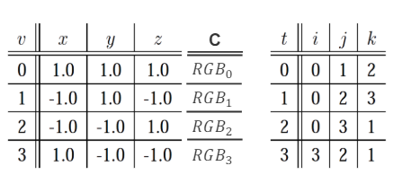
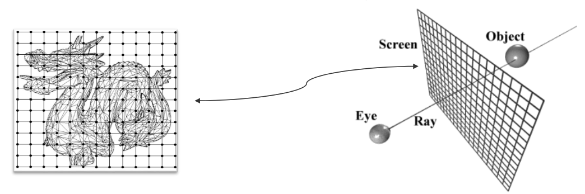
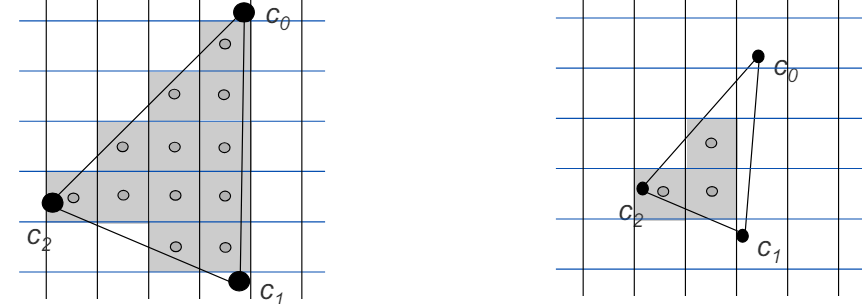
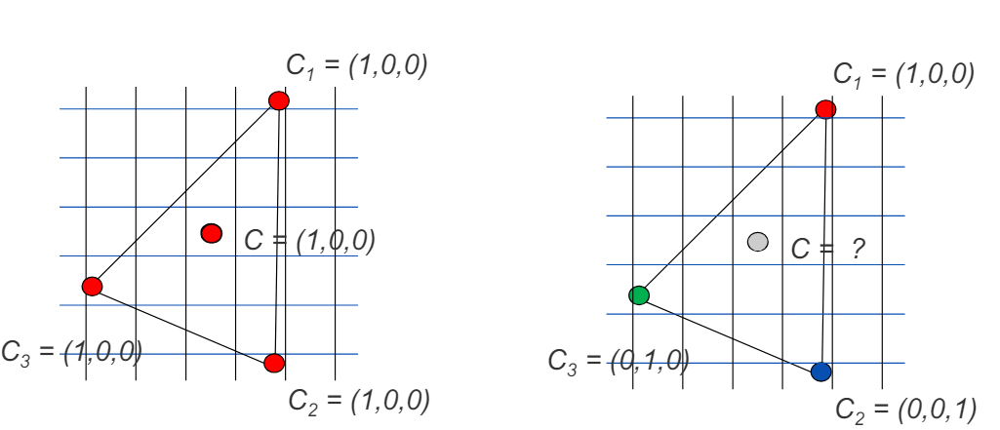
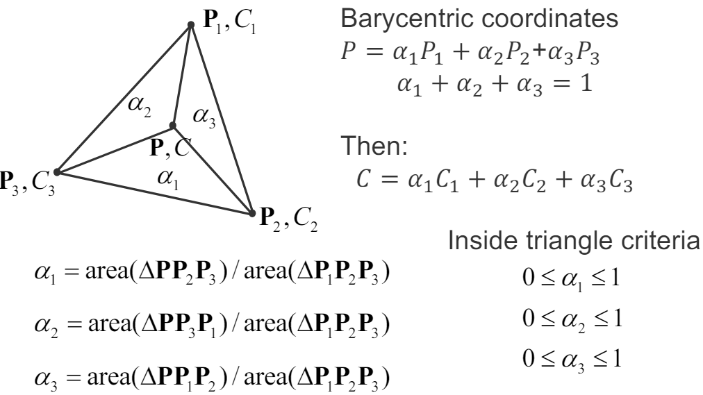

# 03 Shading

- [color models](#color-models)
  - [1. RGB](#1-rgb)
  - [2. CMY(K)](#2-cmyk)
    - [色域 (Gamut)](#色域-gamut)
  - [3. HSV](#3-hsv)
  - [4. YUV](#4-yuv)
    - [案例和一个计算用矩阵](#案例和一个计算用矩阵)
    - [一个精度降低但是视觉上几乎无损的例子](#一个精度降低但是视觉上几乎无损的例子)
- [Appearance modelling (表面建模)](#appearance-modelling-表面建模)
  - [保存格式](#保存格式)
  - [Rendering](#rendering)
  - [Shading](#shading)
    - [shading interpolation - Barycentric Coordinates (重心坐标)](#shading-interpolation---barycentric-coordinates-重心坐标)
    - [Phong Shading, Gouraud Shading, Flat Shading](#phong-shading-gouraud-shading-flat-shading)

## color models

### 1. RGB
### 2. CMY(K)

主要用于彩色打印：Cyan, Magenta, Yellow, Key(Black)

RGB是加色模式，CMY是减色模式。

所谓减色模式，是指在白光中减去一部分光，剩下的光就是我们看到的颜色。

* 青色、品红色和黄色 - 是基本的印刷颜色。
* 额外的黑色墨水 - 通常被添加到印刷中以增加颜色的深度和覆盖力，因为纯CMY混合往往不能产生真正的深黑色，也更经济。

#### 色域 (Gamut)
RGB vs CMYK:

### 3. HSV

chromatic ("bunt") light 意思就是有色光，即不是白光。

* Hue (色相) - 0-360° dominant wavelength（主波长）
* Saturation (饱和度) - 0-1 purity of color（颜色的纯度）与白光的量成反比的
* Value/Brightness (亮度) - 0-1 intensity of light（光的强度）

1. Hue: 第三行
2. Saturation: 第二行
3. Value: 第一行

### 4. YUV

**用于JPEG压缩，视频编码等。人类视觉对亮度的敏感度远大于色度的敏感度。**通过降低色度数据的精确度（而保持亮度数据的精确度），可以有效减少文件大小，同时对视觉质量的影响最小。

* Y: luminance (亮度,brightness)
* U,V: chrominance (色(调和饱和)度,hue)

#### 案例和一个计算用矩阵

#### 一个精度降低但是视觉上几乎无损的例子

## Appearance modelling (表面建模)

Triangle mesh:
1. 颜色是赋给polygon vertices的额外属性
   1. 颜色可以在三角形内插（interpolated）来获得一个平滑的表面颜色
   2. 当指定为恒定face color时，颜色是非平滑的，即在三角形内部颜色是恒定的

### 保存格式

模型文件会有一个C来对应到具体的颜色index。

### Rendering

渲染是指将3D模型转换为2D图像的过程。

像素的颜色代表眼睛的射线穿过像素中心点时，与模型表面的交点的颜色。（只是意义上的“代表”，实际上是通过插值得到的）

### Shading

着色是渲染的一个重要部分

1. 像素中心点在三角形内即颜色由这个三角形决定
   1. 
2. Constant: 每个face一个颜色。比如总是使用第一个顶点的颜色
3. 每个面上的顶点颜色平滑变化

#### shading interpolation - Barycentric Coordinates (重心坐标)

每个三角形占总面积的比例，代表了它对面顶点颜色的权重。

#### Phong Shading, Gouraud Shading, Flat Shading

* Gouraud Shading，着色应用在顶点上，用**顶点的法线算出顶点的颜色**，然后**面内部像素的颜色**用**顶点的颜色**进行插值的方法得出。
* Phong shading，着色应用在每个像素上，同样是求面的顶点法线，然后**面内部每个像素的法线**用**顶点的法线**进行插值的方法得出，再**用像素的法线计算每个像素的颜色**。
  * 面法线->顶点法线->插值像素法线->计算像素颜色

上述通过法线计算颜色其实就是前面上面光照强度的计算公式，只是来源的强度就是原本的颜色，所以光照强度可以得到颜色。

Phone Shading和[Phong光照模型](./05Lighting.md)都是Bui Tuong Phong在"Illumination for Computer Generated Pictures"中提出的。

* Flat Shading，每个面都是一个颜色，不进行插值。(有趣的结果：模型像是开了wireframe，因为每个面都是一个颜色)