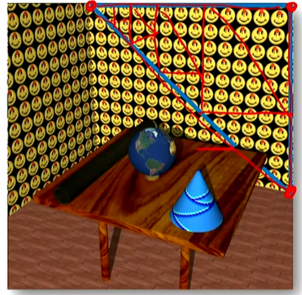
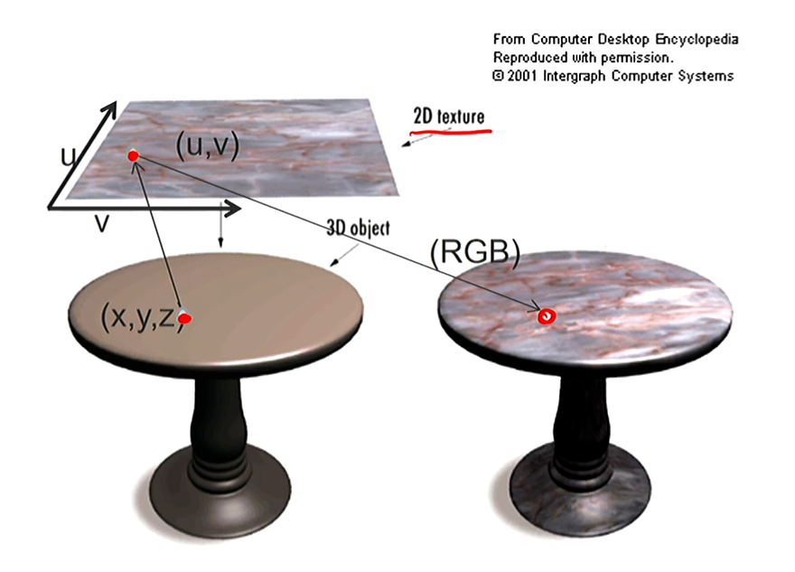
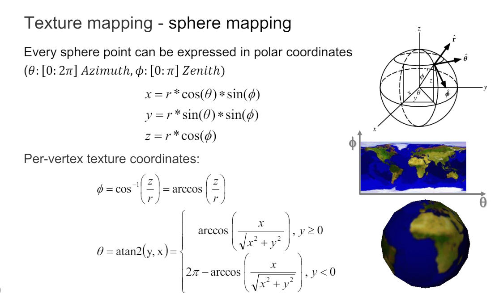
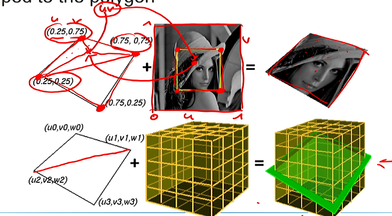
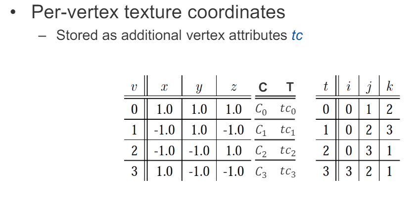
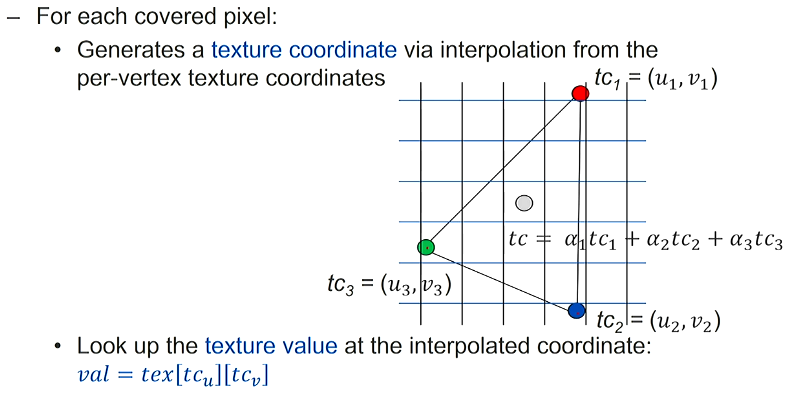

# 04 Texture Mapping
1. [04 Texture Mapping](#04-texture-mapping)
   1. [引言](#引言)
   2. [Texture Coordinates](#texture-coordinates)
   3. [Texutre Mapping](#texutre-mapping)
      1. [案例（球体，理解用不实际）](#案例球体理解用不实际)
      2. [真实案例 - UV 展开 + 插值](#真实案例---uv-展开--插值)
      3. [保存格式](#保存格式)
      4. [坐标插值](#坐标插值)
      5. [优点 - 色彩和分辨率无关](#优点---色彩和分辨率无关)

## 引言

per-vertex coloring的问题：
1. 不能模拟复杂的颜色分布，并且需要高分辨率的mesh
   1. 
   2. 比如这里的笑脸还要分开，并且需要很高的分辨率才能模拟出来
2. 尤其在游戏里，geometry的resolution应该低

Texture Mapping的目的：
1. 分开赋予复杂的颜色分布，然后map到geometry上
2. 一个texture是基础的n维field（典型是2D），它包含material属性
   1. at rendering time,直接从maps里获取颜色之类的信息
   2. texel: texture element，texture的最小单位（类似pixel - picture element）

## Texture Coordinates

在$T_u\times T_v$的texture里，每个vertex $v_i$有一个texture coordinate $(u_i, v_i)$，这个coordinate是在$[0, 1]\times[0, 1]$的范围内的。

$$T_{ij} = (\frac{\Delta u}{2} + i\Delta u, \frac{\Delta v}{2} + j\Delta v)$$

## Texutre Mapping

A mapping 就是一个 transformation 将一个表面的点映射到texture上的Texture coordinate再映射对应的值。

即(x,y,z) -> (u,v) -> (RGB)

### 案例（球体，理解用不实际）

注意还要将$\theta$和$\phi$映射到[0, 1]上，即除以$2\pi$和$\pi$。

不实际是因为实际上并没有这么好的变换公式。

### 真实案例 - UV 展开 + 插值

是modeller在做的时候，直接将点对应到具体的（u,v）上，然后在rendering的时候，用插值的方法来计算中间的点。（这里的插值不是颜色插值，而是坐标插值）

### 保存格式

GPT疑问：

为什么有 T（Texture coordinates）还要有 C （Color）？
1. 用法
   1. 颜色（C）: 这通常是顶点的固有颜色。在不使用纹理的情况下，这些颜色可以直接用于渲染。即使在使用纹理的情况下，顶点颜色也可以与纹理颜色结合使用，来实现特定的视觉效果，比如调整纹理的色调、饱和度或明亮度。
   2. 纹理坐标（T）: 这是用于将纹理映射到3D模型上的坐标。纹理映射允许在模型的表面贴上详细的图像，如皮肤、布料、石材等的图案。纹理可以极大地增加场景的细节和现实感，而不需要增加几何复杂度。不一定只有颜色，还可以有法线、高度等信息。
2. 实际上，将颜色和纹理坐标一起使用，可以提供更多灵活性和创造性的渲染选项。例如：
   1. 颜色叠加：纹理可以应用在顶点颜色之上，通过各种混合模式，颜色可以影响最终的纹理表现。例如，一个白色的纹理在不同颜色的顶点上会呈现不同的颜色。
   2. 条件渲染：某些情况下，开发者可能想根据顶点颜色信息来决定是否应用纹理或者选择不同的纹理。

### 坐标插值

$$tc = \alpha_1 tc_1 + \alpha_2 tc_2 + \alpha_3 tc_3$$

$$val=tex[tc_u][tc_v]$$

### 优点 - 色彩和分辨率无关

高色彩变化，与表面分辨率无关。

High color variation, independent of surface resolution.

