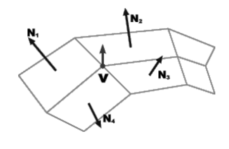
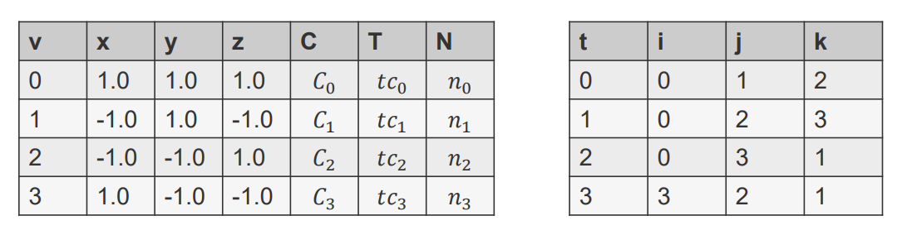
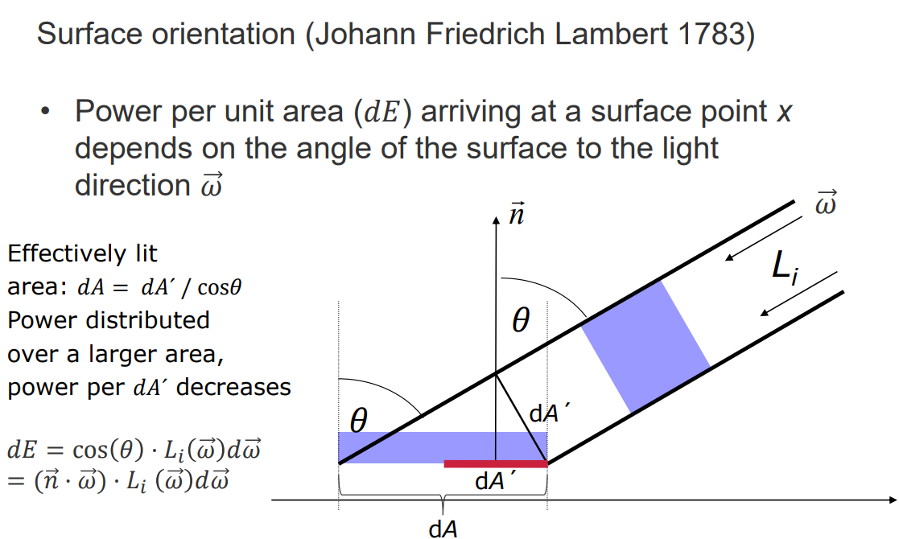
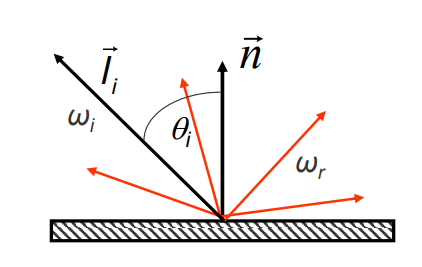
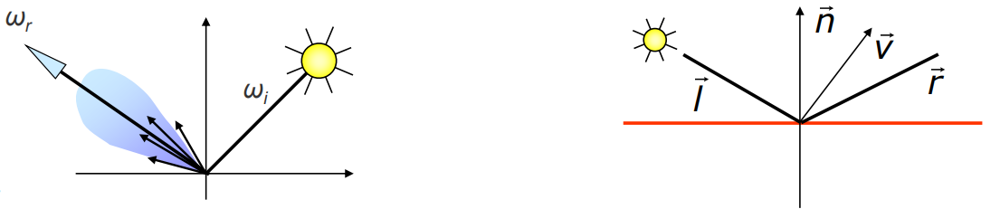
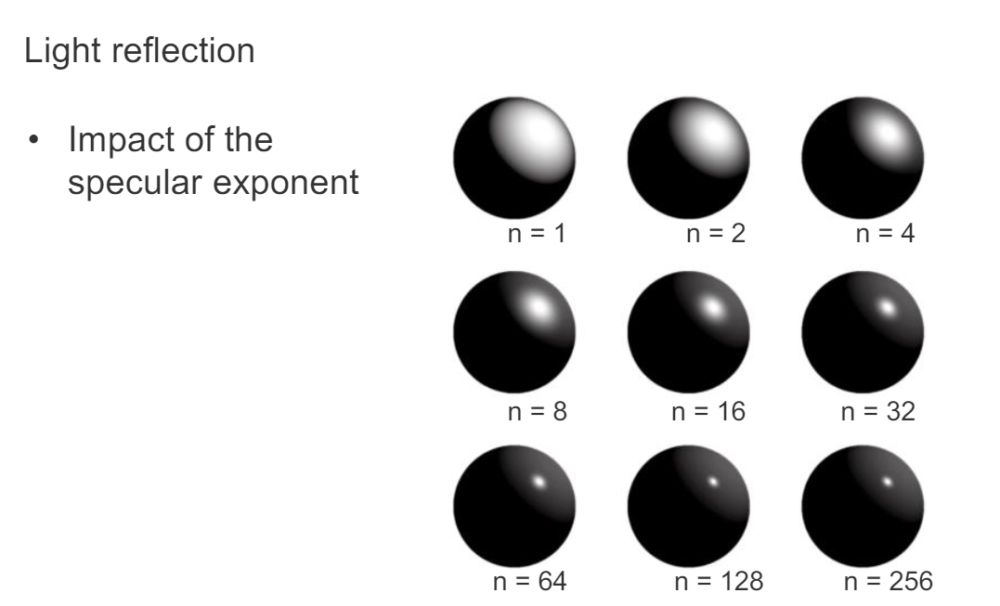
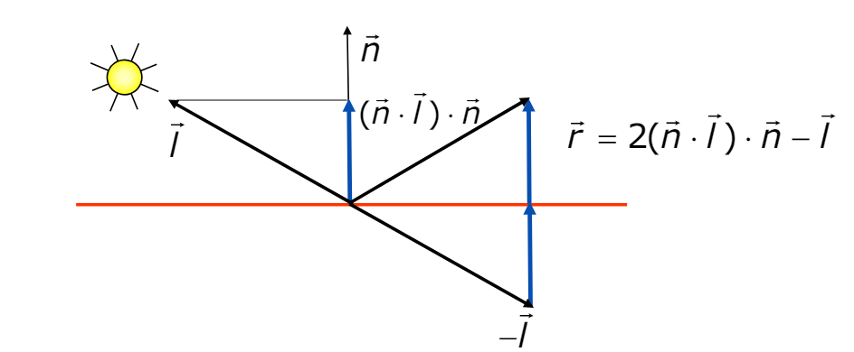
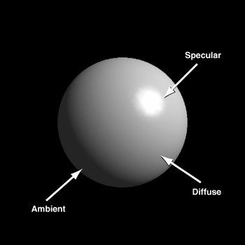
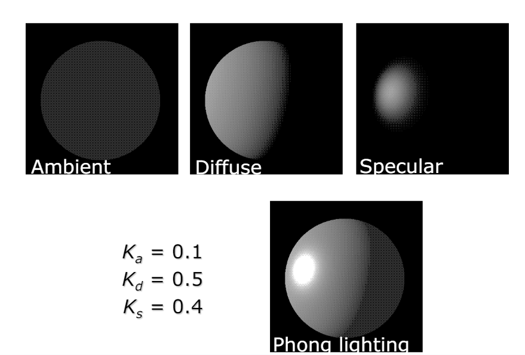
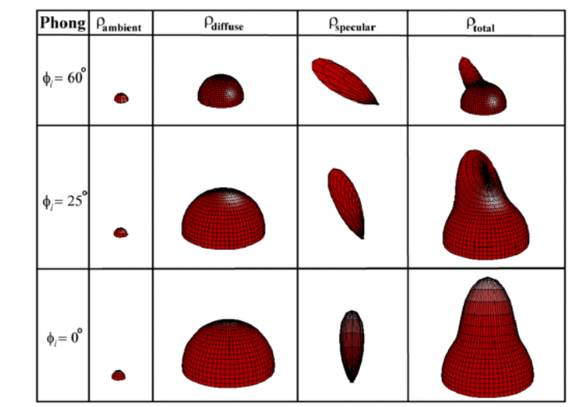

# 05 Lighting

- [1. 介绍](#1-介绍)
- [2. 表面朝向](#2-表面朝向)
  - [2.1. Per-vertex normal](#21-per-vertex-normal)
    - [2.1.1. 标准化法线](#211-标准化法线)
    - [2.1.2. 中心差分法](#212-中心差分法)
    - [2.1.3. 保存格式](#213-保存格式)
- [3. Light reflection(光反射)计算](#3-light-reflection光反射计算)
  - [3.1. Lambert反射模型-漫反射](#31-lambert反射模型-漫反射)
    - [3.1.1. 粗糙材料的漫反射(Diffuse(Lambertian) reflection - Rough material)](#311-粗糙材料的漫反射diffuselambertian-reflection---rough-material)
  - [3.2. Phong光照模型-三光照模型](#32-phong光照模型-三光照模型)
    - [3.2.1. 镜面反射(Specular(glossy) reflection - Smooth material)](#321-镜面反射specularglossy-reflection---smooth-material)
      - [3.2.1.1. specular exponent(镜面反射指数)](#3211-specular-exponent镜面反射指数)
    - [3.2.2. 反射方向计算(r向量)](#322-反射方向计算r向量)
    - [三光合并模型](#三光合并模型)
      - [强度](#强度)
      - [颜色](#颜色)
    - [Phong反射光颜色局限-材质和镜面反射](#phong反射光颜色局限-材质和镜面反射)
  - [Blinn-Phong光照模型](#blinn-phong光照模型)
    - [存在的意义-Phong对比](#存在的意义-phong对比)
- [4. Phong Shading,Gouraud Shading,Flat Shading](#4-phong-shadinggouraud-shadingflat-shading)

## 1. 介绍

照亮模型需要：
1. 光源属性（比如光强度，颜色，位置等）
2. 外观属性（比如反射，吸收等）

首先，我们看到的反射光会受表面接收到多少光影响。接收到的光取决于表面对光源的朝向。

## 2. 表面朝向

tangent_plane(切线平面) + normal_vector(normalize到1)

### 2.1. Per-vertex normal

#### 2.1.1. 标准化法线

$$\vec{N_v}=\sum_{i=1}^{k}\vec{N_i}/||\sum_{i=1}^{k}\vec{N_i}||$$

#### 2.1.2. 中心差分法

[中心差分法](../计算机图形学知识积累/中心差分法计算法线.md)

#### 2.1.3. 保存格式

1. 存储为$n_i$ ([obj文件格式](../计算机图形学知识积累/obj文件格式.md))
2. render时候，插值计算

## 3. Light reflection(光反射)计算

### 3.1. Lambert反射模型-漫反射

Lambert只考虑漫反射。

Lambert反射模型：表面朝向和光线朝向之间的夹角越小，反射光越强。

有效照亮面积: dA = dA´ / cosθ

每单位面积的光照强度：$dE = cos\theta \cdot L_i(\omega)d\omega$

($\omega$是入射角)

个人理解：就是在法向量上的光强度。下面都可以这么理解。

#### 3.1.1. 粗糙材料的漫反射(Diffuse(Lambertian) reflection - Rough material)

1. 无论入射方向，都均匀散射
2. $k_d$是漫反射系数,范围$[0,1]$
3. $I_i$是光源强度, $I_r$是反射光强度
4. $n$是法向量
5. $w_r$和$w_i$是观察方向和入射方向的单位向量
6. $x$是某个位置
7. $I$是关于位置和方向的函数
8. $l_i$是光源方向，因此$n\cdot l_i$是光源方向和法向量的夹角的cos值，然后即3.1的公式了

$$I_r(x,\omega_r)=k_d(n\cdot l_i)I_i(x,\omega_i)$$

### 3.2. Phong光照模型-三光照模型

#### 3.2.1. 镜面反射(Specular(glossy) reflection - Smooth material)
1. 光主要反射到镜像方向周围
2. $k_s$是镜面反射系数，范围$[0,1]$
3. $n$是镜面指数/高光指数，控制高光的范围
4. $r$是反射方向，$v$是视线方向（相机方向）
5. $I_i$是光源强度, $I_r$是反射光强度
6. $w_r$和$w_i$是观察方向和入射方向的单位向量
7. $x$是某个位置
8. $I$是关于位置和方向的函数

$$I_r(x,\omega_r)=k_s(r\cdot v)^nI_i(x,\omega_i)$$

##### 3.2.1.1. specular exponent(镜面反射指数)

#### 3.2.2. 反射方向计算(r向量)

$$r=2(n\cdot l)n-l$$

* n是法向量
* l是点到光源的向量
* 都是单位长度的向量
* 理解：n*l就是$||n||*||l||*cosθ$，就是图中蓝色的线

#### 三光合并模型

##### 强度

$$I_r(x, \omega_v) = \\k_d \cdot (l \cdot n) \cdot I_i(x, \omega_i) + \\k_s \cdot (r \cdot v)^n \cdot I_i(x, \omega_i) + \\k_a \cdot I_a$$

* 漫反射光 + 镜面反射光 + 环境光
* Ambient term（环境光项）是一个常数背景光

不同角度的光和形状的样子：

##### 颜色

$$C_r(x, \omega_v) = \\k_d \cdot (l \cdot n) \cdot C_SC_L + \\k_s \cdot (r \cdot v)^n \cdot C_L + \\k_a \cdot C_SC_A$$

* $C_S$是表面颜色
* $C_L$是光源颜色
* $C_A$是环境光颜色
* 表面颜色只与漫反射和环境光交互，不与镜面反射交互
* 镜面反射用的是光源颜色

#### Phong反射光颜色局限-材质和镜面反射

* 在蜡质、涂层或塑料等材料的表面，镜面反射光的颜色主要是光源的颜色
* 而在金属表面，镜面反射光的颜色不仅是光源的颜色，还会被金属本身的颜色所调制，产生混合后的颜色效果。

所以老说有的游戏很多材质有塑料感。

### Blinn-Phong光照模型

$$h=\frac{l+v}{||l+v||}$$

$$I_r(x,\omega_r)=k_s(h\cdot n)^nI_i(x,\omega_i)$$

#### 存在的意义-Phong对比

和镜面反射对比：
* 镜面反射：
  * $r=2(n\cdot l)n-l$
  * $I_r(x,\omega_r)=k_s(r\cdot v)^nI_i(x,\omega_i)$
  * 只和r(反射方向)，v(光源方向)之间的夹角有关，那么视线在不同位置，可能会亮，可能会暗
* Blinn-Phong：$h=\frac{l+v}{||l+v||}$
  * 夹角变成了h和n的夹角，h是l(光源方向)和v(视线方向)的中间向量，所以不会因为视线位置不同而亮暗不一样，因为这个中间向量始终会因为视角变化而变化

## 4. Phong Shading,Gouraud Shading,Flat Shading

[Phong Shading,Gouraud Shading,Flat Shading](./03Shading.md)