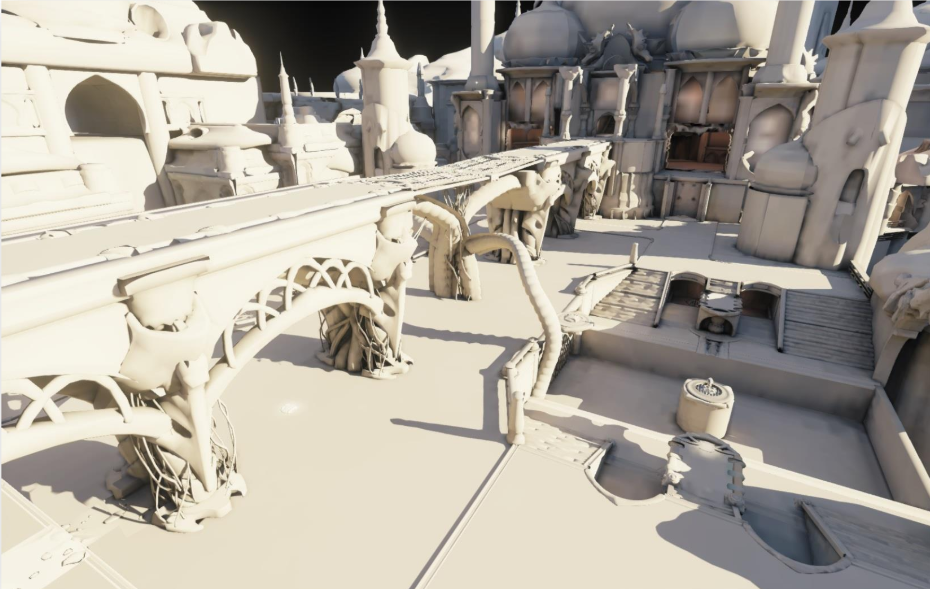
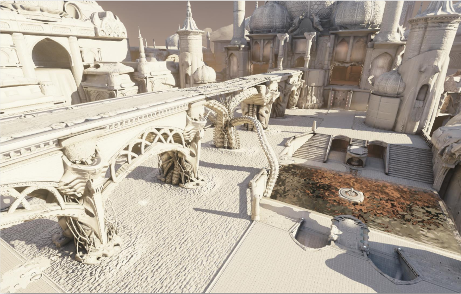
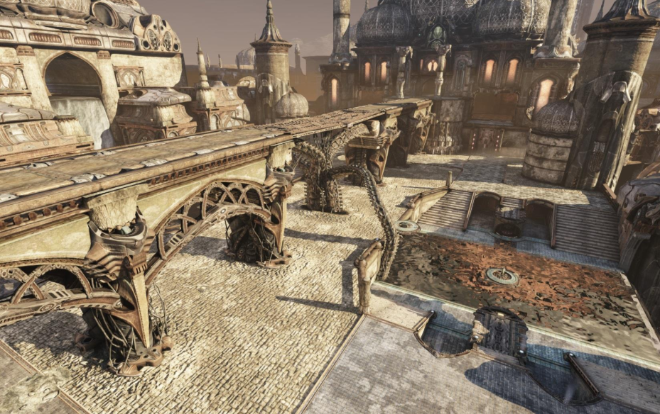
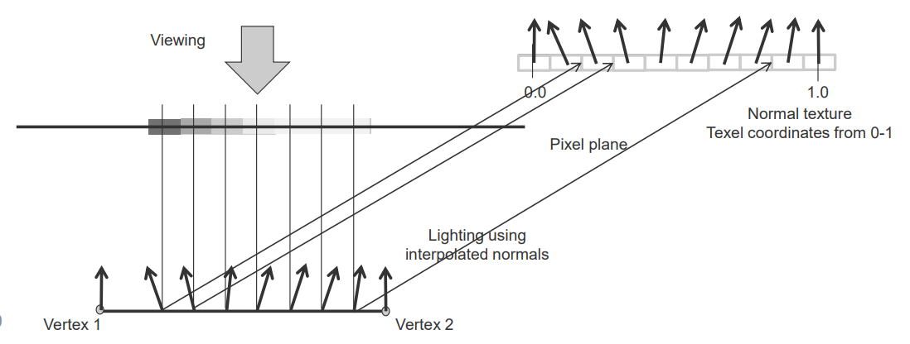
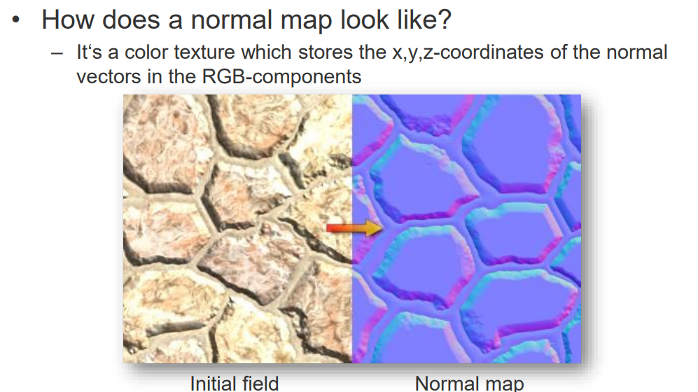
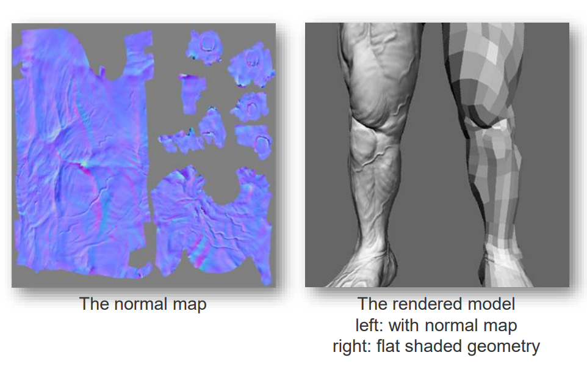

# 06 Normal Mapping

## 预习

bump mapping和normal mapping的区别是什么？

* 凹凸贴图：使用灰度图来表示表面高度变化，通过修改法线方向来影响光照计算。适用于模拟较小的表面细节，计算简单，但效果有限。
  * 灰度图：灰度值表示高度信息，越亮的地方越高，越暗的地方越低。
  * 灰度->法线：灰度图中的灰度值可以通过求导来计算法线方向，即用灰度图的梯度来近似法线方向。
* 法线贴图：使用RGB图来存储法线方向信息，能够模拟复杂的表面细节和高精度的光照效果。适用于高质量渲染，但制作过程复杂，需要更多的计算资源。
  * R: x
  * G: y
  * B: z
* 和Texture Mapping一样，对应方式也是UV Mapping。

## 图片案例

1. lit-only - 包含shadows
   
2. lit-only - 加上bumps
   
3. lit and colored
   

## 法线贴图

### 原理

通过UV定位到右边的法线贴图。

### 样板

左边纯托盘，右边按法线贴图的样子。

1. 左腿和右腿
2. 法线贴图不一定真个图都布满