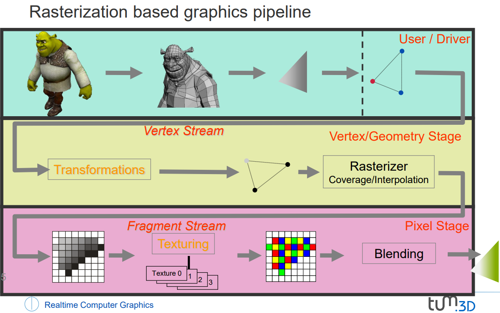
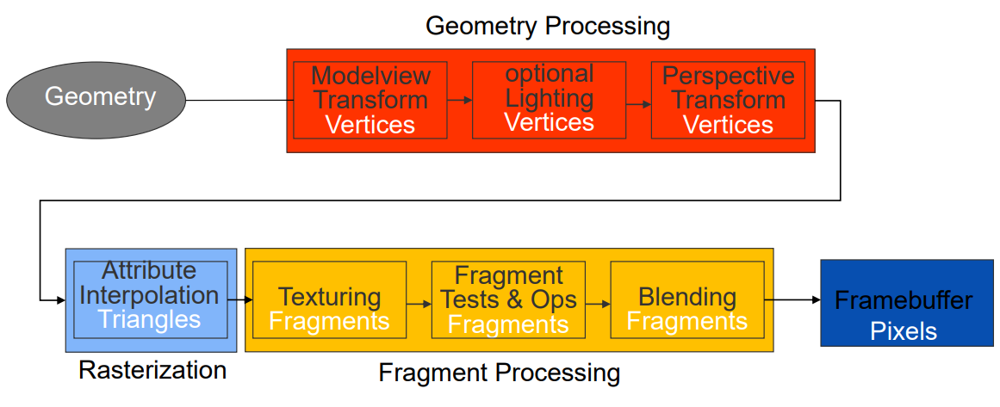
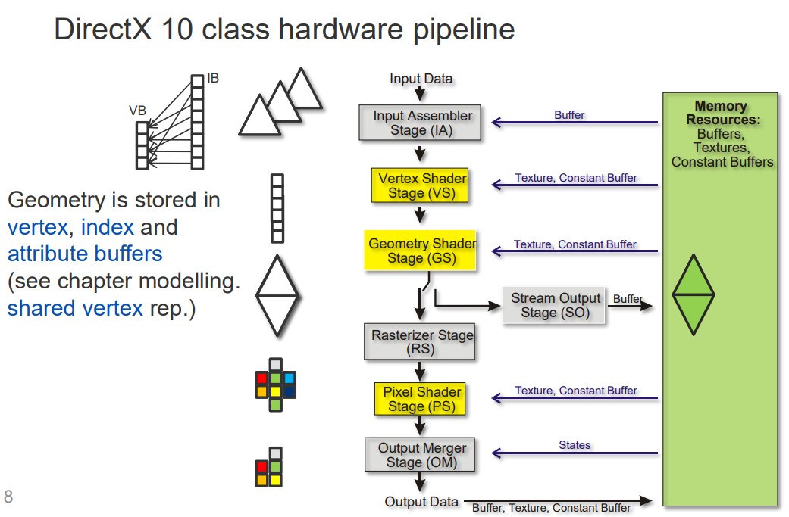

# 07 Graphics APIs

- [1. Graphics Application Programmer Interface](#1-graphics-application-programmer-interface)
- [2. Pipeline](#2-pipeline)
  - [2.1. 介绍](#21-介绍)
  - [2.2. 案例图流程](#22-案例图流程)
  - [2.3. 图解](#23-图解)
- [3. GPU](#3-gpu)
- [4. DirectX 10 class hardware pipeline](#4-directx-10-class-hardware-pipeline)
- [5. Programmable graphics pipeline](#5-programmable-graphics-pipeline)

## 1. Graphics Application Programmer Interface

1. Low-level API: directly access to graphics hardware
    - OpenGL (Open Graphics Library)
    - Direct3D
    - Vulkan
2. High-level API: support the non-expert by providing built-in utilities like data structure, viewers, accceleration methods, effcts, etc.
    - Scene-Graph APIs: Inventor, OpenSG, Java3D
    - Game engines: Unity, Unreal Engine, CryEngine

## 2. Pipeline

### 2.1. 介绍
概念：Low-level APIs implement the rasterization based graphics pipeline. (翻译：低级API实现基于光栅化的图形管线)

管线:
1. Application - 应用程序
2. Command - 命令
3. Geometry - 几何
   1. Transforms triangles and projects the transformed triangles into the pixel raster（转换三角形并将转换后的三角形投影到像素光栅）
   2. 理解：光栅就是像素网格
4. Rasterization - 光栅化
   1. The rasterizer detemines the pixels that are covered by a triangle and generates a fragment for every covered pixel（光栅化器确定由三角形覆盖的像素并为每个覆盖的像素生成一个片元）
5. Texturing - 纹理
   1. Perform operations - texturing - on the fragments
6. Fragment - 片元
   1. Perform operations - blending - on the fragments
7. Display - 显示

补充: shading - 着色，即计算物体表面的颜色和亮度的过程，根据光源、材质和观察者的位置来模拟光照效果。在管线里，分布在不同的地方，比如vertex shading在geometry阶段，fragment shading在fragment阶段。

### 2.2. 案例图流程

### 2.3. 图解

* Model transform: 本地坐标系到世界坐标系的变换
* View transform: 世界坐标系到相机坐标系的变换
* Projection transform: 相机坐标系到裁剪坐标系的变换 - 透视投影，比如近打远小

## 3. GPU

GPU - Graphics Processing Unit

* 构建以高效实现基于光栅化的图形管线
* Highly parallel stream architecture
  * Stream of **individual vertices/fragments** is processed in parallel（单个顶点/片段流在并行处理中处理）
  * 并行处理：在多个流元素上使用单一指令集
  * 高达 80 GB 的 on-chip memory
* Specifies programmable rendering pipeline
  * Additional **stages** a vertex or a fragment is passing through (e.g. geometry shader, tessellation shader，翻译：顶点或片段通过的附加阶段)
    * 指的是在渲染管线中，除了固定功能的阶段外，还可以通过用户编写的着色器程序定义额外的可编程阶段。顶点和片段数据会依次通过这些阶段，每个阶段执行特定的计算操作，以达到所需的渲染效果。
  * 所谓的着色器程序 **shader program**（**由用户编写**）控制每个顶点和片段上执行的操作

## 4. DirectX 10 class hardware pipeline

符合DirectX 10标准的一类硬件设备管线

* Geometry is stored in vertex, index and attibute buffers

* VB - Vertex Buffer
* IB - Index Buffer
* 理解：
  * 左边一列会从右边的内存资源里读取数据或中途输入一些数据，然后经过一系列的处理，最终输出到右边的内存资源里

## 5. Programmable graphics pipeline

* 允许通过对顶点和片段进行操作，实现“几乎”任意的图形效果
* 着色语言：GLSL（OpenGL），HLSL（DirectX），Nvidia CG（两者）
  * 语法类似于C/C++
  * 编译（在程序启动时）-> 链接（着色器阶段）-> 运行（绘制对象）
  * 硬件无关（编译器嵌入驱动程序中）
    * 着色器代码的编译器通常嵌入在驱动程序中，这使得着色器程序可以在不同的硬件上运行而无需修改。编译器会根据硬件特性进行优化，确保着色器程序的高效执行。
* 图形引擎程序员需要编写着色器程序！