# 10 Pixel Stage

- [1. rasterizer stage](#1-rasterizer-stage)
- [2. Rasterization](#2-rasterization)
- [3. 为什么要keep z-value for each fragment](#3-为什么要keep-z-value-for-each-fragment)
- [4. Fragment processing](#4-fragment-processing)
  - [4.1. pixel shader](#41-pixel-shader)
  - [4.2. 如何多个片段颜色合并存储](#42-如何多个片段颜色合并存储)
  - [4.3. Blending 混合](#43-blending-混合)
    - [4.3.1. α混合](#431-α混合)
      - [4.3.1.1. blending in graphics pipeline](#4311-blending-in-graphics-pipeline)

## 1. rasterizer stage

* Vertex shader stage的结果：
  * perspective projection后的齐次顶点坐标
  * （modelview transformed）法线
  * 额外的属性（颜色，纹理坐标等）
* The transformed, attributed vertex stream is passed to the rasterizer stage
  * 光栅化使用**除以w**和maps NDC to 像素坐标
    * NDC (Normalized Device Coordinates) 规一化设备坐标，范围是[-1, 1]
  * 对于每个三角形，光栅器决定哪些像素被这个三角形覆盖 - 对于每个这样的像素，a fragment is generated
  * 每个顶点的属性被插值到这个fragment上。
  * 补充fragment概念在[图元片元光栅化概念](../计算机图形学知识积累/图元片元光栅化.md)一文里。

* 继前面一节的Transformation pipeline图，下一步就是光栅化和片元生成阶段，在[07GraphicsAPIs](./07GraphicsAPIs.md)中有流程介绍。

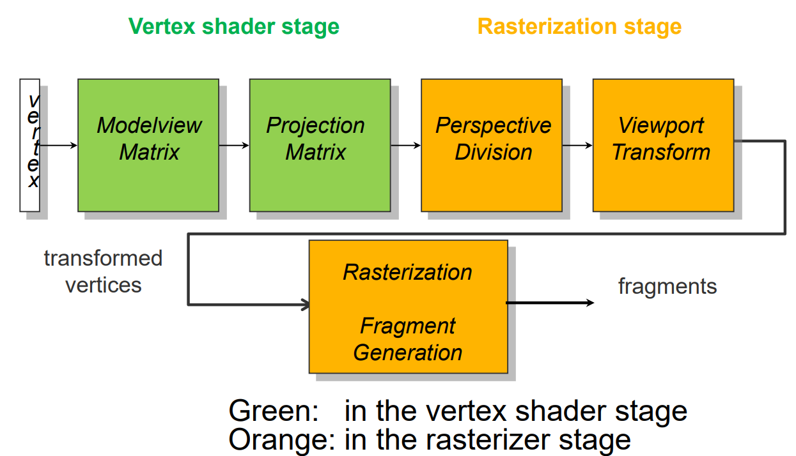

## 2. Rasterization

1. Fragment generation: for each covered pixel, one fragment generated
   1. 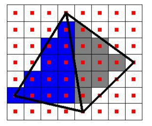
2. for each fragment, per-vertex attributes (color, normal, z-value, texture coodinates, ...) are interpolated
   1. 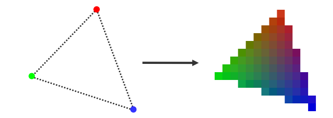
* Result of rasterization stage:
  * A set of fragments, each storing its pixel coordinate as well as interpolated z-value, color, normal, texture coordinate etc. 
  * 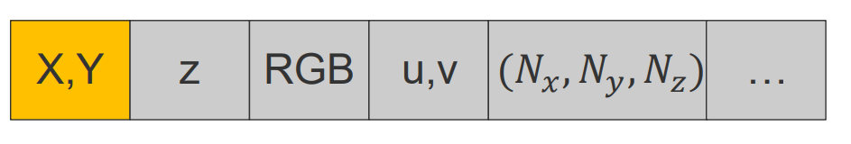

## 3. 为什么要keep z-value for each fragment

1. 深度值表示点距离近平面的距离；它在片段处理阶段被用来进行深度测试(depth-test)。
2. depth-test：当多个表面点，即片段落在同一个像素上时，只保留最靠近近平面的那一个。这一操作在fragment stage执行。
   1. 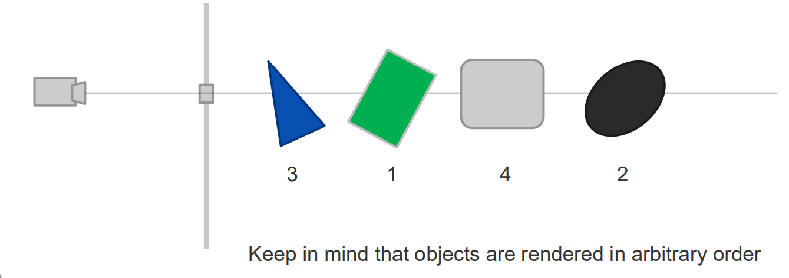
   2. 备注：物体的render的顺序是任意的。

## 4. Fragment processing

1. On the GPU, multiple buffers are used during rendering
   1. color(pixel) buffer: stores the color RGBα of each pixel
   2. depth buffer: stores each pixel of 到目前为止渲染到此像素的最近表面点的深度
* 在一个片段被写入颜色缓冲区之前，它会经历深度测试：片段的深度值会与深度缓冲区中的深度值进行比较。
  * 深度缓冲区最初被初始化为可能的最高值。
  * 每当一个片段将其颜色写入颜色缓冲区时，它也会将其深度值写入到深度缓冲区的同一位置。
  * 一个片段只有在通过深度测试后才被允许将其颜色值写入。

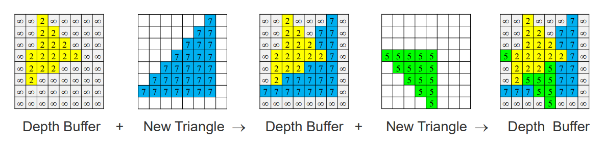

### 4.1. pixel shader

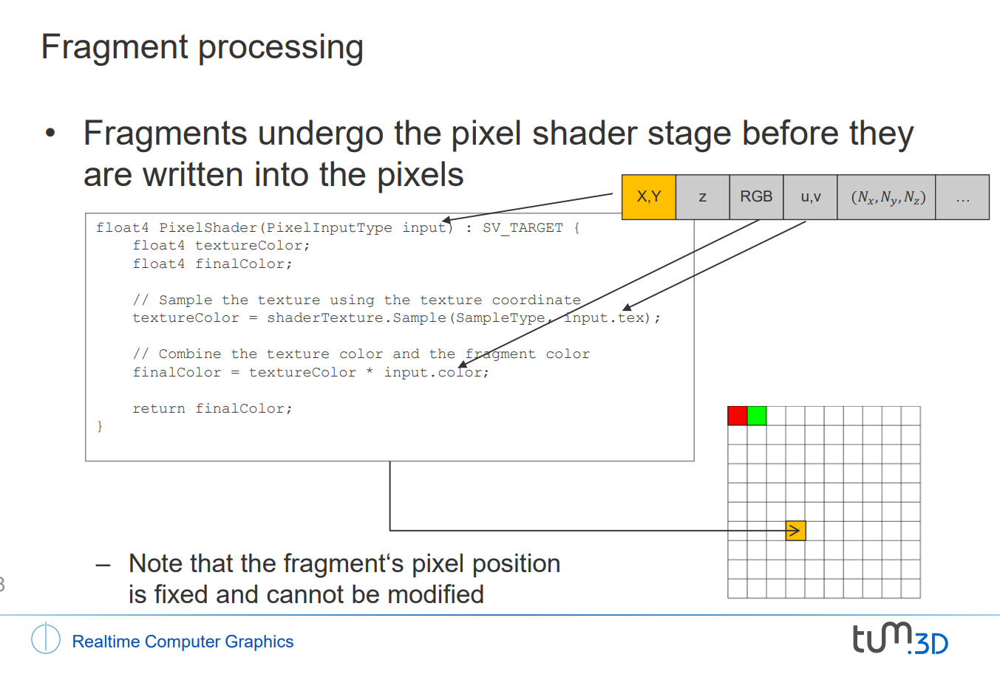

1. 每个片段（通常对应屏幕上的一个像素位置）在被写入到颜色缓冲区之前，会先经过一个称为像素着色器（Pixel Shader）的处理阶段。像素着色器是一种程序，可以对片段的颜色和属性进行高度定制化的计算。
   1. 注意，片段的像素位置在进入像素着色器时是固定的，不能被修改。这意味着你不能在像素着色器中改变一个片段将要写入的像素位置。
   2. 颜色是 `finalColor = textureColor * input.color`
2. 深度测试通过DX（DirectX）调用启用，然后自动执行
   1. 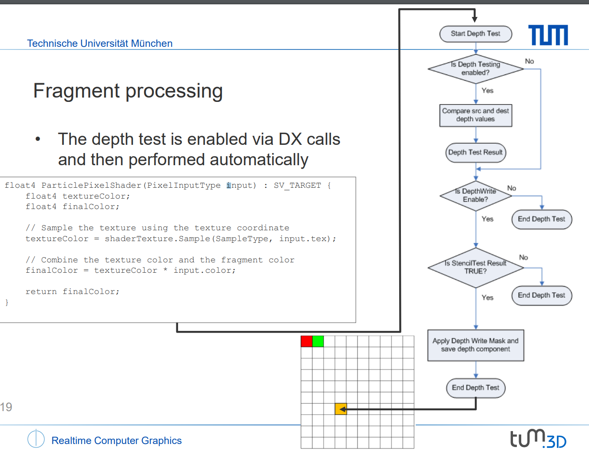
   2. 深度buffer里的深度值不能被直接访问
   3. 一个片元的深度不能再pixel shader里被计算

### 4.2. 如何多个片段颜色合并存储

* 因为深度测试会丢弃除了最近的片段之外的所有片段，并显示其颜色。
* 所以解决方案：**禁用深度测试**并混合所有落在同一像素上的片段的颜色。

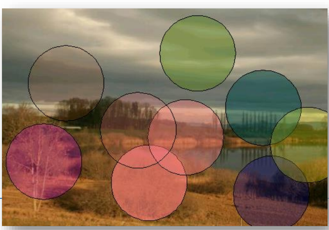

### 4.3. Blending 混合

混合告诉我们传入的片段颜色（源色 src）是如何与颜色缓冲区中已存在的颜色（目标色 dst）结合的。

* 存在多种不同的混合函数。
* 像素颜色可以被替换或与片段颜色结合。

理解：在需要创建透明效果或其他颜色混合效果时，通过选择适当的混合函数，可以实现各种视觉效果，例如让一张图片透过另一张图片显示，或者合成复杂的光照和色彩效果。混合操作是图形渲染中的一个高级特性，使得图像的表现更加丰富和真实。

#### 4.3.1. α混合

* 允许通过考虑片段和像素的不透明度来组合片段颜色（源色 src）和像素颜色（目标色 dst）。
  * α值对应于不透明度，范围从0到1。
  * 表示从背后透过的光线被阻挡的百分比。

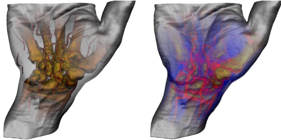

- 假设有两个物体，颜色分别为 C1α1 和 C2α2。
  - 物体1在观察者视角前方相对于物体2。
  - 为了正确混合这两个物体，需要考虑颜色和α值：
    - C = α1C1 + (1-α1)α2C2
    - α = α1 + (1-α1)α2
    - 案例：C1α1 = (1,0,0,0.8), C2α2 = (0,0,1,0.5)
      - ⇒ C = 0.8 * (1,0,0) + (1 - 0.8) * 0.5 * (0,0,1) = (0.8,0,0.1)
      - α = 0.8 + (1 - 0.8) * 0.5 = 0.9
- α混合两个片段，颜色为 C1α1 和 C2α2：
  - 首先渲染较远的片段到颜色缓冲区，让其颜色受到其不透明度的调制：
    - C_D = α2C2
  - 然后渲染较近的片段，让其颜色也受到其不透明度的调制：
    - C_S = α1C1
  - 通过以下方式混合颜色：
    - C = C_S + (1-α1) C_D
  - **由于我们是从后向前渲染，深度测试可以被禁用**
  - **也不需要α值的累积**

---

理解：在有深度测试的策略里，由于深度buffer的存在，渲染物体的顺序是随机的也行，但是α混合策略是确定的，因为它是从后向前渲染的。

---

为了正确混合多个透明对象，执行以下步骤：
1. 清除颜色/不透明度（0,0,0,0）在颜色缓冲区中。
2. 从后向前排序**对象**（相对于观察平面的距离递减）。
3. 按排序顺序通过混合方程渲染对象：
   1. C_d = α_sC_s + (1-α_s)C_d
   2. 其中，s（src）代表传入的片段，d（dst）代表颜色缓冲区中的值。

为了正确混合多个透明和不透明对象，执行以下步骤：
1. 清除颜色/不透明度（0,0,0,0）在颜色缓冲区中。
2. 从后向前排序**透明对象**（相对于观察平面的距离递减）。
3. 使用**深度测试/写入启用** **先** 渲染 **不透明对象**。
4. 使用深度测试启用并按排序顺序通过混合方程渲染透明对象：
   1. C_d = α_sC_s + (1-α_s)C_d
   2. 其中，s（src）代表传入的片段，d（dst）代表颜色缓冲区中的值。

##### 4.3.1.1. blending in graphics pipeline

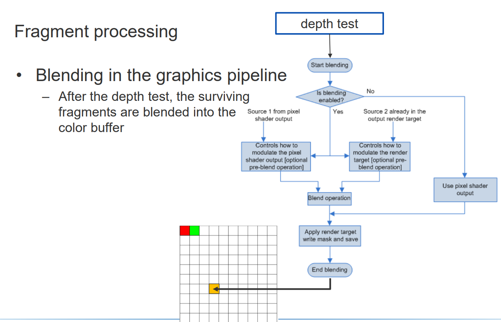

深度测试后，存活的片元会被blend到颜色缓冲区。（所以先排序后深度测试，深度测试可以很好的处理不透明物体的遮挡关系）