# 12 Sampling

## Sampling and Aliasing 采样和走样

### 采样案例
* example 1
    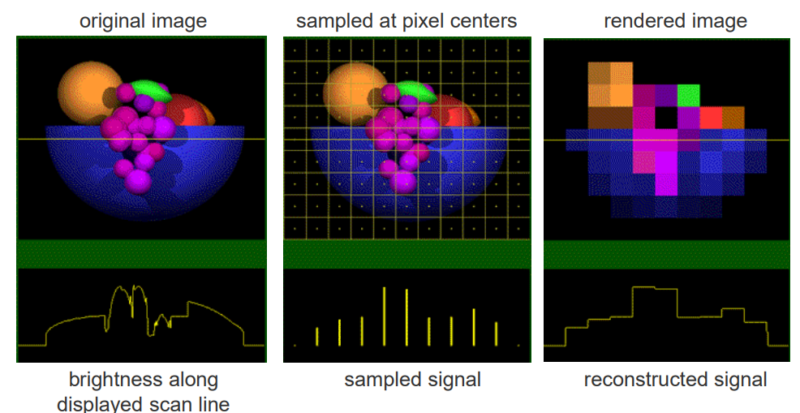
* example 2
    jagged profiles （锯齿状轮廓）

    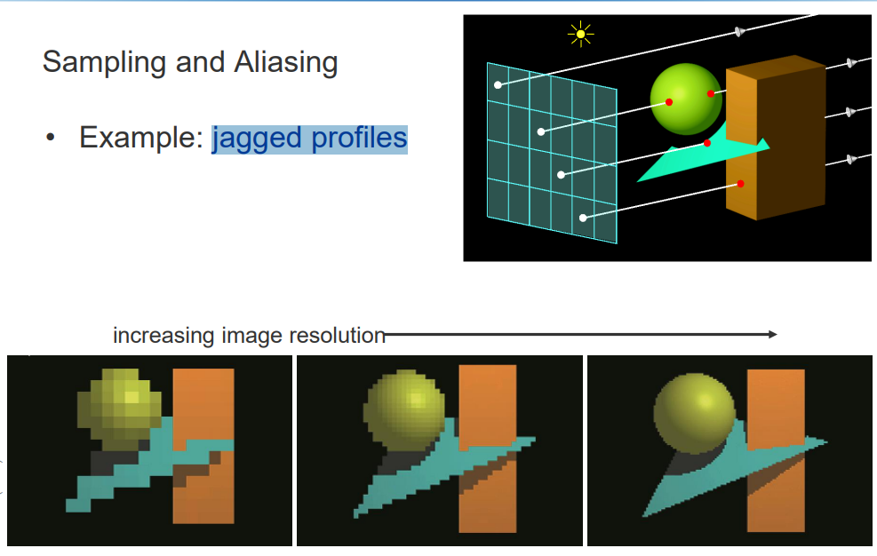

    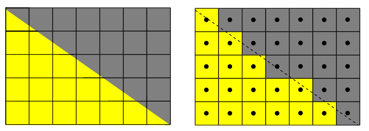

* example 3: 采样频率随视点距离的增加而降低。
    
    随着距离观察者的距离增加和表面倾斜，一个像素下能看到的表面区域越来越大，但每个像素只有一个片段无法很好地代表那个区域。

    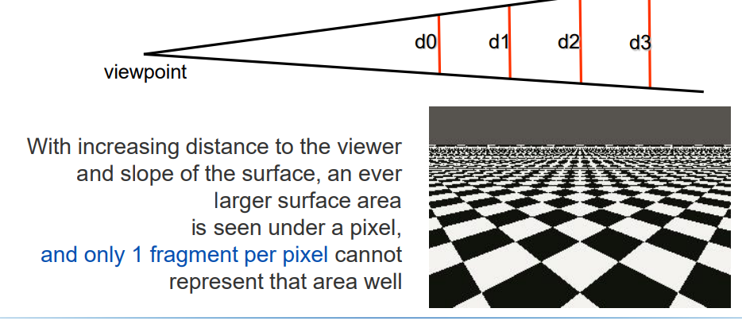

### 走样的影响

* 空间走样（Spatial aliasing）：图中示例显示了理想的连续信号和通过不足采样得到的信号，展示了因采样率不够高而引起的空间走样效果。这通常会导致图像中出现锯齿状的边缘。
  * 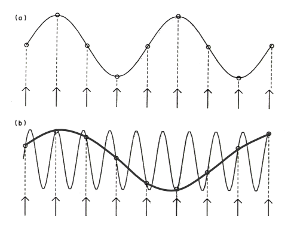
* 时间走样（Temporal aliasing）：通过动态图标（红黑色的圆圈和箭头）展示，当帧率不足以捕捉到运动的连续性时，就会出现时间走样，如动画或视频中的闪烁或跳跃现象。
  * 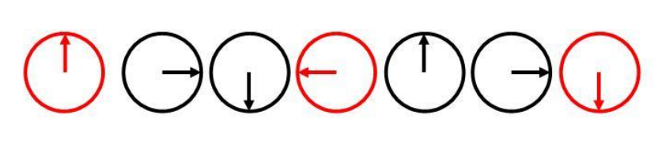

理解：空间走样就是本来这里起起伏伏，但是采样少了，起伏少了。时间走样就是本来很流畅的旋转，缺帧了，看起来瞬移。

### 如何避免因信号下采样导致的走样问题

* 超采样（Supersampling）：通过增加采样频率来解决，即在同一区域内采集更多的样本点，从而更精细地重建图像，减少走样。
* 预过滤（Prefiltering）：在采样之前降低信号中的最高频率，通常通过一个滤波器来实现，以去除那些可能导致走样的高频成分，再进行采样处理。

## 超采样 Supersampling

超采样是一种通过在每个像素内采样多个片段(fragments)来增加采样密度的技术，从而实现视觉上的高分辨率效果。这种方法虚拟地增加了视口的分辨率。

超采样的几种方式：
* 常规采样（Regular Sampling）
  * 如图示例：使用5x5的采样格，每个像素由25个子采样点（fragments）组成。
  * 颜色平均：最终每个像素的颜色是这25个采样点颜色的平均值。
  * 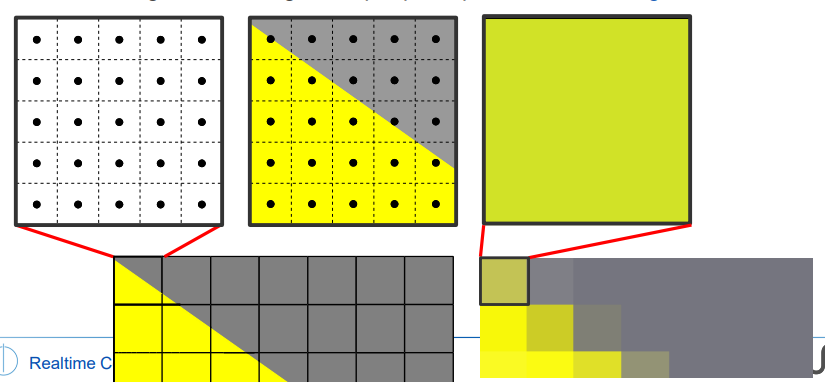
  * 1 sample/pixel vs 16 samples/pixel
    * 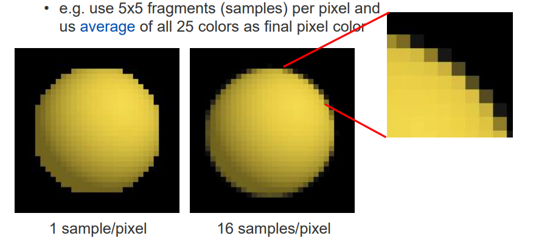
* 颠簸随机采样（Jittered Random Sampling）
  * 这种方法在保持随机性的同时，强调在像素上更均匀地分布采样点。
  * 左侧图：显示了25个完全随机分布的采样点。这些点在像素区域内随机散布，没有明显的规律，可能导致采样密度在某些区域偏高而在其他区域偏低。
  * 中间图：展示了25个颠簸随机采样点。这种方法**通过小范围内的随机性来改善样本分布**，每个点仍然随机，但整体上更均匀。
  * 右侧图：为了进一步说明颠簸采样的布局，显示了一个包含25个小格的网格，**每个网格内有一个采样点**。这显示了每个点虽然位置随机，但被限制在一个较小的子区域内，从而实现了整体的均匀分布。
  * 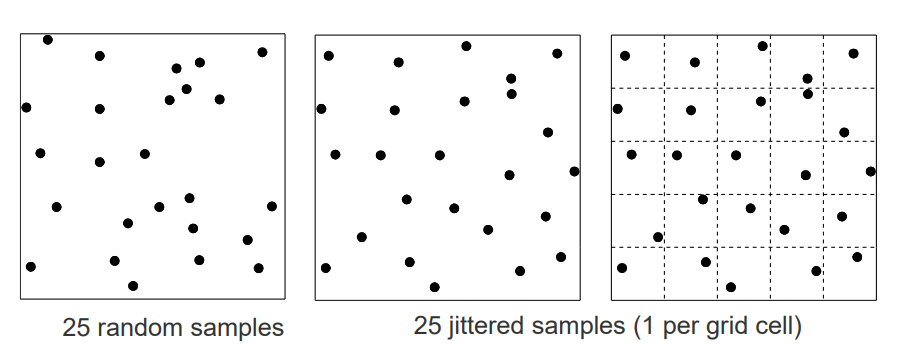
  * 1 sample/pixel vs 64 jittered samples/pixel
    * 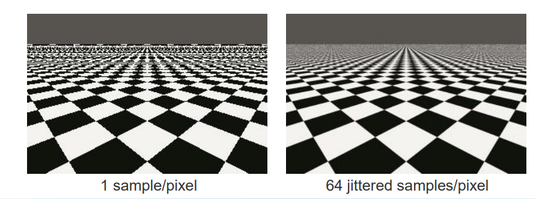
  * 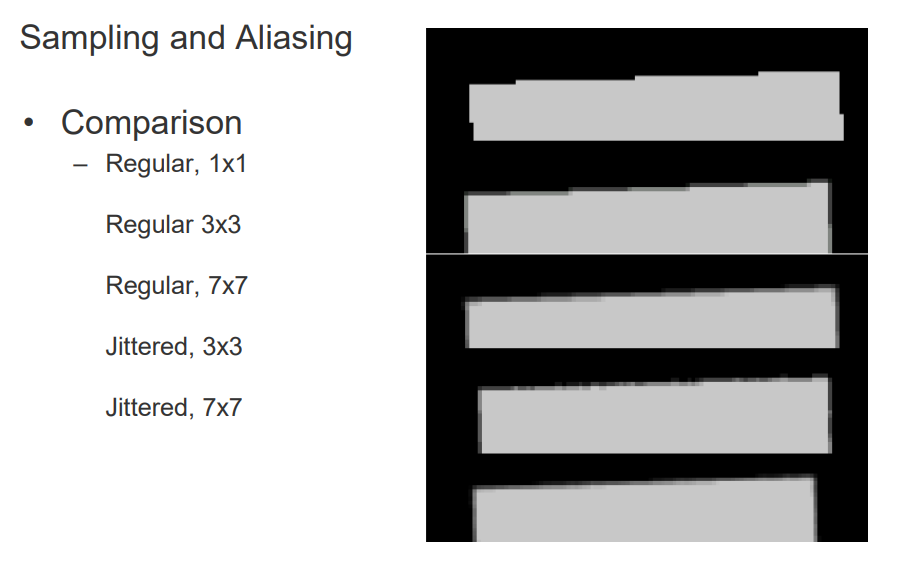

### Jittered Random Sampling vs Uniform supersampling
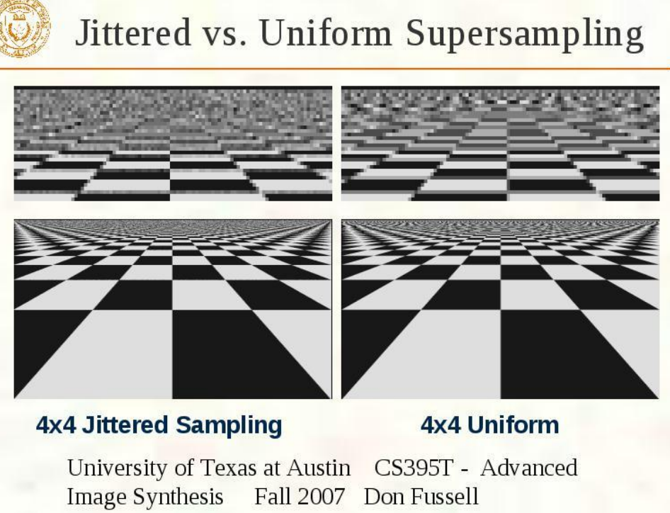

* 颠簸采样通过在每个格子内随机放置采样点，尝试覆盖更广的区域，以此减少走样并提高图像质量。
* 均匀采样则是在每个像素内以固定的间隔放置采样点，虽然方法简单且易于实现，但在处理复杂图像时可能不如颠簸采样效果好。

### 颠簸随机采样vs泊松盘采样

1. Poisson-disk sampling
   1. **随机生成采样点，但限制采样点之间的最小距离**。这种方法确保了采样点之间不会太近，从而避免过度集中和潜在的图案重复，使采样分布更加均匀和自然。
2. Jittered random sampling
   1. **像素区域进行规则分割，每个分割区域内随机选择一个采样点**。这种方式相较于完全随机采样，通过规则分区来保证了采样的均匀性，避免了采样点过于集中或稀疏的问题。

## 预过滤 Prefiltering

* 降低texture的频率，而不是提高采样频率。
* 通过平滑处理（滤波）信号，生成逐渐去除细节的多个版本。
* 始终从细节与像素大小相当的信号中选择，确保不丢失重要的视觉信息。

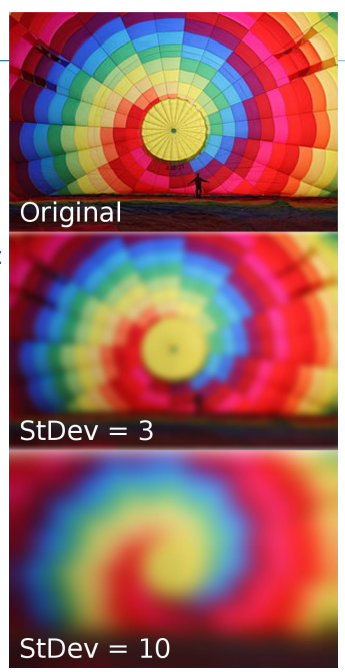

* 顶部图像（Original）：原始未经过滤的照片，展示了一张多彩的热气球。这张图清晰地显示了所有的细节和色彩变化。
* 中间图像（StDev = 3）：应用了中等程度的高斯模糊（标准差为3）。这种模糊程度使图像细节开始变得不那么锐利，但仍保留了大部分的结构。
* 底部图像（StDev = 10）：应用了更强烈的高斯模糊（标准差为10），导致更多细节被模糊处理，色彩过渡变得更加柔和。

### Texture minification - mipmapping

* Mipmapping是一种纹理预过滤技术。
* MIP：拉丁语“multum in parvo”，意为“小中见多”，形象地描述了这种技术在小空间内储存多个细节层次的特点。
* 预过滤的细节层次（LOD，Levels of Detail）：在一个金字塔结构中存储多个不同分辨率的纹理级别。
* 每个level的resolution在每个维度上大约减2。（就是说一半）
* 初始是：level 0。

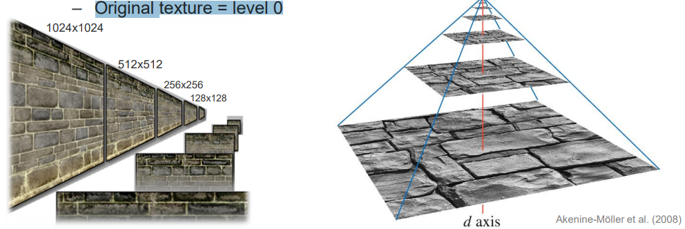

比如：从原始纹理（标记为层级0，最高分辨率1024x1024）开始，每个下一级的纹理分辨率都大约减少一半（在每个维度上），例如512x512、256x256，直到最低分辨率。

1. creation
   1. 最简单的选项：在每个级别，将来自上一级（更细节的级别）的2x2纹理元素（texels）**平均**合并到一个纹理元素中。也就是说，在 level l 的每个纹理元素代表了$2^l \times 2^l$个初始的纹理元素。
2. usage
   1. 当一个片段（fragment）进行纹理映射时，会计算出在该像素视野下哪个Mipmap级别的一个纹理元素代表了与初始纹理元素数量相同的视觉信息。然后从这个级别开始采样纹理。

#### Pixel to texel ratial 像素到纹理元素比例

1. 这个比率描述的是通过一个像素所能看到的纹理元素（texels）的数量，这个数量取决于纹理的分辨率以及纹理化多边形到观察平面的距离。

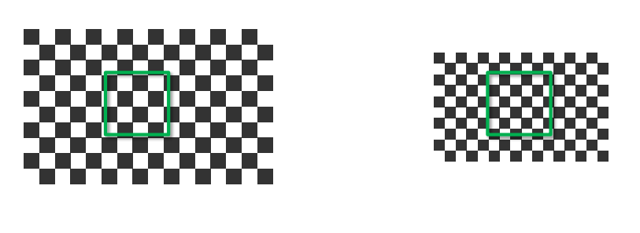

* 两个图示中都展示了一个棋盘格纹理，其中绿色框标示的区域代表一个像素所覆盖的纹理元素数量。
* 左侧图示：展示了较近的观察距离或较高的纹理分辨率，所以一个像素覆盖的纹理元素较少。
* 右侧图示：显示了当多边形远离观察平面或纹理分辨率较低时，一个像素可能覆盖更多的纹理元素。

2. 观察角度对这一比率的影响:

这个比率还取决于多边形被观察的角度。不同的观察角度会导致通过单个像素看到的纹理元素数量发生变化。

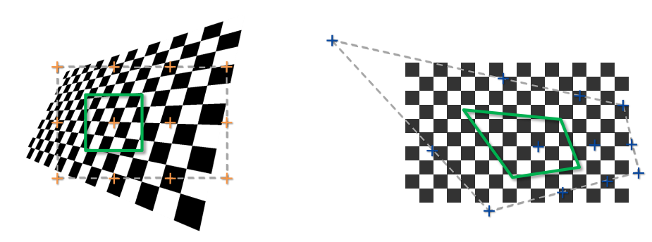

* 左侧图示：展示了一个多边形在斜视角下的纹理映射。在这种视角下，一个像素可能覆盖更多的纹理元素。

#### 如何选择正确的细节级别

* 一个图像的像素覆盖了纹理上的一个区域：当这个像素投影到纹理化的多边形上时，它包括了多个纹理元素（texels）。
* 目标：大致确定多少纹理影响一个像素的空间。

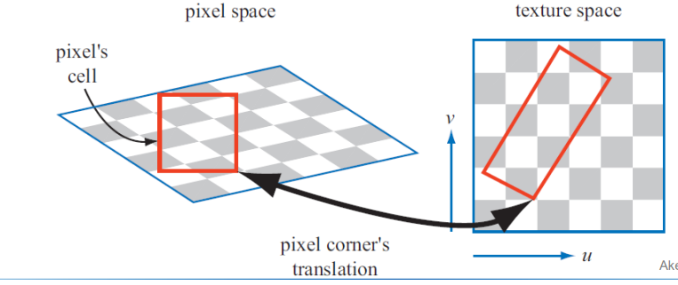

#### Trilinear interpolation 三线性插值

* 使用像素区域的投影来计算“细节级别”：通过将像素的区域投影到纹理上，可以计算出所需的细节级别（Level of Detail, LOD）变量 d：使用一个**浮点数变量d表示不同级别之间的位置**。这个变量可以帮助选择两个连续的Mipmap级别进行插值。
* 目标：实现至少1:1的像素到纹理元素比率，保证图像的清晰度。
* 使用(u,v,d)三元组访问Mipmap：这个三元组不仅指定了纹理坐标，还包括了细节级别，用于精确控制纹理采样。
* 三线性插值：在纹理映射中使用三线性插值可以在不同的Mipmap级别之间平滑过渡，从而提高渲染质量。

课外补充：
1. 通常计算d:
   1. $$d=log_2(像素尺寸到纹理尺寸的比率)$$
   2. 例如，如果一个像素覆盖了四个纹理元素的面积，这个比率是 4:1，那么 d 将是 2。
2. 不同的图形硬件和API（如 OpenGL 或 DirectX）可能提供了内置的函数来自动计算这个 LOD。例如，OpenGL 有一个函数 glGetTexParameter()，可以用来获取或设置纹理参数，其中包括自动生成的Mipmap级别。
3. 好像还可以直接通过距离来算，比如level 0 是 100米，level 1 是 200米，那么160米的距离就用level 0.6。
4. 理解：0.4 * level 0 的双线性插值结果 + 0.6 * level 1 的双线性插值结果

#### 比较有无mipmap的区别

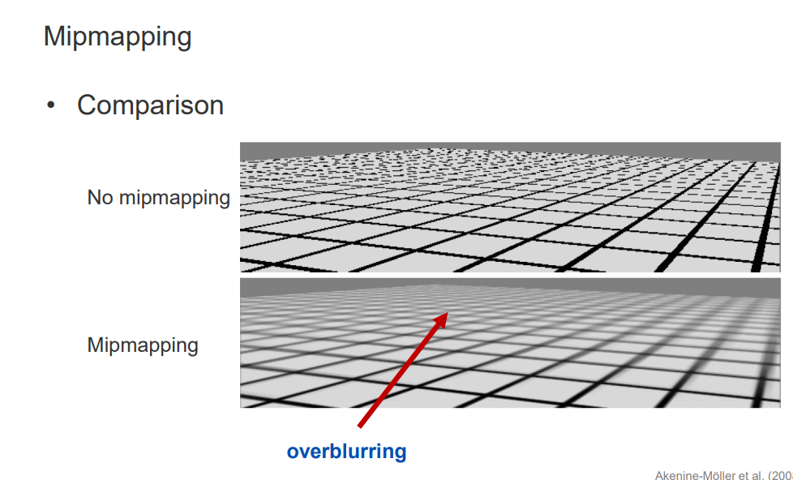

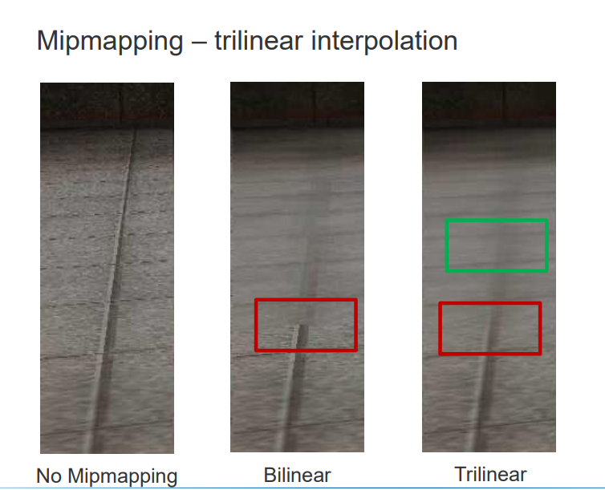

双线性滤波（Bilinear Filtering）:

在纹理坐标（u,v）附近的四个最近的纹理元素（texels）之间进行线性插值。这包括在u方向上进行两次插值和在v方向上进行两次插值，总共四个纹理元素参与。

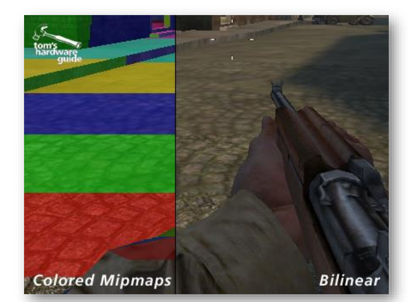

Colored Mipmaps：使用彩色Mipmaps来标识不同层级的Mipmap，有助于理解在渲染过程中各个Mipmap级别的使用情况。这种方法通常用于开发阶段，以便观察和调试Mipmap的选择和应用。

#### Anisotropic Filtering

各向异性过滤 - 比如 terrain rendering

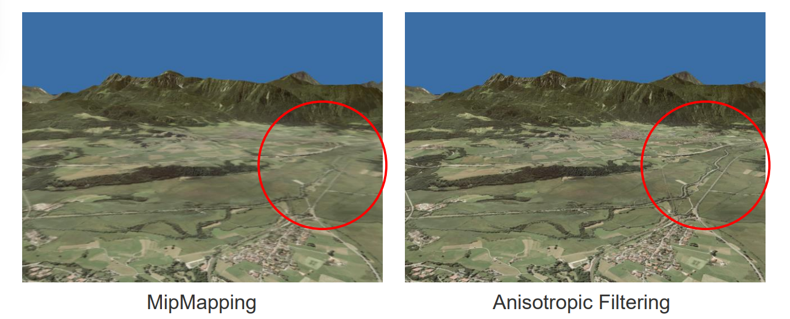

* 左侧图像展示了使用Mipmapping技术的地形渲染。Mipmapping有助于减少纹理细节在不同距离和尺度上的走样，通过选择适当级别的纹理来优化性能和视觉效果。然而，从图中可以看到，在远处地形的某些区域，如红圈所示，纹理可能显得模糊，这是因为**Mipmapping在处理远距离的纹理时可能过度平滑纹理细节**。
* 右侧图像则展示了应用了各向异性过滤技术的地形渲染效果。各向异性过滤是一种纹理过滤技术，特别**适用于从低角度观察纹理**时，如地平线或道路表面，能**显著改善远距离和斜视角下的纹理质量**。
* 与Mipmapping相比，各向异性过滤提供更清晰和详细的纹理表现，尤其是在视线方向和纹理对齐较低的角度。红圈标出的区域明显显示了地形细节，包括道路和田野的边界，比左侧的Mipmapping图像更为清晰和丰富。

## 小结

* 每个通过所有测试的片段会与颜色缓冲区中的当前值混合。
* 它会在颜色缓冲区留下一个 RGBA 值和在深度缓冲区留下一个深度值
  * 颜色缓冲区的内容是你在屏幕上看到的内容
  * 深度缓冲区的内容用来决定可见性
  * α-缓冲区的内容用于模拟透明度

fragment process中顺序：
1. 纹理采样（Texture Sampling）
2. 片段着色（Fragment Shading）
3. 测试和混合（Tests and Blending）