# 13 Ray Tracing

## 引言

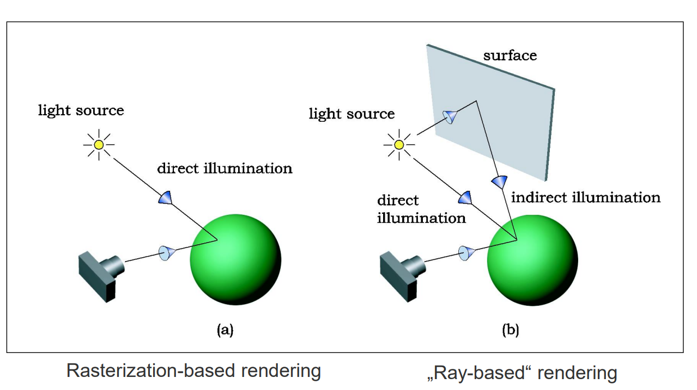

## Raytracing 基础

光线是光子沿直线路径传播的路线。在同一光线上，可以有多个光子同时传播。光子从某个光源发出，在场景中的几何体上反弹，直到它们撞击到观察者的眼睛。

从每个光源向前追踪光子将产生一幅极好的场景图像——但大多数光子永远不会进入眼睛。因此，我们追溯光子从眼睛到场景的路径。（需要采样结构，即虚拟像素平面，来确定要跟随的光线）

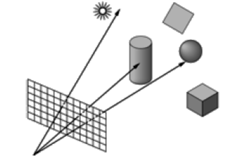

## 经典射线追踪方法

这种方法通过递归计算场景中的路径进行，包括与物体的交互（吸收、镜面反射、折射等），以及点对点的局部光照模型和阴影的计算。

阴影光线（Shadow Rays）：为了确定一个表面点是否处于阴影中，从该点射出去的光线（称为影子光线）被用来检测它是否被其他物体遮挡。

点光源和面光源：光线可以是来自点光源的单一光线，或者面光源产生的多个光线。这决定了阴影的硬度或软度：
* 点光源产生硬阴影，因为每个点要么完全在光下，要么完全在阴影中。
* 面光源产生软阴影，因为阴影的边缘（半影）是渐变的，不同的点接收到不同程度的光照。

当表面点位于阴影中时，即阴影光线在到达光源前被其他物体遮挡，这个点不会接收来自光源的光。如果表面点不在阴影中，将计算该点的局部光照。

* Umbra（本影）：完全没有光照的区域。
* Penumbra（半影）：部分光照的区域，这是由于光源的面积造成的。

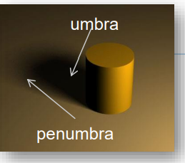

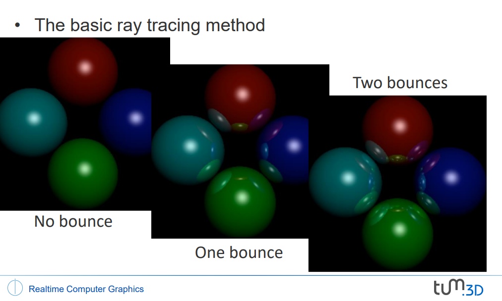

没有反射，一次反射，两次反射的光线追踪区别图。

需要发射的光线数量（即样本数量）是由视口的分辨率决定的。视口的分辨率就是像素栅格的大小，也就是显示画面的水平和垂直像素数量。如果视口分辨率是1920x1080，那么理论上至少需要发射1920 * 1080 = 2,073,600条光线来计算整个图像。

### Recursice ray traversal 递归光线遍历

tree-like 计算顺序

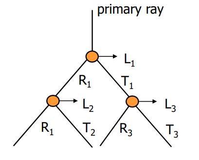

* 主光线、次级光线、三级等光线
* 一条或多条阴影光线指向点光源：为了计算一个点是否处于阴影中，从该点向光源射出阴影光线。如果这些光线在到达光源前遇到障碍，则该点处于阴影中。
* 在分支中工作量大但对最终图像的贡献较小：因为吸收的存在，随着光线级别的增加，每个分支对最终图像的影响越来越小。这意味着虽然计算越来越复杂，但是对图像的实际贡献却在减少。

$$I = I_direct + k_s * I_reflected + k_t * I_refracted$$

* I：最终的光强度
* I_direct：直接光照强度，包括漫反射（I_diffuse）和镜面反射（I_specular）。
* k_s：反射系数，决定了多少反射光被计入总光照。
* I_reflected：反射光强度。
* k_t：折射系数，决定了多少折射光被计入总光照。
* I_refracted：折射光强度。

$$I_direct = I_diffuse + I_specular$$

* I_diffuse：漫反射光照，描述了光线在物体表面均匀散射的部分。
* I_specular：镜面反射光照，描述了光线在光滑表面如镜子或光滑金属上的反射光。

---

1. 通过每个像素追踪一条光线进入场景：
   1. 这意味着从摄像机或观察点向场景中的每个像素发射一条光线。这是光线追踪的基础，用于计算光线与场景中物体的交互。
2. 在镜面或透明表面反射/折射：
   1. 当光线遇到具有镜面（如镜子）或透明特性（如玻璃）的表面时，光线会相应地发生反射或折射。
3. 持续追踪直到满足以下条件之一：
   1. 击中纯漫反射表面：这是原始Whitted光线追踪器的特点，光线会在遇到纯漫反射表面时停止。
   2. 能量低于阈值因衰减：因为光线在传播过程中可能会逐渐失去能量，一旦能量低于某个阈值，追踪会停止。
   3. 光线离开场景：如果光线没有击中任何物体而离开了定义的场景边界，追踪也会结束。

---

## Reflection and Refraction

1. 反射定律（Snell's Law of Reflection）告诉我们光线会如何在完美反射的表面上反弹。
   1. $$\vec{r} = 2(\vec{n} \cdot \vec{I})\cdot\vec{n} - \vec{I}$$
   2. r 是反射光线的方向，n 是表面法线，I 是入射光线的方向。
   3. 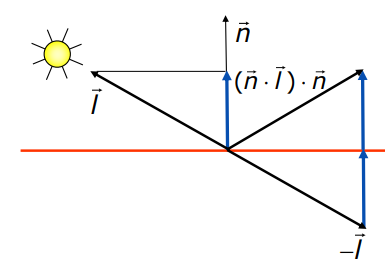
2. 折射定律（Law of Refraction，即 Snell's Law）描述了光线在穿过不同介质时速度的改变（相对于真空中的速度），公式为：$s_i \sin(\theta_i) = s_t \sin(\theta_t)$，其中 $s_i$ 和 $s_t$ 分别是两个介质的折射率，$\theta_i$ 和 $\theta_t$ 分别是入射角和折射角。
   1. 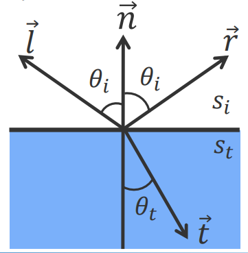

## Acceleration

### 漫反射表面diffuse surfaces的光线追踪

（在“图像合成”中）

* 收集来自每个可见点的贡献
* 需要在所有方向上进行多次采样
* 使用随机（蒙特卡洛）技术
* 结合重要性采样: 这是一种优化技术，目的是提高采样效率，通过在对最终图像贡献最大的方向射出更多光线来实现。这种方法可以减少计算资源的浪费，同时提高渲染效果的精确度和质量。

### 光线追踪加速技术

* 复杂度：光线追踪的计算复杂度为O(m*p), m是像素数，p是场景中的物体数。这意味着每一条光线都需要与场景中的每一个物体进行交叉检测。
* 如果场景中的物体是多边形，并且整个场景由 n 个多边形组成，那么复杂度将是 O(m×n)。对每条光线，都需要检查与每个多边形的交叉情况。

### 加速技术分类

1. 加速光线与物体的交叉检测Faster ray-object intersections：
   1. 使用高效的交叉检测器，这些工具可以快速判断光线与物体是否相交，从而减少计算时间。
   2. A Fast Triangle-Triangle Intersection Test (1997)
      1. 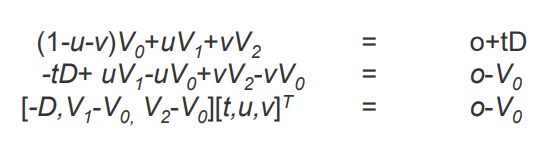
   3. Ray-triangle intersection
      1. 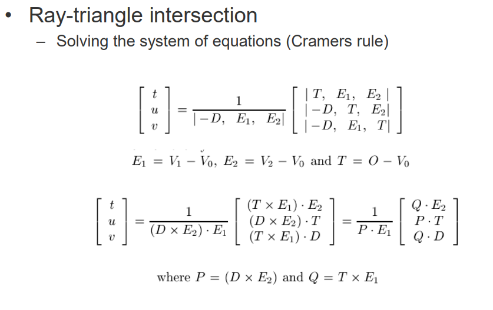
2. 减少光线与物体的交叉intersections检测次数：
   1. 边界体（Bounding Volumes）：通过围绕物体设置简单的几何形状（如盒子或球体）来快速排除那些明显不会与光线相交的情况。只有当光线与边界体相交时，才进行具体物体的详细交叉检测。
      1. 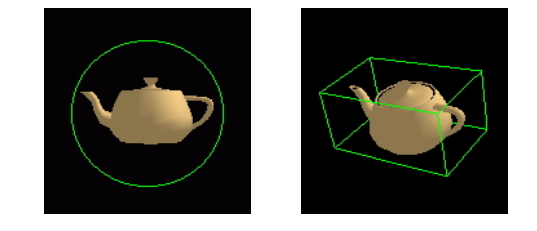
      2. 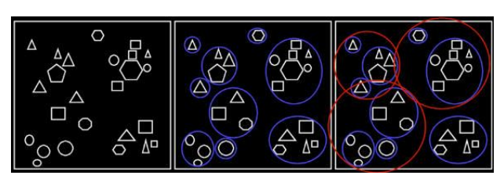
      3. Hierarchical bounding volumes
         1. 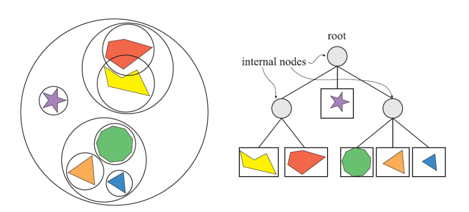
         2. 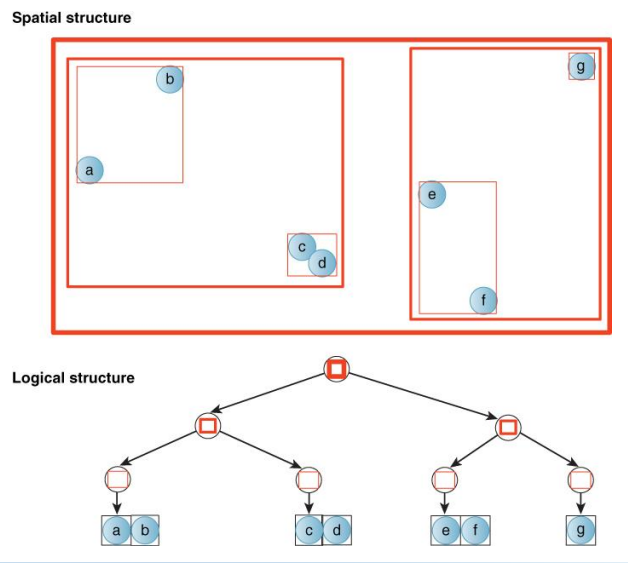
         3. 光线交叉算法递归遍历树
            1. 如果光线没有击中任何边界体，那么就没有交叉发生。
            2. 如果光线击中某个边界体，就进一步递归检查该边界体内部的更小边界体和物体。
            3. 维护近和远边界，以进一步减少需要考虑的体积和物体，这称为剪枝（pruning）。
         4. 整体效果取决于模型和构建的层级结构：
            1. 分层边界体的设计和实现方式将直接影响算法的效率。优良的层级结构可以大幅提高检测效率，减少不必要的计算。
   2. 空间细分（Space Subdivision）：将场景划分成小的区域或体积，每个区域只包含局部物体，这样可以减少需要检测的物体数量。
      1. 详情单独见下面的章节。
3. 减少总光线数：
   1. 自适应树深度控制（Adaptive Tree-Depth Control）：根据需要动态调整光线追踪的深度或次数，以减少不必要的计算。
   2. 随机采样（Stochastic Sampling）：通过随机选择追踪的光线而不是均匀覆盖所有像素，可以有效减少计算量，同时保持图像质量。

### Space subdivision

* 空间细分作为边界体的替代方案：将空间划分为不相连的子区域（即分区）。
  * 对于每个区域，存储一个包含该区域内所有对象/多边形的列表。
  * 在运行时，只测试被光线击中的子区域。
* 所有空间细分方案的通常问题：对象/多边形可能会被区域边界切割。
  * 解决方案：要么在所有重叠的区域存储对象/多边形，要么将其切成两半——这将增加需要存储的多边形数量。
  * 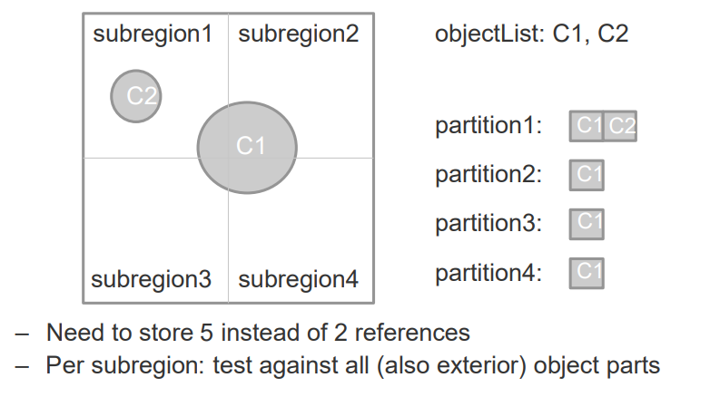
  * 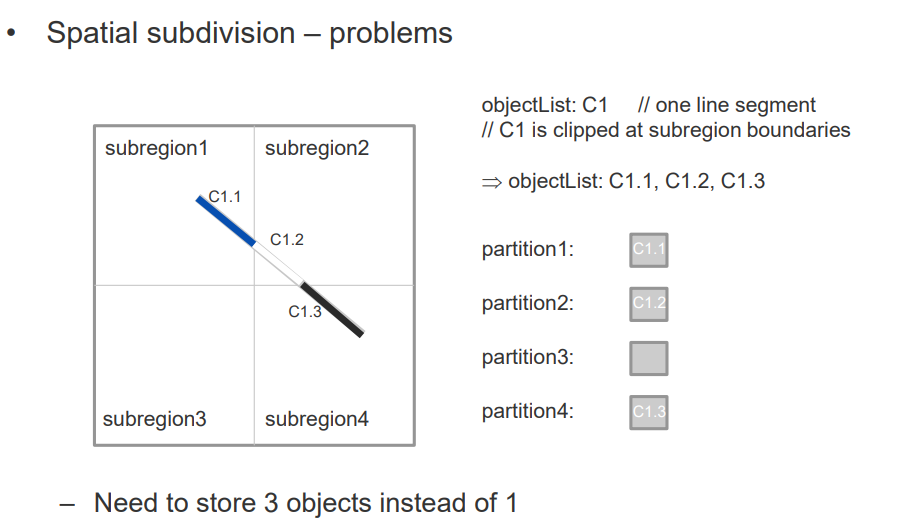

#### Uniform spatial subdivision - grids

统一空间细分 - 网格
* 一个由单元格组成的三维数组，是一种规则的空间划分。
* 光线从一个单元格步进到另一个单元格，并对每个单元格内的对象/多边形进行测试。

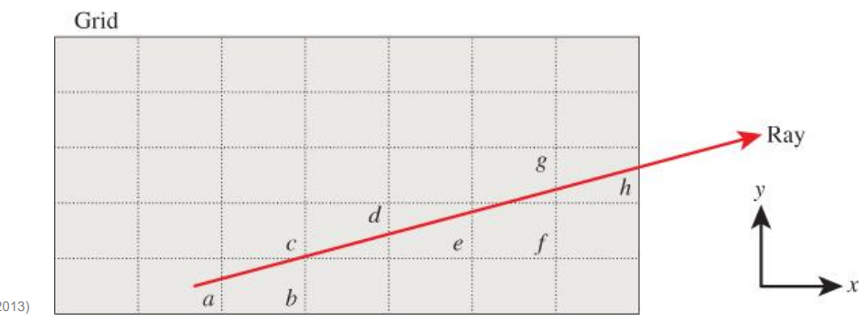

规则网格的属性：
* 网格遍历，即从一个单元格到另一个单元格的遍历，是非常快的。
* 网格的分辨率：
  * 分辨率过低：每个单元格中的多边形太多。
  * 分辨率过高：需要遍历和存储过多的空单元格。
* 当几何形状在局部高度聚集时，选择规则网格是一个不好的选择，即许多单元格可能不包含任何多边形。
* 非均匀空间细分更为灵活：可以根据几何“密度”进行调整。

#### Non-uniform space subdivision

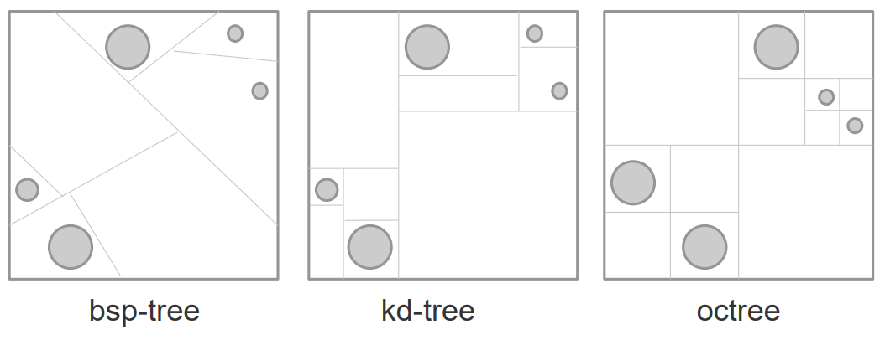

* BSP树（Binary Space Partitioning Tree）：
  * BSP树通过任意的划分平面来递归分割空间，这些平面可以是**任意方向和位置**。
* kd树：
  * kd树是BSP树的一种特殊形式，其中的划分平面总是与坐标轴对齐，并且按照固定的顺序进行分割，例如，**先按x轴，再按y轴**，然后是z轴。
* 八叉树（Octree）：
  * 在八叉树中，划分平面总是与坐标轴对齐，并且总是将空间分割为相等的一半，分割同时沿x、y、z轴进行。

#### Adaptive subdivision

自适应细分

##### 四叉树

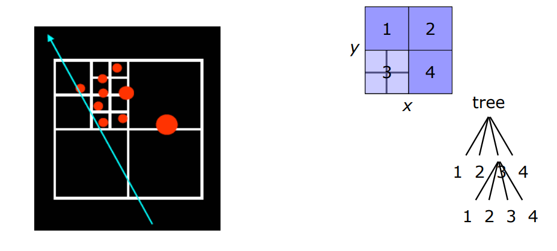

图展示了自适应细分的一个例子，使用的是四叉树（四个区域）。光线（蓝色线）穿过不同的区域：
* 自适应细分：根据物体的密集度递归地对空间进行更精细的分割。
* 这个图中的光线测试了它穿过的区域，仅在遇到实际物体（圆形）的部分区域进行详细的交叉测试。

##### BSP树

Binary Space Partitioning

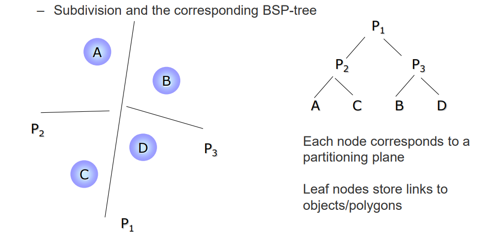

这张图展示了自适应细分与BSP树的关联：

* BSP树结构：每个节点对应一个分割平面，例如 P1、P2、P3，将空间分割成不同的区域（A, B, C, D）。
* 叶节点：存储链接到实际物体或多边形的链接，允许快速访问和交叉测试。

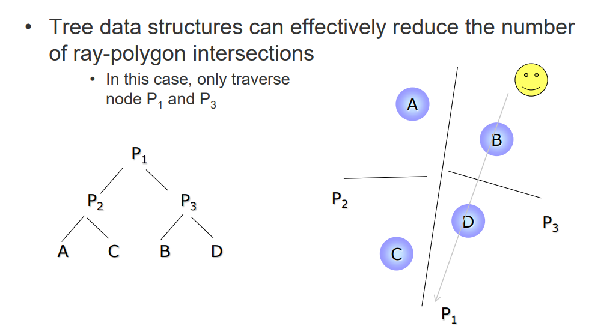

这张图进一步说明了如何使用BSP树结构减少光线-多边形交叉测试：
* 有效减少测试：图中的光线仅需要在节点P1和P3进行交叉测试，因为只有这些部分包含物体。
* 这种方法显著降低了不必要的计算量，因为避免了在空白区域或不包含目标物体的区域进行光线交叉测试。

* 树形数据结构可以有效地确定对象的可见性顺序；哪个对象可以隐藏哪个其他对象
* 通过首先递归到包含查看器的分区来隐式地对对象进行排序

###### Bsp-tree construction
1. 生成候选分割平面的位置。
2. 在每个位置评估成本函数C。
3. 选择成本最低的平面。

###### BSP树（kd树）的构建:
1. 存在无限多的候选平面。
2. 选择与对象边界盒对齐的候选平面。

###### 成本函数C:
1. 应该衡量如果选择了某个平面将要做的工作(计算量)。
   1. 平面将空间划分为“左”和“右”两个半空间。
   2. 一条光线与左/右半空间相交的工作量与该半空间中的对象数量成正比。
   3. 问题：在与整个空间相交的所有光线中，有多少是与左/右半空间相交的。

###### 二叉空间分割的概率计算

如何计算一条光线击中完全位于凸形单元内的凸形物体的概率。这基于Crofton的定理和表面积启发式（Surface Area Heuristic）：

* 概率p：表示为光线与物体相交的概率，等于物体表面积$S_0$与物体包围盒表面积$S_c$的比值。
* Crofton的定理：对于凸形物体，平均投影面积 A 等于其表面积 S 的四分之一。

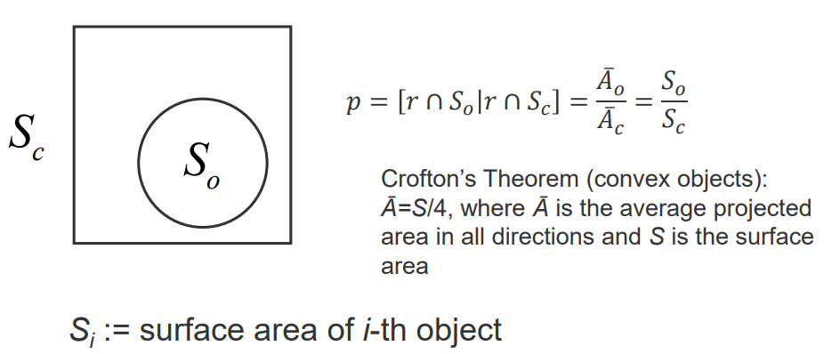

###### 成本函数的定义和应用

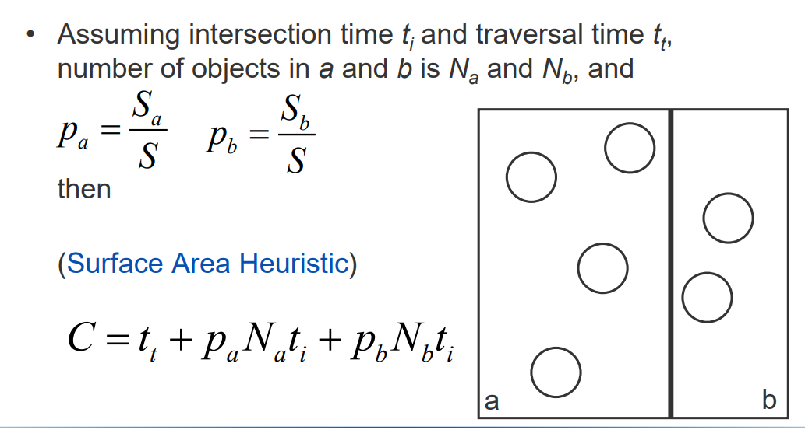

* 成本函数 C：用来衡量如果选择了特定的分割平面，将要进行的计算量。
* 概率Pa和Pb: 分别表示分割后左侧和右侧空间中物体所占的表面积比例。
* 对象数量 Na和Nb: 分别是分割后左侧和右侧空间的对象数量。
* $t_t$是遍历时间，$t_i$是交叉测试时间。

表面积启发式（Surface Area Heuristic, SAH）:基于对象表面积比例来优化分割，使得渲染过程中光线与对象的相交测试最小化，从而提高渲染效率。