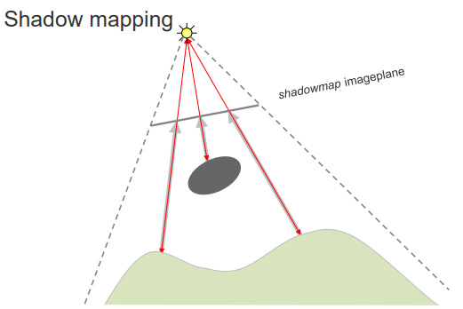
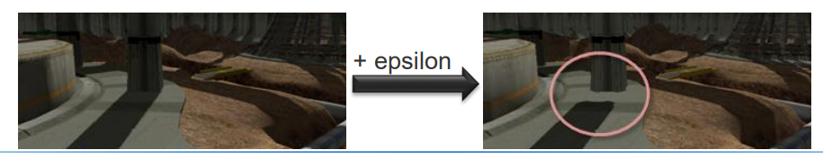

# 14 Shadow mapping

## Advanced graphics effects

阴影shadows和可见性visibility:

* Visibility: which objects can be seen from the **view point**?
* Shadows: which objects can be seen from the **light source**?

* 记住，深度测试（depth-test）在每个片段基础上解决可见性问题。
* z-buffer 存储所有投影到同一个像素的片段的最小 z 值
* 在片段处理期间进行测试
  * Frustum (perspective) 视锥体（透视）变换保持 z 轴顺序:确保在透视变换过程中，物体的前后顺序不变。
  * 增量 z 值更新（如果片段比当前的更接近近平面）：如果新片段的 z 值小于当前存储的 z 值，更新 z-buffer。
* 可见性是相对于观察者的：可见性决定是基于从观察者的视角出发的。


z-buffer algorithm:
```
colorbuffer ← BackgroundColor
z-buffer ← 1

foreach polygon
    foreach fragment_x,y  // generated by the rasterizer
        z = fragment_x,y.depth
        if z < z-buffer[x, y] then  // depth test
            z-buffer[x, y] = z
            colorbuffer[x, y] = fragment_x,y.color
```

无聊的讲义代码，已经在前面学习过更富在的内容了，即带透明度的混合。

## Shadow mapping

Shadow mapping是一种图形技术，通过从光源的角度渲染场景并存储深度信息，以确定哪些片段在光源的阴影中，从而生成阴影效果。

* 在两次渲染过程中模拟阴影
  * 从光源位置渲染场景以确定不在阴影中的所有片段，即被光照射到的片段
    * 这一步的目的是生成一个深度图（shadow map），记录从光源视角看到的每个片段的深度值。
  * 从摄像机位置渲染场景，并测试每个生成的片段是否在第一个过程中被看到，即是否有一个片段比当前片段更接近光源
    * 如果在第一个过程中被看到，则该片段接受光照，否则它在阴影中，其颜色变暗。


注：阴影图像平面（shadowmap imageplane）：这是用来生成和存储阴影图的平面。

从灯光 POV 渲染对象，将距离光源最近的对象（深度值）的距离存储在阴影贴图shadowmap（屏幕外渲染目标）中




1. 从摄像机 POV 渲染对象，同时**将其位置project到light space中（坐标系）**
2. 将光空间深度值与存储在阴影图中的值进行比较！

理解：将转换到光源空间中的片段深度值与阴影图中对应位置的深度值进行比较。如果当前片段的深度值大于阴影图中的值，说明这个片段被其他物体遮挡，在阴影中；否则，它在光照范围内。

### 计算

* 将模型视图变换后的顶点坐标投影到光空间，进行去齐次化，并计算阴影贴图纹理坐标（在`[0,1]`范围内）和与阴影贴图图像平面的距离
* 生成**齐次纹理坐标** (s,t,r,q) 于（相机）视图空间

顶点到阴影贴图的投影矩阵 (Vertex-to-ShadowMap projection matrix SM)：


去齐次化 (de-homogenization)：


归一化：


### 实图展示


## Shadow mapping implementation

1. 第一步
   1. 从光源位置渲染场景（设置光视图和光投影矩阵）
      1. 读取深度缓冲区的内容并将深度值存储到纹理资源缓冲区（即阴影图）。
      2. 另一种方法（如果无法读取深度缓冲区）：计算片段的深度值并将这些值写入纹理资源缓冲区（即阴影图）。
2. 第二步
   1. 设置顶点到阴影图的投影矩阵 (SM shadowmap)，用于将相机空间的位置转换为光源空间，作为附加的着色器变量。
   2. 顶点着色器（VS vertex shading）：通过 SM 将每个顶点转换为光源空间，并将转换后的坐标分配为附加的每顶点属性。
   3. 片段着色器（PS pixel shading）：使用转换后的坐标计算阴影值，以确定片段是否在阴影中。
      1. 通过除以 w 来去齐次化光源空间坐标，并进行缩放/平移以生成 [0,1] 范围内的阴影图纹理坐标。
      2. 从阴影图中采样值并将其与片段的光源空间深度（z/w）进行比较。
      3. 仅当深度值小于阴影图中存储的值时，执行光照计算。

## 补充

1. 每个光源需要额外的渲染过程
2. 可以用于点光源和平行光源
   1. 使用正交投影代替透视投影
3. 阴影图的分辨率可能会导致伪影Artefacts，如下图所示


## 阴影图伪影：块状效果

* 减少块状效果的方法：百分比更近过滤（Percentage Closer Filtering，PCF）
  * 左图：普通阴影映射
    * 普通阴影映射在边缘处可能会出现明显的阻塞伪影（blocky artifacts），导致阴影边缘呈现锯齿状。
  * 右图：3x3 百分比更近过滤
    * 使用3x3 PCF技术可以显著减少这些伪影，使阴影边缘更加平滑和自然。
  * 
  * 具体实现：
    * 采样阴影图的邻域：对阴影图中的多个像素进行采样，以获取一个邻域范围内的深度值。
    * 深度测试：将片段的深度值与采样的深度值进行比较，计算有多少采样点失败（在阴影中）。
    * 过滤阴影测试结果：将阴影测试的结果进行过滤，计算每个采样点的加权照明值。例如，如果9个采样点中有5个在阴影中，则weight lighting with 4/9。
    * 硬件支持：2x2的PCF采样点可以在硬件中直接支持，其计算成本与单次纹理查找相当。

通过计算平均值来平滑阴影边缘：

$$Average((d<z_i))$$

其中 d 为当前片段的深度值，zi 为从阴影贴图中采样得到的深度值。如果 d < Zi，则表示光源能照到这个点，否则在阴影中。通过对所有采样点进行这样的比较，并计算其平均值，可以得到更加平滑和自然的阴影边缘。小于就是1，大于就是0，所以途中平均值就是5/9。

然后$0.45 * 光的颜色 + 0.55 * 阴影的颜色$，这样就可以得到一个平滑的阴影效果。

## 阴影图伪影：自阴影

阴影痘（Shadow Acne）：

阴影痘是指由于深度贴图的精度限制或深度测试的不精确导致的，表面错误地为自身生成阴影的现象。这通常发生在表面的微小凹凸不平处，导致阴影映射时，本应被光照到的部分被错误地判定为在阴影中。由于深度值存储的精度和计算的精确度限制，可能导致深度值非常接近的两个表面片段，一个被判定为在阴影中，另一个则不在。（就是表面长粉刺了，有几个点和周围不一样）


解决方法：

* 在计算阴影时，向深度贴图中的深度值添加一个小的偏移量（称为ε或bias），以确保当表面片段本应被照亮时不会被误判为在阴影中。
* 这个偏移量的大小需要足够小，以避免产生另一个称为“悬浮”（peter-panning）的视觉错误，即阴影与其投射物体之间出现不自然的间隙。

