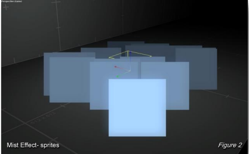
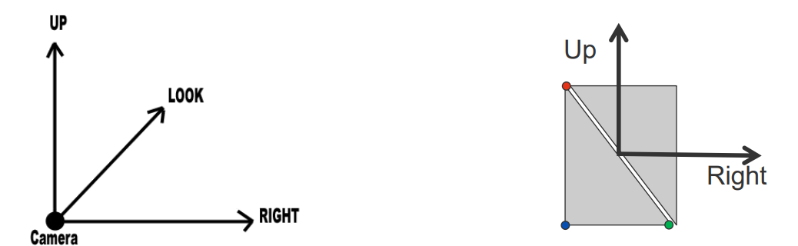

# 15 Billboarding

## 简介

Billboarding是一种图形技术，使2D纹理总是面向摄像机，以便在3D场景中呈现，例如用于树木、火焰或粒子效果，使其从任何角度看都显得自然。

子弹射到飞船上：
1. 在碰撞点创建一组粒子
2. 将粒子随机散布在碰撞点周围
3. 根据视图平面对粒子进行排序
4. 为每个粒子创建一个小的带纹理的四边形，即Billboarding
5. 变换Billboarding的边缘使其与视图平面对齐
6. 按照排序后的顺序渲染每个粒子的Billboarding
7. 将粒子混合到颜色缓冲区中
8. 模拟粒子的运动
9. 重复步骤3

碰撞检测将在《Game Physics》课程中讨论。（我的下学期的课）

### 详解
1. 在世界空间中的种子点处创建一组粒子，即在应用建模变换之后
   1. 
2. 排序
   1. 粒子将被渲染为透明的Billboarding
   2. 记住：混合不是交换律的；因此，粒子应根据它们与视图平面的距离顺序进行渲染和混合，即从后到前
   3. 需要在CPU上对缓冲区进行排序和重新组织
   4. 
3. 为每个粒子创建一个 Billboarding (或精灵sprite)，即由两个三角形组成的四边形

---

注意：上一张图中的代码假设视平面是 x-y 平面并沿 z 轴观察
* 但Billboarding应始终与当前视平面平行对齐
* 在每一帧中相应地调整Billboarding的方向

---

4. 每帧广告牌重新定向
   1. 为了使广告牌在世界空间中平行于视图平面，首先从相机对象或视图矩阵中提取相机坐标系统
   2. 记住：逆视图矩阵在第1/2/3列中分别包含相机的右（Right, R）、上（Up, U）和观察（Look, D）向量
   3. 从中提取右和上向量并构建Billboarding的角点
   4. 即将ViewMatrix的第2/1列作为Billboarding的两个方向
   5. 
5. 使用与视图空间对齐的带纹理四边形渲染粒子
   1. 可以使用相同的纹理或略有不同的纹理，或者可以旋转四边形以使外观更随机。
   2. 
6. 使用视图空间对齐的带纹理且透明四边形来渲染粒子
   1. 将所有Billboarding贡献混合在一起、
   2. 
7. 在着色器中打开 alpha 混合并设置混合方程，该方程指示如何将传入的片段（源）与颜色缓冲区中已有的像素（目标）混合
   1. 
8. Simulate particle movements
   1. 
9. 使用不同的粒子发射器并随时间改变Billboarding的几何形状和外观
   1.  随着时间的推移，放大并同时淡出（降低透明度）Billboarding
   2.  
10. 精灵一开始几乎是瞬间长大的，然后它们会随着缓慢的旋转而分开。此发射器上的重力设置应为负值，但接近于零，因此烟雾会随着时间的推移缓慢上升，而不是下降。颜色应从亮黄色/橙色开始，然后随着火焰变成烟雾而迅速变为黑色。
    1.  

## implementation details

* 讨论的技术在CPU上创建广告牌几何图形
* 广告牌几何图形可以在渲染过程中使用几何着色器（GS）在GPU上创建
  * 顶点着色器通过视图矩阵变换每个粒子
  * 几何着色器获取相机空间中当前粒子的坐标作为输入
  * 几何着色器生成广告牌几何图形（现在边缘与x/y轴对齐）
* 甚至可以在GPU上执行粒子积分(integration)
  * 粒子位置更新后写入GPU内存，并在下一帧读取
* 甚至可以在GPU上执行粒子排序
  * 粒子位置更新后写入GPU内存，并在下一帧读取

这种方法通过在GPU上进行广告牌几何生成、粒子积分和排序，可以提高系统的效率和性能，因为GPU在处理并行计算方面比CPU更有优势。