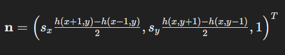
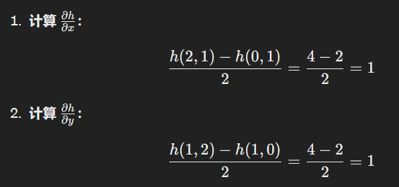
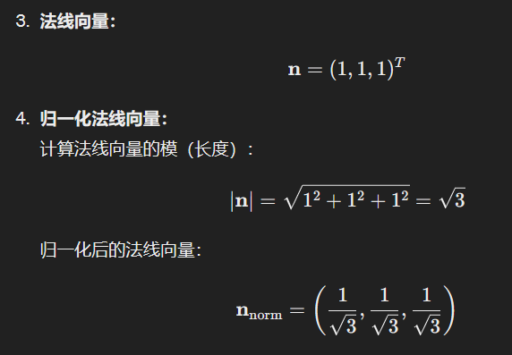

# 中心差分法计算法线

## 教案原理介绍

利用x的偏微分和y的偏微分的叉乘来计算法线。

$$(1,0,\frac{\partial f}{\partial x}) \times (0,1,\frac{\partial f}{\partial y})$$

$$\frac{\partial f}{\partial x} \approx \frac{f_{i+1,j} - f{i,j}}{\Delta x}$$
$$\frac{\partial f}{\partial y} \approx \frac{f_{i,j+1} - f{i,j}}{\Delta y}$$

## 简介



```
1 2 3
2 3 4
3 4 5
```

假设$s_x$和$s_y$都是1





## 代码实现:

注意写代码时候，由于可能会让index < 0 或者 > 上边界，因此用来 dx,dy来调节。相当于每个顶点的法向量是连接它每个面的法向量的权重和。

```c
    public void writeVertexNormals(PrintWriter writer) {
        float scalingX = heightScale / xScale * (size - 1.0f) / 2.0f;
        float scalingY = heightScale / yScale * (size - 1.0f) / 2.0f;

        for (int y = 0; y < size; y++) {
            for (int x = 0; x < size; x++) {
                float dx, dy;
                float left, right, top, bottom;
                if (x > 0) {
                    left = heightmap[y][x - 1];
                    dx = 2.0f;
                } else {
                    left = heightmap[y][x];
                    dx = 1.0f;
                }
                if (x < size - 1) {
                    right = heightmap[y][x + 1];
                    dx = 2.0f;
                } else {
                    right = heightmap[y][x];
                    dx = 1.0f;
                }
                if (y > 0) {
                    top = heightmap[y - 1][x];
                    dy = 2.0f;
                } else {
                    top = heightmap[y][x];
                    dy = 1.0f;
                }
                if (y < size - 1) {
                    bottom = heightmap[y + 1][x];
                    dy = 2.0f;
                } else {
                    bottom = heightmap[y][x];
                    dy = 1.0f;
                }
                float nx = -(right - left) / dx * scalingX;
                float ny = -(bottom - top) / dy * scalingY;
                float nz = 1.0f;
                float normalLength = (float)Math.sqrt(nx * nx + ny * ny + nz * nz);
                nx /= normalLength;
                ny /= normalLength;
                nz /= normalLength;
                writer.println("vn " + nx + " " + ny + " " + nz);
            }
        }
    }
```