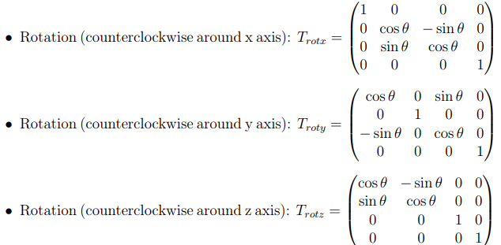
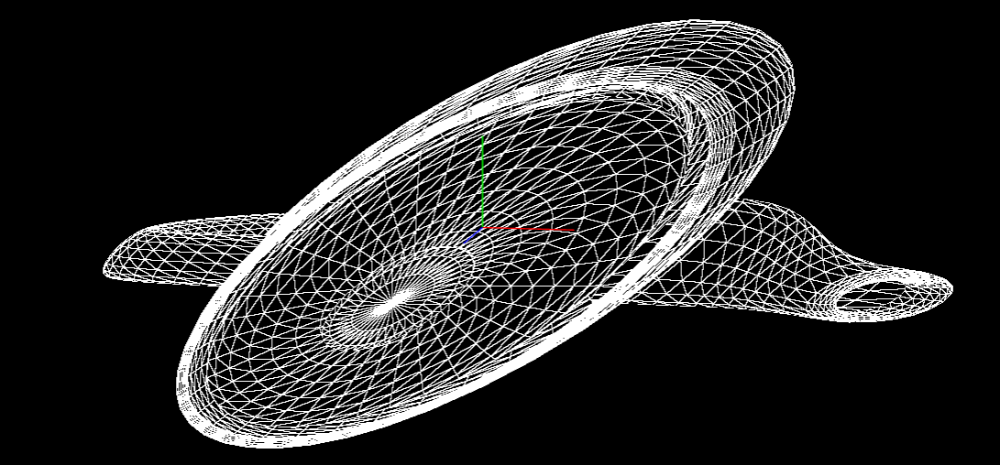
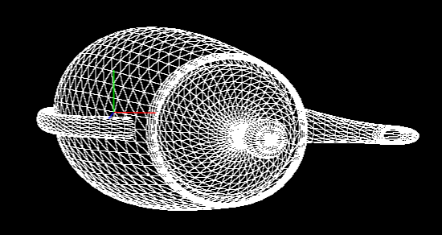

# 仿射变换-旋转_平移_缩放_剪切_投影_反射_变换矩阵

## 仿射变换

仿射变换是一种线性变换，包括平移、旋转、缩放、剪切等。

要先将矩阵变成齐次坐标，即增加一维，然后再进行变换。从三维角度看，就是将三维坐标变成四维坐标，然后再进行变换，最简单理解就是要多一个维度来表示平移。

## 1. 旋转矩阵（Rotation Matrix）

### 1.1. 普通绕xyz轴旋转

### 1.2. 通用绕任意轴旋转

#### 1.2.1. 普通方法
1. 将旋转轴转平移到原点
2. 将旋转轴转到x轴（或者y轴，z轴）
3. 绕x轴旋转
4. 将旋转轴转回去

#### 1.2.2. Rodrigues' rotation formula
使用Rodrigues' rotation formula来构造任意轴$\vec{v}$的旋转矩阵：

* **先将轴移动到通过原点**，然后旋转，最后**再移动回去**。
* 将旋转轴$\vec{v}$转换为单位向量，即$\vec{v} = \frac{\vec{v}}{||\vec{v}||}$。

$$R = I + \sin(\theta)K + (1 - \cos(\theta))K^2$$

其中：
* $I$ 是单位矩阵
* $\theta$ 是旋转角度
* $\vec{v} = (v_x, v_y, v_z)$ 是旋转轴
* $K$ 是反对称矩阵：
  * $$K = \begin{bmatrix} 0 & -v_z & v_y \\ v_z & 0 & -v_x \\ -v_y & v_x & 0 \end{bmatrix}$$

$$T_总 = T_{平移到原点} \times R \times T_{平移回去}$$

## 2. 平移矩阵（Translation Matrix）

$$T = \begin{bmatrix} 1 & 0 & 0 & t_x \\ 0 & 1 & 0 & t_y \\ 0 & 0 & 1 & t_z \\ 0 & 0 & 0 & 1 \end{bmatrix}$$

## 3. 缩放矩阵（Scale Matrix）

$$S = \begin{bmatrix} s_x & 0 & 0 & 0 \\ 0 & s_y & 0 & 0 \\ 0 & 0 & s_z & 0 \\ 0 & 0 & 0 & 1 \end{bmatrix}$$

## 4. 剪切矩阵（Shear Matrix）

$$S = \begin{bmatrix} 1 & s_{xy} & s_{xz} & 0 \\ s_{yx} & 1 & s_{yz} & 0 \\ s_{zx} & s_{zy} & 1 & 0 \\ 0 & 0 & 0 & 1 \end{bmatrix}$$

理解：比如$S_{xy}$表示x方向上的剪切，y的下标表示剪切的方向，x的下标表示被剪切的方向，数学上理解就是将一部分y方向的值加到x方向上。

视觉效果：
* (注：右手系截图，蓝色朝我们是z轴，红色朝右是x轴，绿色朝上是y轴)
* $S_{xy}$ = 1
  * 
* $S_{xz}$ = 1
  * 

## 5. 投影矩阵

### 应用

投影矩阵通常是透视投影矩阵或正交投影矩阵。

- 透视投影矩阵：将3D坐标投影到2D屏幕上，通常用于逼真的3D渲染，近大远小（想象素描）。
  - $$P = \begin{bmatrix} \frac{f}{A} & 0 & 0 & 0 \\ 0 & f & 0 & 0 \\ 0 & 0 & \frac{f+n}{n-f} & \frac{2fn}{n-f} \\ 0 & 0 & -1 & 0 \end{bmatrix}$$
  - $f$ 是焦距，$A$ 是宽高比，$n$ 是近裁剪面，$f$ 是远裁剪面。
- 正交投影矩阵：将3D坐标投影到2D屏幕上，通常用于2D游戏或CAD软件，近远一样大。

### 5.1. 初始设置
假设我们有一个摄像机和一个简单的3D点。摄像机的参数设定如下：

- 视场角 (FOV): 90度
- 宽高比 (Aspect Ratio): 宽度和高度的比例为 1.0（假设屏幕是正方形）
- 近裁剪面 (Near Clipping Plane): 0.1
- 远裁剪面 (Far Clipping Plane): 1000.0

我们想要投影的3D点是 $P_{model} = (1, 2, -5)$。

### 5.2. 构建投影矩阵
透视投影矩阵可以通过以下方式计算：
- $f = \frac{1}{\tan(\frac{\text{FOV}}{2})}$
- $A = \text{Aspect Ratio}$
- $n = \text{Near Clipping Plane}$
- $f = \text{Far Clipping Plane}$

透视投影矩阵 $P$ 形式如下：

$$
P = \begin{bmatrix}
\frac{f}{A} & 0 & 0 & 0 \\
0 & f & 0 & 0 \\
0 & 0 & \frac{f+n}{n-f} & \frac{2fn}{n-f} \\
0 & 0 & -1 & 0
\end{bmatrix}
$$

具体数字计算时，假定 FOV = 90度，则 $f = 1$。

### 5.3. 投影变换

英文: Projection Transformation

将点 $P_{model}$ 通过投影矩阵转换到裁剪坐标：

$$
P_{clip} = P \times P_{model} = \begin{bmatrix}
1 & 0 & 0 & 0 \\
0 & 1 & 0 & 0 \\
0 & 0 & \frac{1000.1}{-999.9} & \frac{200}{-999.9} \\
0 & 0 & -1 & 0
\end{bmatrix} \times \begin{bmatrix}
1 \\
2 \\
-5 \\
1
\end{bmatrix}
$$

### 5.4. 透视除法

英文: Perspective Division

将裁剪坐标 $P_{clip}$ 转换到规范化设备坐标 (NDC) 通过透视除法：

$$
P_{ndc} = \left( \frac{P_{clip,x}}{P_{clip,w}}, \frac{P_{clip,y}}{P_{clip,w}}, \frac{P_{clip,z}}{P_{clip,w}} \right)
$$

### 5.5. 视口变换

英文: Viewport Transformation

最后一步是将 NDC 坐标映射到屏幕坐标。这通常涉及将 [-1, 1] 范围内的 NDC 坐标转换到屏幕的像素坐标。

假设屏幕大小为 800x800 像素：

$$
P_{screen,x} = \frac{P_{ndc,x} + 1}{2} \times \text{ScreenWidth}
$$
$$
P_{screen,y} = \frac{1 - P_{ndc,y}}{2} \times \text{ScreenHeight}
$$

## 6. 反射矩阵

反射矩阵是将一个物体关于一个平面进行对称的矩阵。

### 6.1. 沿xy平面反射

$$T = \begin{bmatrix} 1 & 0 & 0 & 0 \\ 0 & 1 & 0 & 0 \\ 0 & 0 & -1 & 0 \\ 0 & 0 & 0 & 1 \end{bmatrix}$$

### 6.2. 沿yz平面反射

$$T = \begin{bmatrix} -1 & 0 & 0 & 0 \\ 0 & 1 & 0 & 0 \\ 0 & 0 & 1 & 0 \\ 0 & 0 & 0 & 1 \end{bmatrix}$$

### 6.3. 沿xz平面反射

$$T = \begin{bmatrix} 1 & 0 & 0 & 0 \\ 0 & -1 & 0 & 0 \\ 0 & 0 & 1 & 0 \\ 0 & 0 & 0 & 1 \end{bmatrix}$$

### 6.4. 沿任意平面反射

已知一个法向量 $N$，则反射矩阵为：

$$T = I - 2N \cdot N^T$$