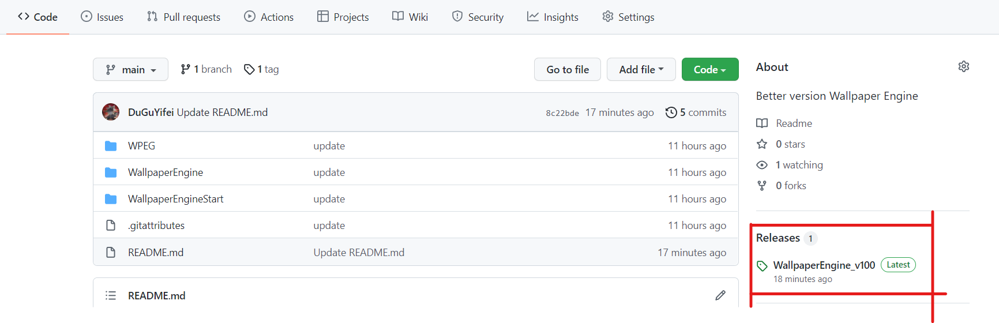

# 知识积累 Git

## GitLens 和 在VSCode中使用自带git功能
[前端技能树中提及的vscode](../../../前端学习/前端学习技能树.md##VSCode)

## Git系统基础介绍
[Web/02-Git的使用.md at master · qianguyihao/Web](https://github.com/qianguyihao/Web/blob/master/00-%E5%89%8D%E7%AB%AF%E5%B7%A5%E5%85%B7/02-Git%E7%9A%84%E4%BD%BF%E7%94%A8.md)

## Git基本操作

| 命令       | 说明               |
| ---------- | ------------------ |
| git remote | 远程仓库操作       |
| git fetch  | 从远程获取代码库   |
| git pull   | 下载远程代码并合并 |
| git push   | 上传远程代码并合并 |

## Git删除branch

```bash
git push origin --delete 分支名
```

## Git 切换分支

```bash
git checkout -b main
# Switched to a new branch 'main'
git branch
# * main
#  master
git merge master # 将master分支合并到main上
# Already up to date.
git pull origin main --allow-unrelated-histories # git pull origin main会报错：refusing to merge unrelated histories
git push origin main
```

### Git 新仓库切换分支
```bash
git branch -M main
git remote add origin git@github.com:DuGuYifei/Vue_MusicPlayer_Demo.git
```

## 改变git buffer支持大文件
500MB*1024*1024
```
git config http.postBuffer 524288000
```


## Git 大文件 LFS (Large file storage)

[GitHub大文件(大于100M)上传_往復不息的博客-CSDN博客_github 大文件](https://blog.csdn.net/wifi74262580/article/details/85060187)
```bash
git init
git remote add origin git@github.com:DuGuYifei/WallPaperEngine.git #(你自己的git地址)
git pull origin main
#git lfs install
git lfs track "*/ffplay.exe"
git add .gitattributes
git add . # [记得去除大文件](## 从缓存区删除文件)
git commit -m "update"
git push origin main
```

```
git init #创建本地仓库环境
git lfs install #安装大文件上传应用
git lfs track * #追踪要上传的大文件，*表示路径下的所有文件
git add .gitattributes #添加先上传的属性文件(要先上传属性文件，不然有可能失败)
git commit -m "pre" #添加属性文件上传的说明
git remote add origin https://github.com/Youpeng-Zhang/MOP.git #建立本地和Github仓库的链接
git push origin master #上传属性文件
git add * #添加要上传的大文件，*表示路径下的所有文件
git commit -m "Git LFS commit" #添加大文件上传的说明
git push origin master #上传大文件
```

## 设置默认分支为main

```bash
cat C:/Users/独孤逸飞/.gitconfig
git config --global init.defaultBranch main
cat C:/Users/独孤逸飞/.gitconfig
```

## asset release
在右侧有一个release按钮


## 从缓存区删除文件（适用于删除仓库文件不过需要commit再push）
```bash
git rm --cached */ffplay.exe
```
加上`-r`可以递归删除该文件夹下的所有文件

**注意：如果子文件夹有.git，这个子文件夹是没法操作的，需要将其变为子模块**

## 彻底删除（包括物理的）
```bash
git rm --f  "文件路径"
```

## 子模块
[Github子模块(submodule)使用介绍_cain-won的博客-CSDN博客_github submodule](https://blog.csdn.net/kaijkl/article/details/118752830)

解决仓库包含仓库问题
```bash
git submodule add 子仓库url [目标文件夹]
```

## 忽略某个文件/文件夹
```bash
touch .gitignore
```
编辑器打开生成的 .gitignore 文件，加入:

node_modules
/*以及其他你想要忽略的文件或文件夹*/


## 同时push多个仓库
进入你的项目目录，打开.git/config文件(.git是隐藏目录，需要打开显示隐藏文件...)


## 克隆到指定文件夹
```bash
git clone https://github.com/next-theme/hexo-theme-next.git themes/next
```

## gh-pages的分支
github只要是`gh-pages`的branch都可以同过`github.io/project`来访问，所以可以看上图中的deploy的url并不是io仓库

## pull request

### 当原主人更新时

```bash
git remote add upstream 开源项目原地址
git checkout master # 因为一般fork一个项目到自己的master后会自己再复制一个branch，所以要切换回去
git pull --rebase upstream master  # 把最新的更新放到我的branch里
```

## git commit 修改
还未push时
```bash
git commit --amend
```
按 i 进入修改模式

:wq 退出