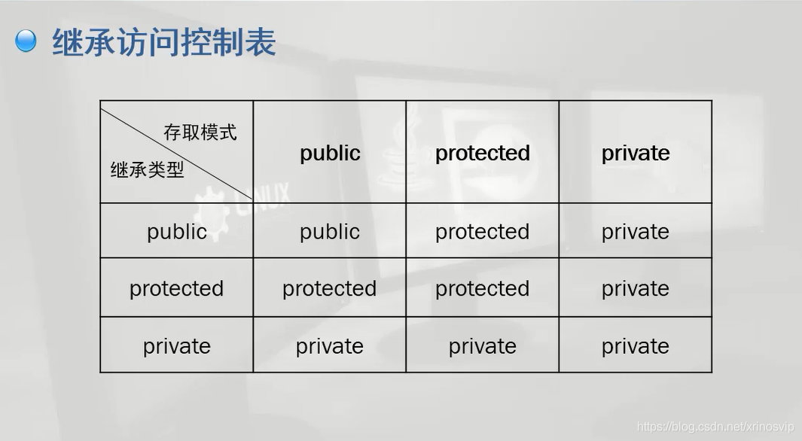

# C++的三种继承_public_protected_private



1. 首先说明一点：类实例（即类对象）不能直接访问类的 private成员和protected成员，但是能直接访问类的public成员。

2. 另外无论哪种继承方式，子类都不能直接访问父类的 private成员；但是能直接访问父类的 protected成员和public成员（注意：是子类，而不是类实例），并且能通过父类的protected成员函数和public成员函数间接访问父类的private成员；这句话强调了类与类之间通过继承方式的访问规则，而非类与实例之间的访问规则。

3. 子类通过public方式继承父类，则父类中的public、protected和private属性的成员在 子类 中 依次 是 public、protected和private属性，即通过public继承并不会改变父类原来的数据属性。

4. 子类通过protected方式继承父类，则父类中的public、protected和private属性的成员在 子类 中 依次 是 protected、protected和private属性，即通过protected继承原来父类中public属性降级为子类中的protected属性，其余父类属性在子类中不变。

5. 子类通过private方式继承父类，则父类中的public、protected和private属性的成员在 子类 中 依次 是 private、private和private属性，即通过private继承原来父类中public属性降级为子类中的private属性，protected属性降级为子类中的private属性，其余父类属性在子类中不变。

注意: 其实父类的原属性并未改变，只是通过 继承关系被继承到子类中的父类成员的个别属性有所变化 ，即只是在子类中父类的个别成员属性降级了，原来父类的成员属性并未变。

**关键在于第四点，如果是protected默认继承，那么父类的public属性在另一个类中无法访问**
如下
```cpp
class A
{
public:
    int x;
    void F();
}
class B:A
{
}

class C
{
    B b;
    void C()
    {
        b.F(); //可以
        //b.x 不可以
    }
}
```

