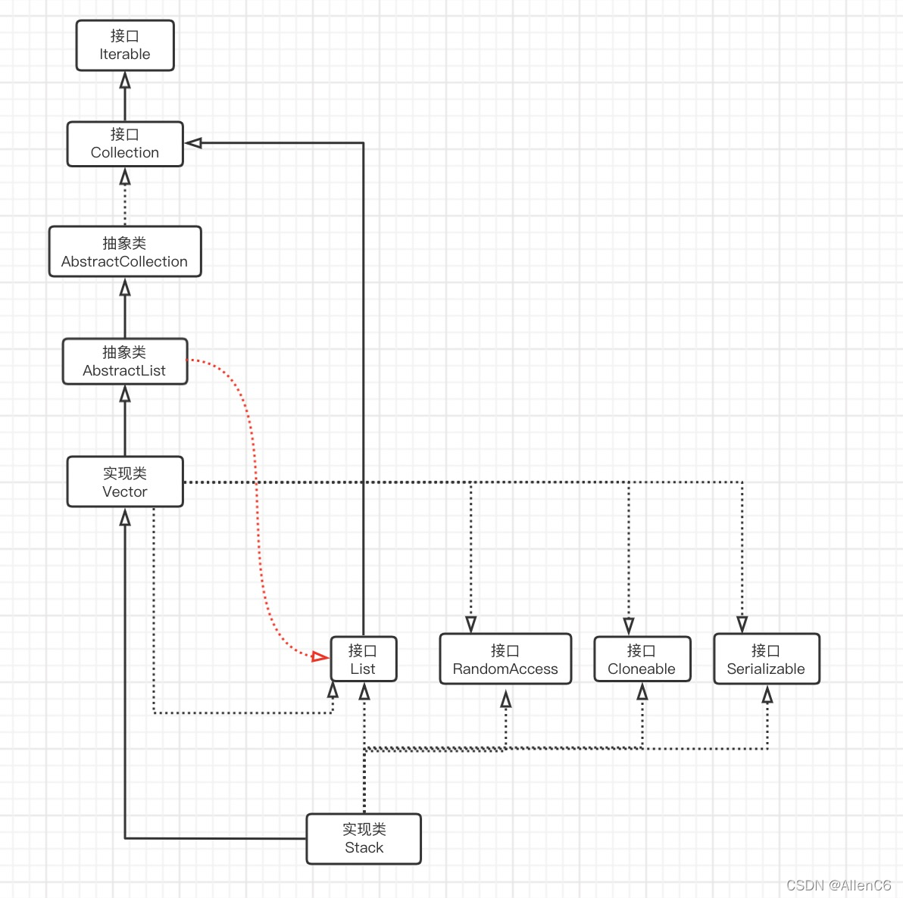

# stack

先进后出

`stack`继承自`deque`不是`vector`，vector在容器大小变化时动作大，deque动作小，但是push_back更复杂



```cpp
`#include <stack>`
```

`FILO` 先进后出，所以可以(前3行)
| function | effect           |
| :------: | ---------------- |
|  pop()   | 移除栈顶元素     |
|  push()  | 在栈顶增加元素   |
|  top()   | 返回栈顶元素     |
| empty()  | 堆栈为空则返回真 |
|  size()  | 返回栈中元素数目 |

stack 没有迭代器，所以没有 clear()，只能不停pop，所以可以直接新赋一个新的stack值`minStack = stack<int>();`。

## 用例：
```cpp
class Solution {
public:
    ListNode* removeNthFromEnd(ListNode* head, int n) {
        ListNode* dummy = new ListNode(0, head);
        stack<ListNode*> stk;
        ListNode* cur = dummy;
        while (cur) {
            stk.push(cur);
            cur = cur->next;
        }
        for (int i = 0; i < n; ++i) {
            stk.pop();
        }
        ListNode* prev = stk.top();
        prev->next = prev->next->next;
        ListNode* ans = dummy->next;
        delete dummy;
        return ans;
    }
};

作者：LeetCode-Solution
链接：https://leetcode-cn.com/problems/remove-nth-node-from-end-of-list/solution/shan-chu-lian-biao-de-dao-shu-di-nge-jie-dian-b-61/
来源：力扣（LeetCode）
著作权归作者所有。商业转载请联系作者获得授权，非商业转载请注明出处。
```