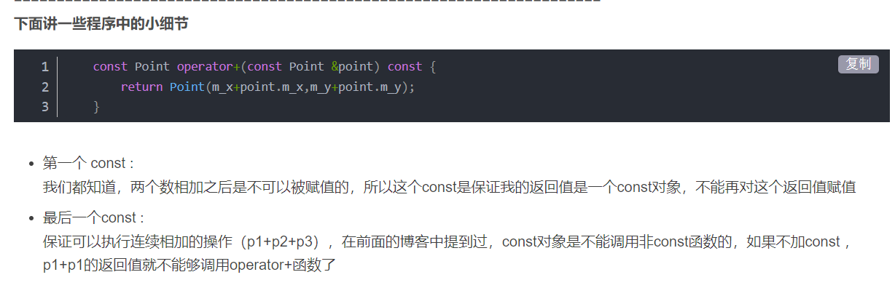

# 符号重载



[�后置++等的重载_不爱吃药的少爷、的博客-CSDN博客_重载减号](https://blog.csdn.net/qq_47329614/article/details/106974621)
```cpp
#include <iostream>
using namespace std;

class Point {
private:
	int m_x;
	int m_y;
public:
	Point(){}
	Point(int x,int y):m_x(x),m_y(y){}
	void Display(){
		cout << "(" << m_x << "," << m_y << ")" <<endl;
	}

	Point(const Point &point){
		m_x=point.m_x;
		m_y=point.m_y;
	}

	 //加号重载
	const Point operator+(const Point &point) const {
		return Point(m_x+point.m_x,m_y+point.m_y);
	}

	// 减号重载
	const Point operator-(const Point &point) const {
		return Point(m_x-point.m_x,m_y-point.m_y);
	}

	// 等于号重载
	Point& operator= (Point& point){
		m_x=point.m_x;
		m_x=point.m_x;
		return *this;
	}

	// +=重载
	Point &operator+=(const Point &point) {
		m_x += point.m_x;
		m_y += point.m_y;
		return *this;
	}

	// ==重载
	bool operator==(const Point &point) const {
		return (m_x == point.m_x) && (m_y == point.m_y);
	}

	// ！=重载
	bool operator!=(const Point &point) const {
		return (m_x != point.m_x) || (m_y != point.m_y);
	}

	// 负号重载
	const Point operator-() const {
		return Point(-m_x, -m_y);
	}

	// 前置++
	Point &operator++(){
		m_x++;
		m_y++;
		return *this;
	}
	
	// 后置++
	const Point &operator++(int){
		Point old(m_x,m_y);
		m_x++;
		m_y++;
		return old;
	}

	friend ostream &operator << (ostream &,const Point &);
	friend istream &operator >> (istream &cin, Point &point) ;
};

ostream &operator << (ostream &cout,const Point &point) {
	cout << "(" << point.m_x << "," << point.m_y << ")"<< endl ;
	return cout;
}

istream &operator >> (istream &cin, Point &point) {
	cin >> point.m_x;
	cin >> point.m_y;
	return cin;
}

int main(){
	Point p0(10,20);
	Point p1(10,10);
	Point p2(10,20);
	Point p3(30,30);

	cout << -p0;

	Point p4=p1;
	p4.Display();

	Point p5=p0+=p1;
	p5.Display();

	Point p6=p1+p2+p3;
	p6.Display();

	Point p7=p1+p2-p3;
	p7.Display();

	cout << (p0==p1) << endl; //p0==p1,返回1，否则返回0
	cout << (p0!=p1) << endl; //p0!=p1,返回1，否则返回0

	Point p10(100,100);
	Point p11(200,200);
	cout << p10++ + p11;
	cout << ++p10+ p11;

	Point p8;
	cin >> p8;//从键盘输入
	cout << p8;

	return 0;
}
————————————————
版权声明：本文为CSDN博主「不爱吃药的少爷、」的原创文章，遵循CC 4.0 BY-SA版权协议，转载请附上原文出处链接及本声明。
原文链接：https://blog.csdn.net/qq_47329614/article/details/106974621
```

```cpp
class Complex{
private:
	int r,v;
public:
	Complex(){}
	Complex (int r,int v):r(r),v(v){}

	Complex& operator+(Complex& c){
		int r=this->r+c.r;
		int v=this->v+c.v;
		static Complex ct(r,v);
		return ct;
	}

	//minus
	friend Complex& operator-(const Complex&,const Complex&);

	//output
	friend ostream& operator << (ostream& ,const Complex&);

	//input
	friend istream& operator >> (istream& , Complex&);
};


Complex& operator-(const Complex& c1,const Complex& c2){
	int r=c1.r-c2.r;
	int v=c1.v-c2.v;
	static Complex ct(r,v);
	return ct;
}

ostream& operator<<(ostream& os,const Complex& c){
	int r=c.r;
	int v=c.v;
	if(r==0){
		os << v << " ";
	}else if(v==0){
		os << r;
	}else if (v<0){
		os << r << v << "i";
	}else {
		os << r << "+" << v <<"i";
	}
	return os;
}

istream& operator >> (istream& is,  Complex& c){
	int r,v;
	scanf("%d%di",&r,&v);
	getchar();
	c.r=r;
	c.v=v;
	return is;
}

int main(){
	Complex c1,c2;
	cout << "input two number:" << endl;

	cin >> c1 >> c2;
	cout << "=========" <<endl;
	cout <<"c1+c2=" << (c1+c2) <<endl;
	cout <<"c1-c2=" << (c1-c2) <<endl;

	return 0;
}
————————————————
版权声明：本文为CSDN博主「不爱吃药的少爷、」的原创文章，遵循CC 4.0 BY-SA版权协议，转载请附上原文出处链接及本声明。
原文链接：https://blog.csdn.net/qq_47329614/article/details/106974621
```

```cpp
class complex
{
public:
    complex(int re = 0, int im = 0)
    {
        real = re;
        image = im;
    }
    //重载负号
    complex operator -()    
    {
        return complex(-real, -image);
    }
    //重载减号
    friend complex operator -(const complex &c1, const complex &c2)    
    {
        return complex(c1.real-c2.real, c1.image-c2.image);
    }
    friend ostream &operator <<(ostream &os, const complex &c)
    {
        os << "(" << c.real << ", " << c.image << ")";
        return os;
    }
private:
    int real;
    int image;
};

//————————————————
//版权声明：本文为CSDN博主「giantmfc123」的原创文章，遵循CC 4.0 BY-SA版权协议，转载请附上原文出处链接及本声明。
//原文链接：https://blog.csdn.net/mafucun1988/article/details/89066948
```


[C++ 中重载运算符 “&lt;” 及 friend属性_weixin_30552811的博客-CSDN博客](https://blog.csdn.net/weixin_30552811/article/details/97694667)

```cpp
class person

{

public:

//作为类的成员函数，重载运算符参数只需要右操作值即可
    bool operator<(const Person& arg);

private:

   int a;

};

//实现时需要类名限定

 bool person::operator<(const Person& arg)
{
    if( (this->a) < arg.a)
       return true;
    else
        return false;

}


person a1,a2;

bool bRet = a1 < a2 ; 正确
class person

{

public:

//作为类的成员函数，重载运算符参数只需要右操作值即可


   friend bool operator<(const Person& arg1, const Person& arg2);

private:

   int a;

};

//实现时不需要类名限定

 bool operator<(const Person& arg1, const Person& arg2)
{
    if( arg1.a < arg2.a)
       return true;
    else
        return false;

}


person a1,a2;

bool bRet = a1 < a2 ; 正确
```