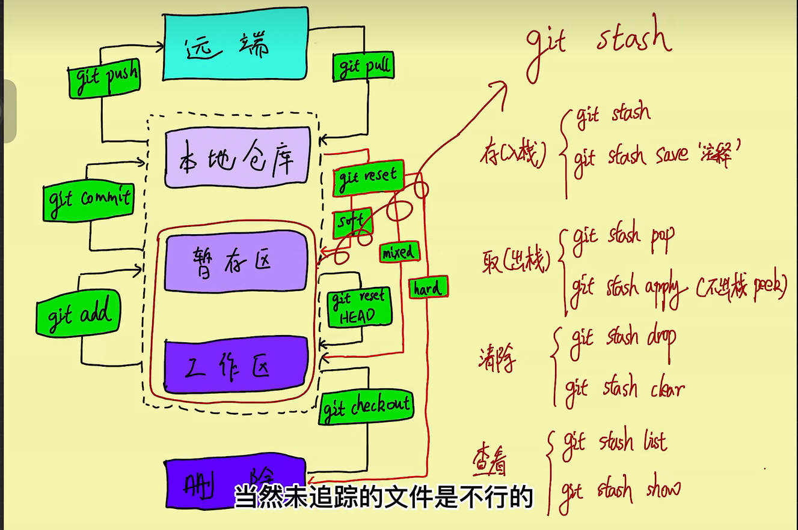
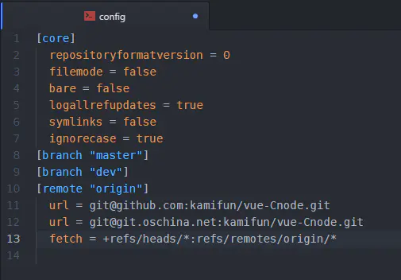
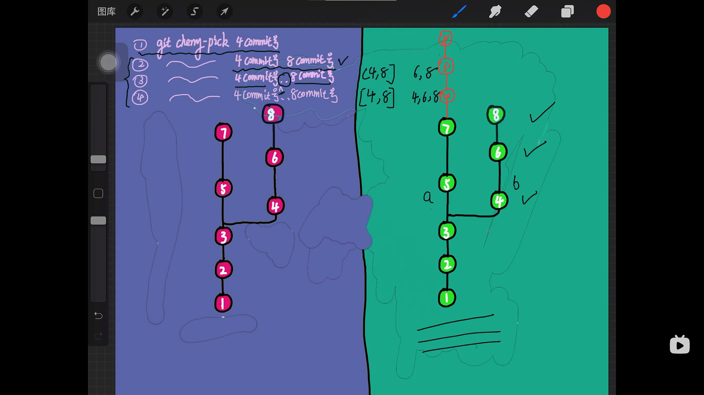

# 知识积累 Git



1. [连接账户（多个账户）](#连接账户多个账户)
2. [know\_hosts文件](#know_hosts文件)
3. [GitLens 和 在VSCode中使用自带git功能](#gitlens-和-在vscode中使用自带git功能)
4. [Git系统基础介绍](#git系统基础介绍)
5. [Git基本操作](#git基本操作)
6. [更新链接](#更新链接)
7. [Git删除branch](#git删除branch)
8. [Git 切换分支](#git-切换分支)
   1. [Git 新仓库切换分支，其实就是创建分支](#git-新仓库切换分支其实就是创建分支)
9. [设置默认分支为main](#设置默认分支为main)
10. [重命名分支](#重命名分支)
11. [改变git buffer支持大文件](#改变git-buffer支持大文件)
12. [Git 大文件 LFS (Large file storage)](#git-大文件-lfs-large-file-storage)
13. [asset release](#asset-release)
14. [从缓存区删除文件（适用于删除仓库文件不过需要commit再push）](#从缓存区删除文件适用于删除仓库文件不过需要commit再push)
15. [彻底删除（包括物理的）](#彻底删除包括物理的)
16. [子模块](#子模块)
    1. [子模块的更新](#子模块的更新)
17. [忽略某个文件/文件夹](#忽略某个文件文件夹)
18. [同时push多个仓库](#同时push多个仓库)
19. [克隆到指定文件夹](#克隆到指定文件夹)
20. [gh-pages的分支](#gh-pages的分支)
21. [pull request](#pull-request)
    1. [当原主人更新时](#当原主人更新时)
    2. [处理pull request](#处理pull-request)
       1. [直接在原主人上修改](#直接在原主人上修改)
       2. [直接拉取refs只读](#直接拉取refs只读)
       3. [自己新建分支来解决](#自己新建分支来解决)
22. [git commit 修改](#git-commit-修改)
    1. [继续上次commit](#继续上次commit)
23. [git merge / rebase](#git-merge--rebase)
24. [git pull / fetch](#git-pull--fetch)
    1. [拉取代码，如果本地代码没有改变](#拉取代码如果本地代码没有改变)
25. [git stash](#git-stash)
    1. [应用场景1：改动同一分支/不想git pull产生新的commit点](#应用场景1改动同一分支不想git-pull产生新的commit点)
    2. [应用场景2：不小心改动其他分支](#应用场景2不小心改动其他分支)
26. [强制推送](#强制推送)
27. [关于git所在文件夹和操作系统的思考](#关于git所在文件夹和操作系统的思考)
28. [撤销](#撤销)
29. [git cherry pick](#git-cherry-pick)

## 连接账户（多个账户）
[一台电脑上的git同时使用两个github账户_AI悦创的博客-CSDN博客_git 两个账号](https://blog.csdn.net/qq_33254766/article/details/122941664)

**注**:
**创建的私钥公钥在哪不重要，重要的是config文件要在.ssh里**

1. 生成两份包含私钥和公钥的共 4 个文件，后缀为 .pub 的文件为公钥文件。
```git
ssh-keygen -t rsa -C "one@gmail.com"
ssh-keygen -t rsa -C "two@gmail.com"
```
运行命令后不要一路回车，分别在第一次对话出现 “Enter file in which to save the key” 的时候**输入文件名**（此处文件名为 id_rsa 和 id_rsa_two ），第二次会话是让你输密码，一般回车密码设置为空就好了。第三次再次确认密码，同样回车。

Windows用户则在“ `C:\Users\用户名\.ssh` ”目录下运行命令行。

2. 在 .ssh 目录下创建 config 文件，在 config 文件中添加以下内容：
```
# one(one@gmail.com)
Host one.github.com
HostName github.com
PreferredAuthentications publickey
IdentityFile ~/.ssh/id_rsa_one
User one
    
# two(two@gmail.com)
Host two.github.com
HostName github.com
PreferredAuthentications publickey
IdentityFile ~/.ssh/id_rsa_two
User two
```

翻译：
```
Host myhost（这里是自定义的host简称，以后连接远程服务器就可以用命令ssh myhost）
HostName 主机名可用ip也可以是域名(如:github.com或者bitbucket.org)
Port 服务器open-ssh端口（默认：22,默认时一般不写此行）
PreferredAuthentications   配置登录时用什么权限认证--可设为publickey,password publickey,keyboard-interactive等
IdentityFile 证书文件路径（如~/.ssh/id_rsa_*)
User 登录用户名(如：git)
```

**Host 的名字可以自定义名字，不过这个会影响 git 相关命令**，例如：
Host mygithub 这样定义的话，
使用命令 `git clone git@mygithub:PopFisher/AndroidRotateAnim.git`，git@后面紧跟的名字改为mygithub。

3. 部署 SSH key
这里以配置 Github 为例，分别登陆两个 github 账号，进入Settings –> SSH and GPG keys，点击"new SSH key"， 把下面两个公钥（.pub文件）的内容分别添加到相应的 Github 账号中，其中 Title 为自定义的名字，Key 为 .pub 文件的内容，最后点击“ Add SSH key ”即可。

4. 远程测试
输入以下命令进行测试
```bash
ssh -T git@one.github.com
ssh -T git@two.github.com
```

此处 “one.github.com” 和“ two.github.com ”为 config 文件中你配置的 Host 名字

运行命令后如果出现“Hi xxxx! You’ve successfully authenticated, but GitHub does not provide shell access.”，其中“xxxx”为你配置的 User 名字，这时恭喜你，配置成功了~

## know_hosts文件
A通过ssh首次连接到B，B会将公钥1（host key）传递给A，A将公钥1存入known_hosts文件中，以后A再连接B时，B依然会传递给A一个公钥2，OpenSSH会核对公钥，通过对比公钥1与公钥2 是否相同来进行简单的验证，如果公钥不同，OpenSSH会发出警告， 避免你受到DNS Hijack之类的攻击。

## GitLens 和 在VSCode中使用自带git功能
[前端技能树中提及的vscode](../../../前端学习/前端学习技能树.md##VSCode)

## Git系统基础介绍
[Web/02-Git的使用.md at master · qianguyihao/Web](https://github.com/qianguyihao/Web/blob/master/00-%E5%89%8D%E7%AB%AF%E5%B7%A5%E5%85%B7/02-Git%E7%9A%84%E4%BD%BF%E7%94%A8.md)

## Git基本操作

| 命令       | 说明               |
| ---------- | ------------------ |
| git remote | 远程仓库操作       |
| git fetch  | 从远程获取代码库   |
| git pull   | 下载远程代码并合并 |
| git push   | 上传远程代码并合并 |

## 更新链接
```bash
git remote set-url origin <new URL>
```

## Git删除branch

```bash
git push origin --delete 分支名
```

## Git 切换分支
```
git checkout -b ＜new-branch＞ ＜existing-branch＞
```

默认的git checkout -b命令会从当前所在的HEAD指针所指的分支来派生出新建的分支。但git checkout命令仍然可以接受一个可选的分支名作为参数。在上面的例子中，`<existing-branch>` 作为这个参数传递给git checkout命令，这一命令意味着从指定的existing-branch分支派生创建了一个名为new-branch的新分支。

没有-b就是切换已存在的分支

```bash
git checkout -b main
# Switched to a new branch 'main',
# 没有-b就是切换已存在的分支
git branch
# * main
#  master
git merge master # 将master分支合并到main上
# Already up to date.
git pull origin main --allow-unrelated-histories # git pull origin main会报错：refusing to merge unrelated histories
git push origin main
```

### Git 新仓库切换分支，其实就是创建分支
```bash
git branch -M main
git remote add origin git@github.com:DuGuYifei/Vue_MusicPlayer_Demo.git
```

## 设置默认分支为main

```bash
cat C:/Users/独孤逸飞/.gitconfig
git config --global init.defaultBranch main
cat C:/Users/独孤逸飞/.gitconfig
```

## 重命名分支
[【Git】如何修改分支名_想上天的小鱼的博客-CSDN博客_修改分支名称](https://blog.csdn.net/weixin_38629529/article/details/125359597)
```bash
git branch -m oldBranch newBranch
git push --delete origin oldBranch
#方案1 ----------
git push -u origin newBranch
#方案2 ----------
git push origin newBranch
git branch --set-upstream-to origin/newBranch
```

## 改变git buffer支持大文件

500MB*1024*1024
```
git config http.postBuffer 524288000
```

## Git 大文件 LFS (Large file storage)

[GitHub大文件(大于100M)上传_往復不息的博客-CSDN博客_github 大文件](https://blog.csdn.net/wifi74262580/article/details/85060187)
```bash
git init
git remote add origin git@github.com:DuGuYifei/WallPaperEngine.git #(你自己的git地址)
git pull origin main
#git lfs install
git lfs track "*/ffplay.exe"
git add .gitattributes
git add . # [记得去除大文件](## 从缓存区删除文件)
git commit -m "update"
git push origin main
```

```
git init #创建本地仓库环境
git lfs install #安装大文件上传应用
git lfs track * #追踪要上传的大文件，*表示路径下的所有文件
git add .gitattributes #添加先上传的属性文件(要先上传属性文件，不然有可能失败)
git commit -m "pre" #添加属性文件上传的说明
git remote add origin https://github.com/Youpeng-Zhang/MOP.git #建立本地和Github仓库的链接
git push origin master #上传属性文件
git add * #添加要上传的大文件，*表示路径下的所有文件
git commit -m "Git LFS commit" #添加大文件上传的说明
git push origin master #上传大文件
```

## asset release
在右侧有一个release按钮


## 从缓存区删除文件（适用于删除仓库文件不过需要commit再push）
```bash
git rm --cached */ffplay.exe
git rm --cached -r **
```
加上`-r`可以递归删除该文件夹下的所有文件

**注意：如果子文件夹有.git，这个子文件夹是没法操作的，需要将其变为子模块**

## 彻底删除（包括物理的）
```bash
git rm --f  "文件路径"
```

## 子模块
[Github子模块(submodule)使用介绍_cain-won的博客-CSDN博客_github submodule](https://blog.csdn.net/kaijkl/article/details/118752830)

解决仓库包含仓库问题
```bash
git submodule add 子仓库url [目标文件夹]
```

### 子模块的更新
子模块的维护者提交了更新后，使用子模块的项目必须手动更新才能包含最新的提交。

在项目中，进入到子模块目录下，执行 git pull更新，查看git log查看相应提交。

完成后返回到项目目录，可以看到子模块有待提交的更新，使用git add，提交即可。

## 忽略某个文件/文件夹
```bash
touch .gitignore
```
编辑器打开生成的 .gitignore 文件，加入:

node_modules
/*以及其他你想要忽略的文件或文件夹*/


## 同时push多个仓库
进入你的项目目录，打开.git/config文件(.git是隐藏目录，需要打开显示隐藏文件...)



## 克隆到指定文件夹
```bash
git clone https://github.com/next-theme/hexo-theme-next.git themes/next
```

## gh-pages的分支
github只要是`gh-pages`的branch都可以同过`github.io/project`来访问，所以可以看上图中的deploy的url并不是io仓库

## pull request

### 当原主人更新时

```bash
git remote add upstream 开源项目原地址
git checkout master # 因为一般fork一个项目到自己的master后会自己再复制一个branch，所以要切换回去
git pull --rebase upstream master  # 把最新的更新放到我的branch里
```

### 处理pull request

#### 直接在原主人上修改
```bash
git remote add <pr-随便name> pr-url
```
但是pr主需要打开允许manager edit选项

#### 直接拉取refs只读
```bash
git fetch origin pull/ID/head
```

#### 自己新建分支来解决
当别人向你的 Git 仓库提交了一个 Pull Request（PR）时，你可以通过以下步骤来测试并合并该请求：

1. 查看 PR：通过 Git 仓库的 Web 界面或 Git 客户端，查看该 PR 的内容和变更。
2. 拉取 PR 分支：在本地克隆你的 Git 仓库之后，你可以使用命令 `git fetch origin pull/ID/head:new-branch-name`，其中 ID 是 PR 的 ID，new-branch-name 是一个新的本地分支名称，以检出该 PR 的代码。head是关键字不用管。
3. 测试 PR：在新的本地分支上测试该 PR 的代码，包括运行测试用例、手动测试和代码审查等。
4. 确认 PR：如果该 PR 没有任何问题，可以在 PR 页面中确认该请求，并编写合适的合并消息。
5. 合并 PR：使用 `git merge` 命令将 PR 分支合并到主分支中。在执行合并之前，最好使用 `git fetch` 命令更新本地主分支，并使用 `git rebase` 命令将主分支与 PR 分支进行合并，以确保代码是最新的并且没有冲突。
6. 推送更改：合并后的更改需要被推送到远程仓库，使用 git push 命令将更改推送到主分支。

需要注意的是，如果有多个 PR 时，应该先将一个 PR 的更改合并到主分支中，然后再处理下一个 PR 的请求。这将确保在测试和合并代码时不会出现混乱。

关于第五点：
After I change pr code:
```bash
git add .
git commit -m "fixed"
git push
```

## git commit 修改
还未push时
```bash
git commit --amend
```
按 i 进入修改模式

:wq 退出

### 继续上次commit
```bash
# 继续上次commit 
git commit --amend --no-edit
# 继续上次commit 但是修改message
git commit --amend -m "xxxx"
```

## git merge / rebase
[git merge 和 git rebase 小结_wh_19910525的博客-CSDN博客_git merge和rebase](https://blog.csdn.net/wh_19910525/article/details/7554489)

git merge是用来合并两个分支的。

`git merge b` 将b分支合并到当前分支

`git rebase b` 将b分支合并到当前分支

`git rebase --abort` 放弃rebase

* 假设你现在基于远程分支"origin"，创建一个叫"mywork"的分支。
```
git checkout -b mywork origin
```


* 但是与此同时，有些人也在"origin"分支上做了一些修改并且做了提交了. 这就意味着"origin"和"mywork"这两个分支各自"前进"了，它们之间"分叉"了。


* 在这里，你可以用"pull"命令把"origin"分支上的修改拉下来并且和你的修改合并； 结果看起来就像一个新的"合并的提交"(merge commit):


* 但是，如果你想让"mywork"分支历史看起来像没有经过任何合并一样，你也许可以用 git rebase:
```bash
git checkout mywork
git rebase origin
```
这些命令会把你的"mywork"分支里的每个提交(commit)取消掉，并且把它们临时 保存为补丁(patch)(这些补丁放到".git/rebase"目录中),然后把"mywork"分支更新 为最新的"origin"分支，最后把保存的这些补丁应用到"mywork"分支上。


当'mywork'分支更新之后，它会指向这些新创建的提交(commit),而那些老的提交会被丢弃。 如果运行垃圾收集命令(pruning garbage collection), 这些被丢弃的提交就会删除. （请查看 git gc)


## git pull / fetch
`git pull = git fetch + merge`

**git pull 和 fetch 区别：**
* git fetch: 从远程获取最新版本到本地，不会自动merge
* git pull：从远程获取最新版本并merge到本地仓库
* 从安全角度出发，git fetch比git pull更安全，因为我们可以先比较本地与远程的区别后，选择性的合并。

### 拉取代码，如果本地代码没有改变
```
git add .
 
git commit -m 'magic'
 
git stash
```

## git stash
[git stash 与 git add 作用详解-云社区-华为云](https://bbs.huaweicloud.com/blogs/352507)
git stash命令的作用就是将目前还不想提交的但是已经修改的内容进行保存至堆栈中，后续可以在某个分支上恢复出堆栈中的内容。 这也就是说，stash中的内容不仅仅可以恢复到原先开发的分支，也可以恢复到其他任意指定的分支上。 

git stash作用的范围包括工作区和暂存区中的内容，也就是说没有提交的内容都会保存至堆栈中。

* 存(入栈): `git stash (save '注释')`
* 取(出栈): `git stash pop` / `git stash apply (不出栈，相当于peek)`
* 清除: `git stash drop` / `git stash clear`
* 查看: `git stash list` / `git stash show + 栈索引`

### 应用场景1：改动同一分支/不想git pull产生新的commit点

所以一般commit前要pull，pull前要stash

我在本地修改好后，发现远程分支已经被改动了，此时我本地也被改动了就造成了冲突，无法push或者pull。
此时可以使用git stash：
```git
git stash save "本地缓存内容标识" //把本地的改动暂存起来;
git pull //拉取远端分支（此时本地分支会回滚到上次commit的情况，新的改动都已保存在了stash中）;
git stash pop // 将栈顶改动内容重新加回本地分支，就可以继续修改了，当然，如果改好了就是add,commit,push操作。
```

### 应用场景2：不小心改动其他分支
当正在dev分支上开发某个项目，这时项目中出现一个bug，需要紧急修复，但是正在开发的内容只是完成一半，还不想提交，这时可以用git stash命令将修改的内容保存至堆栈区，然后顺利切换到hotfix分支进行bug修复，修复完成后，再次切回到dev分支，从堆栈中恢复刚刚保存的内容。

或者由于疏忽，本应该在dev分支开发的内容，却在master上进行了开发，需要重新切回到dev分支上进行开发，可以用git stash将内容保存至堆栈中，切回到dev分支后，再次恢复内容即可。

例如忘记切换分支，直接在master分支上做改动，这里假设我的分支是test分支。

```git
git stash save "本地缓存内容标识" // 把本地当前改动暂存起来，此时master分支就恢复到了上次拉取时的状态
git checkout test                // 切换到需要改动的分支
git stash pop　　　              // 将改动pop到自己当前的分支
```

## 强制推送
```bash
git push --force
git push -f
```
和远程不一样，强制推送，能将之前的提交记录全部彻底删除

## 关于git所在文件夹和操作系统的思考
git 其实会有linux操作系统，因为
1. 使用win的ssh根本无法访问我的中文路径 .ssh 文件夹，
2. 并且在git bash上，使用`cd ~/.ssh`进入文件夹，使用`ls`以及`cat config`命令就会发现这就是中文路径下的.ssh文件夹，`~`就是root文件夹，其实就是`C:/user/XXX`。

## 撤销
`git reset`
`--mixed` 为**默认**，可以不用带该参数，用于**重置暂存区的文件与上一次的提交(commit)保持一致，工作区文件内容保持不变**。
`--hard`  **撤销工作区中所有未提交的修改内容**，**将暂存区与工作区都回到上一次版本，并删除之前的所有信息提交**，其实就是恢复到某个版本，记得用 `git push -f` 强制更改
`--soft`  **用于回退到某个版本**

```
git reset --soft HEAD~3 # 退回到上上上个版本
git reset --soft HEAD^  # 退回到上个版本
git reset  052e         # 回退到指定版本
git reset HEAD^ hello.php  # 回退 hello.php 文件的版本到上一个版本  
```

## git cherry pick
只摘取少数commit提交记录到当前分支，但是注意，内容虽然pick过来但是commit号会是新的


* `git cherry-pick commit号1 commit号2`
* `git cherry-pick commit号1..commit号n` `(1,n]`
* `git cherry-pick commit号1^..commit号n` `[1,n]`