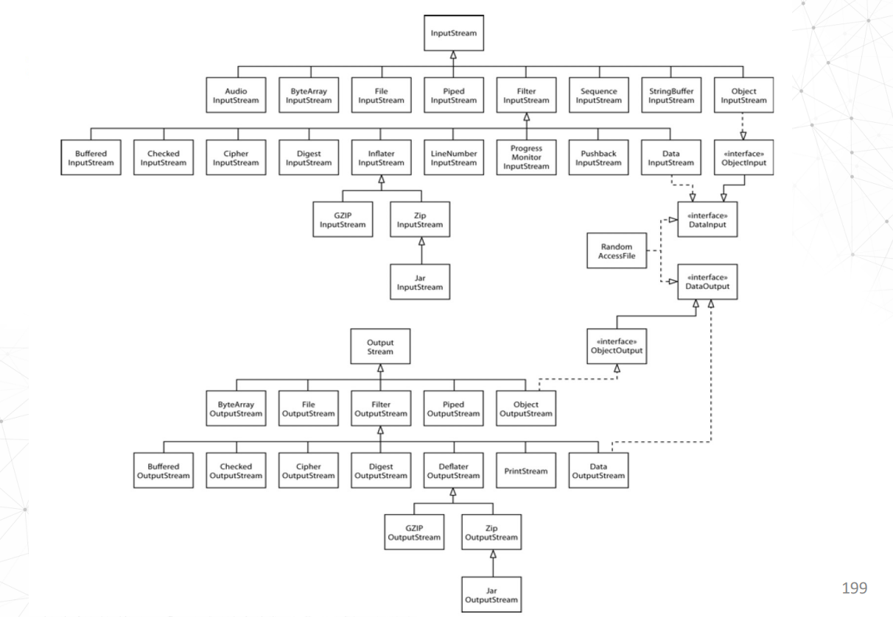

# InputStream_OutputStream

## 介绍

和[Stream](Stream.md)没有关系。Stream类是`java.util.stream`包下的，而InputStream和OutputStream是`java.io`包下的。

### InputStream

InputStream是一个抽象类，定义了所有输入流的基本功能。它是所有输入流的父类。

### OutputStream

OutputStream是一个抽象类，定义了所有输出流的基本功能。它是所有输出流的父类。

### 类视图

## Object和Byte使用案例
[udp](udp.md)中有一个案例，使用了ObjectInputStream和ObjectOutputStream。

