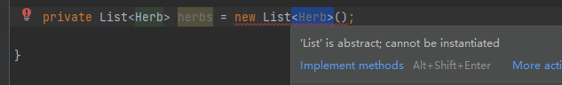

# List和ArrayList

## 两种List
```java
import java.util.List;
import java.awt.List;
```

上面的有泛型，下面的没有

### awt.List
`getRows` 获取行数，即长度

## List 和 ArrayList
[Java中List和ArrayList的区别_supreluc的博客-CSDN博客_java list和arraylist的区别](https://blog.csdn.net/weixin_45687036/article/details/123118857)

List是一个接口，ArrayList是封装对象。

1. 错误
`List<T> = new List<T>()`


2. 正确
   * `List list = new ArrayList();` 这句创建了一个ArrayList的对象后把上溯到了List。此时它是一个List对象了，有些ArrayList有但是List没有的属性和方法，它就不能再用了。
   * `ArrayList list = new ArrayList();` 创建一对象则保留了ArrayList的所有属性。

## list.removeAll(collection<?> c) 和 clear()
* clear是删除Collection对象中的所有元素，即清空Collection对象。
* removeAll是删除所有c里的对象。