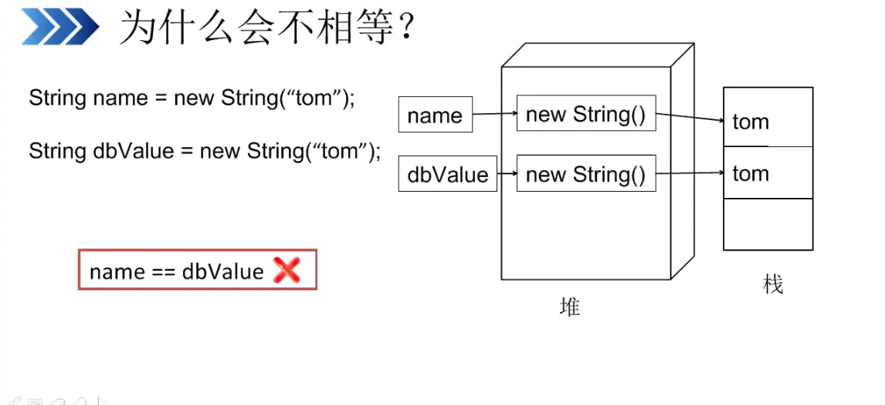
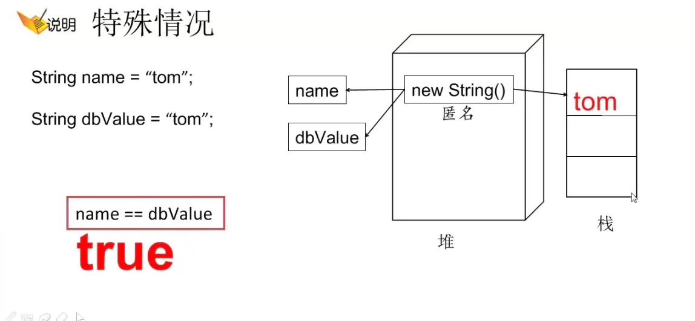

# String

1. [对象？数据类型？](#对象数据类型)
   1. [new 和 不new 的区别](#new-和-不new-的区别)
2. [比较](#比较)
3. [String函数](#string函数)
   1. [String.valueOf()](#stringvalueof)
4. [字符串函数](#字符串函数)
5. [str 变量也可以直接用`"x"`](#str-变量也可以直接用x)
   1. [str.charAt(index)](#strcharatindex)
   2. [str.codePointAt(index)](#strcodepointatindex)
   3. [str.toCharArray() for-each 循环](#strtochararray-for-each-循环)
   4. [str.strip()](#strstrip)
   5. [str.split(char)](#strsplitchar)
   6. [str.substring(int begin)](#strsubstringint-begin)
   7. [str.startsWith(string)](#strstartswithstring)
   8. [str.repeat(n)](#strrepeatn)


## 对象？数据类型？
首先String不属于8种基本数据类型，**String是一个对象**。 因为对象的默认值是null，所以String的默认值也是null；**但它又是一种特殊的对**象，有其它对象没有的一些特性。

new String()和new String(“”)都是申明一个新的空字符串，**是空串不是null**；

### new 和 不new 的区别
当有new时，string每new一个堆中就有一个new出来的对象，其字符串放在不同的地方，所以即使字符串一样，其地址也不一样

当没有new时，string默认在堆中创建一个new出来的匿名对象，字符串放在[字符串常量池](常量池.md)里，如果两个字符串一样，其地址也就一样，即不会在字符串常量池里面开出2个区域放2个相同的字符串

即对于equals相等的字符串，若在常量池（无new）中，仅有一份，在堆中（有new）有多份




## 比较
```java
public class test1 {
    public static void main(String[] args) {
        String a = new String("ab"); // a 为一个引用
        String b = new String("ab"); // b为另一个引用,对象的内容一样
        String aa = "ab"; // 放在常量池中
        String bb = "ab"; // 从常量池中查找
        if (aa == bb) // true
            System.out.println("aa==bb");
        if (a == b) // false，非同一对象
            System.out.println("a==b");
        if (a.equals(b)) // true
            System.out.println("aEQb");
        if (42 == 42.0) { // true
            System.out.println("true");
        }
    }
}
```
## String函数

### String.valueOf() 
char,int注意区分

## 字符串函数

## str 变量也可以直接用`"x"`

### str.charAt(index)
```java
str.charAt(i)
```

### str.codePointAt(index)
返回unicode值

### str.toCharArray() for-each 循环
```java
for (char ch: "xyz".toCharArray()) {
}
```

### str.strip()
Java字符串类strip()方法返回一个字符串，该字符串提供一个除去了所有前导和尾随空格的字符串。此方法类似于String.trim()方法。
* `str.strip()`
* `str.stripLeading()`
* `str.stripTrailing()`

### str.split(char)
```java
String[] splitAddr=address.split("@");

// 多个分隔符 + 转义（双斜杠转义后一位）
String address="上海^上海市@闵行区#吴中路";
String[] splitAddr=address.split("\\^|@|#");
```

默认忽略空值，保存空值:`split(";"，-1)`

### str.substring(int begin)
`word1.substring(id1)`

### str.startsWith(string)
return boolean

### str.repeat(n)
返回重复多少次的string