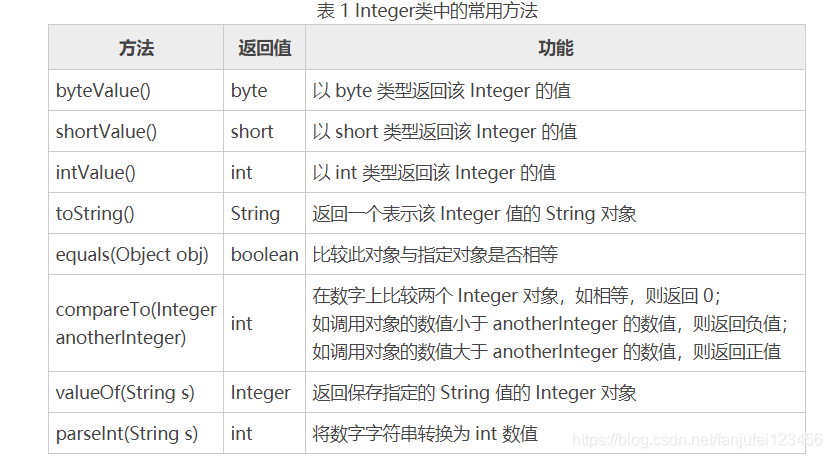

# 基础类型和其包装类问题

## 基础类型和包装类型
8大基础类型：
byte、short、int、long、float、double、boolean、char

对应包装类：
Byte、Short、Integer、Long、Float、Double、Boolean、Character

注意没有String

基础类型会有默认值，包装类型就是个null

比如：boolean 的默认值是 false，Boolean 的默认值是 null

## int和Interger以及包装类问题

Integer 是将 int 封装成一个类，通常作为对象使用。

java.lang包中的Integer类，Long类，Short类，分别将数据类型int、long、short封装成一个类；

比如 list.Remove(Integer i); 就是删除一个int对象。

### Integer 函数
#### Integer.bitCount()
[二进制中1的个数](二进制中1的个数.md)

