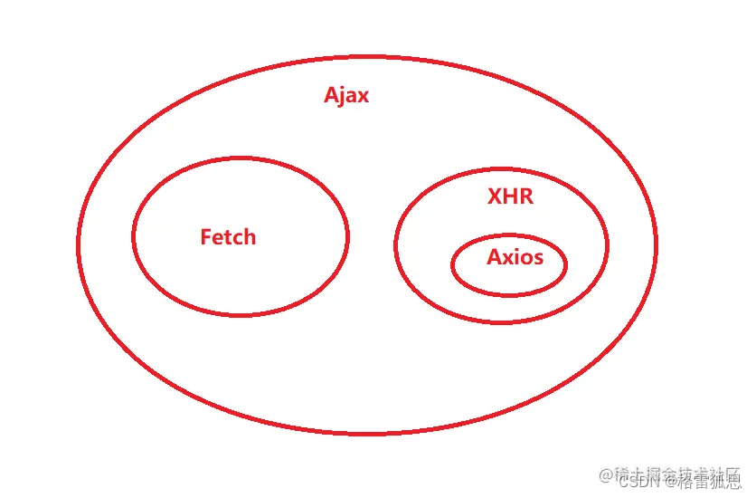
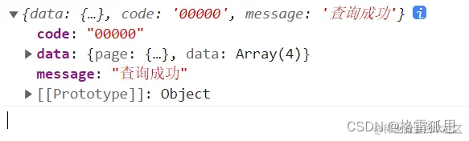

# XHR_AJAX_axios发送请求

1. [nodejs内置](#nodejs内置)
2. [对比链接和关系](#对比链接和关系)
3. [AJAX](#ajax)
4. [Fetch](#fetch)
	1. [特点：](#特点)
	2. [示例](#示例)
5. [XHR](#xhr)
	1. [POST](#post)
	2. [GET](#get)
	3. [DELETE](#delete)
6. [axios](#axios)
	1. [axios 也提供了类似于 jQuery 中 $.ajax() 的函数](#axios-也提供了类似于-jquery-中-ajax-的函数)
	2. [GET](#get-1)
	3. [POST](#post-1)

## nodejs内置
[nodejs内置的http模块](../../../../%E5%90%8E%E7%AB%AF%E5%AD%A6%E4%B9%A0/nodejs/%E5%86%85%E7%BD%AE%E7%9A%84http%E6%A8%A1%E5%9D%97.md)

## 对比链接和关系
[AJAX和XHR和Axios和Fetch_格雷狐思的博客-CSDN博客_xhr ajax axios fetch](https://blog.csdn.net/hangao233/article/details/122737838)


## AJAX
Asynchronous JavaScript And XML “异步的 Javascript 和 XML”

Ajax 是一个技术统称，是一个概念模型，它囊括了很多技术，并不特指某一技术，它很重要的特性之一就是让页面实现局部刷新。

局部刷新页面，无需重载整个页面。

[readyState](../../../../前端学习/前端其他知识积累/readyState.md)

## Fetch
Fetch 是在 ES6 出现的，它使用了 ES6 提出的 promise 对象。它是 XMLHttpRequest 的替代品。

很多小伙伴会把它与 Ajax 作比较，其实这是不对的，我们通常所说的 Ajax 是指使用 XMLHttpRequest 实现的 Ajax，所以真正应该和 XMLHttpRequest 作比较。

**Fetch 是一个 API**，它是真实存在的，它是基于 **promise** 的。

### 特点：

* 使用 promise，不使用回调函数。
* 采用模块化设计，比如 rep、res 等对象分散开来，比较友好。
* 通过数据流对象处理数据，可以提高网站性能。

### 示例
```html
<body>
  <script>
    function ajaxFetch(url) {
      fetch(url).then(res => res.json()).then(data => {
        console.info(data)
      })
    }
    ajaxFetch('https://smallpig.site/api/category/getCategory')
  </script>
</body>
```
上段代码利用 Fetch 发送了一个最简单的 get 请求，其中最重要的特点之一就是采用了.then 链式调用的方式处理结果，这样不仅利于代码的可读，而且也解决了回调地狱的问题。



## XHR
`XMLHttpRequest`
[form发送请求](form发送请求.md)
[下载文件请求](下载文件请求.md)

### POST
```JS
	function createAnimal(name, foodType) {
	    const xhttp = new XMLHttpRequest();
	    xhttp.onreadystatechange = function () {
	        if (this.readyState === 4 && this.status === 200) {
	            console.log("Animal created successfully");
	        }
	    };
	    xhttp.open("POST", 'http://localhost:4030/api/animals/', true);
	
	    const request = {
	        'name': name,
	        'food_type': foodType,
	    };
	
	    xhttp.setRequestHeader('Content-Type', 'application/json');
	
	    xhttp.send(JSON.stringify(request));
	}
```

### GET
```js
	function displayAnimals(animals, obj) {
		obj.animalArr = [];
		animals.animals.forEach(animal => {
			console.log(animal);
			obj.animalArr.push(animal.name);
		});
	}

	function fetchAndDisplayAnimals(obj) {
	    const xhttp = new XMLHttpRequest();
	    xhttp.onreadystatechange = function () {
	        if (this.readyState === 4 && this.status === 200) {
	            displayAnimals(JSON.parse(this.responseText), obj);
	        }
	    };
	    xhttp.open("GET", 'http://localhost:4030/api/animals', true);
	    xhttp.send();
	}
```

### DELETE
```js
	function deleteAnimal(animal, obj) {
	    const xhttp = new XMLHttpRequest();
	    xhttp.onreadystatechange = function () {
	        if (this.readyState === 4 && this.status === 202) {
	            fetchAndDisplayAnimals(obj);
	        }
	    };
	    xhttp.open("DELETE", 'http://localhost:4030/api/animals/' + animal, true);
	    xhttp.send();
	}
```

## axios

Axios 是专注于网络数据请求的库。相比于原生的 XMLHttpRequest 对象，axios 简单易用。相比于 jQuery，axios 更加轻量化，只专注于网络数据请求。
[axios+vue](../../../../前端学习/Vue/Vue知识积累/axios+vue.md)

### axios 也提供了类似于 jQuery 中 $.ajax() 的函数
```js
axios({
     method: '请求类型',
     url: '请求的URL地址',
     data: { /* POST数据 */ },
     params: { /* GET参数 */ }
 }) .then(callback)
```

### GET
```js
axios({
     method: 'GET',
     url: 'http://www.liulongbin.top:3006/api/get',
     params: { // GET 参数要通过 params 属性提供
         name: 'zs',
         age: 20
     }
 }).then(function(res) {
     console.log(res.data)
 })
```

### POST
```js
axios({
     method: 'POST',
     url: 'http://www.liulongbin.top:3006/api/post',
     data: { // POST 数据要通过 data 属性提供
         bookname: '程序员的自我修养',
         price: 666
     }
 }).then(function(res) {
     console.log(res.data)
 })
```