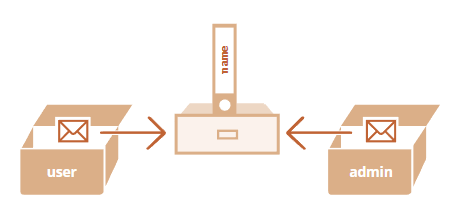

# 0402对象的引用和复制

```javascript
let user = { name: 'John' };

let admin = user;

admin.name = 'Pete'; // 通过 "admin" 引用来修改

alert(user.name); // 'Pete'，修改能通过 "user" 引用看到
```


## 通过引用来比较

```javascript
let a = {};
let b = a; // 复制引用

alert( a == b ); // true，都引用同一对象
alert( a === b ); // true
```

```javascript
let a = {};
let b = {}; // 两个独立的对象

alert( a == b ); // false
alert( a === b ); // false
```

## 克隆与合并，Object.assign

### 深拷贝(不完全深拷贝，下一个是深层克隆，解决对象嵌套问题)

1. 遍历
```javascript
let user = {
  name: "John",
  age: 30
};

let clone = {}; // 新的空对象

// 将 user 中所有的属性拷贝到其中
for (let key in user) {
  clone[key] = user[key];
}

// 现在 clone 是带有相同内容的完全独立的对象
clone.name = "Pete"; // 改变了其中的数据

alert( user.name ); // 原来的对象中的 name 属性依然是 John
```

2. Object.assign
```javascript
Object.assign(dest, [src1, src2...])
```

* 第一个参数 dest 是指目标对象。
* 更后面的参数 src1, ..., srcN（可按需传递多个参数）是源对象。
* 该方法将所有源对象的属性拷贝到目标对象 dest 中。换句话说，从第二个开始的所有参数的属性都被拷贝到第一个参数的对象中。
* 调用结果返回 dest。

* 完整克隆
```javascript
let user = {
  name: "John",
  age: 30
};

let clone = Object.assign({}, user);
```

* 合并
```javascript
let user = { name: "John" };

let permissions1 = { canView: true };
let permissions2 = { canEdit: true };

// 将 permissions1 和 permissions2 中的所有属性都拷贝到 user 中
Object.assign(user, permissions1, permissions2);

// 现在 user = { name: "John", canView: true, canEdit: true }
```

如果该属性已存在，则会覆盖

3. 其他方法，spread
还有其他克隆对象的方法，例如使用 spread 语法 clone = {...user}，在后面的章节中我们会讲到。

### 解决嵌套的对象 深层克隆
问题：
```javascript
let user = {
  name: "John",
  sizes: {
    height: 182,
    width: 50
  }
};

let clone = Object.assign({}, user);

alert( user.sizes === clone.sizes ); // true，同一个对象

// user 和 clone 分享同一个 sizes
user.sizes.width++;       // 通过其中一个改变属性值
alert(clone.sizes.width); // 51，能从另外一个获取到变更后的结果
```

[lodash 库的 _.cloneDeep(obj)](https://lodash.com/docs#cloneDeep)
```javascript
var objects = [{ 'a': 1 }, { 'b': 2 }];
 
var deep = _.cloneDeep(objects);
console.log(deep[0] === objects[0]);
// => false
```
