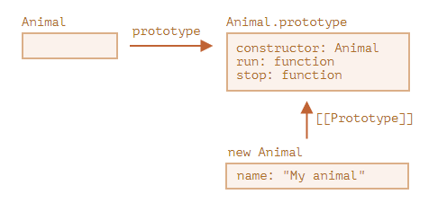
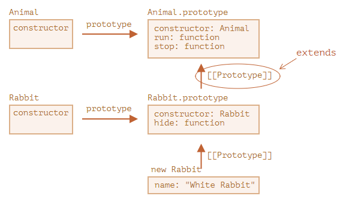

# 0902类继承

类继承是一个类扩展另一个类的一种方式。

因此，我们可以在现有功能之上创建新功能。

## “extends” 关键字
假设我们有 class Animal：
```js
class Animal {
  constructor(name) {
    this.speed = 0;
    this.name = name;
  }
  run(speed) {
    this.speed = speed;
    alert(`${this.name} runs with speed ${this.speed}.`);
  }
  stop() {
    this.speed = 0;
    alert(`${this.name} stands still.`);
  }
}

let animal = new Animal("My animal");
```

这是我们对对象 animal 和 class Animal 的图形化表示：


……然后我们想创建另一个 class Rabbit：

因为 rabbit 是 animal，所以 class Rabbit 应该是基于 class Animal 的，可以访问 animal 的方法，以便 rabbit 可以做“一般”动物可以做的事儿。

扩展另一个类的语法是：class Child extends Parent。

让我们创建一个继承自 Animal 的 class Rabbit：
```js
class Rabbit extends Animal {
  hide() {
    alert(`${this.name} hides!`);
  }
}

let rabbit = new Rabbit("White Rabbit");

rabbit.run(5); // White Rabbit runs with speed 5.
rabbit.hide(); // White Rabbit hides!
```

class Rabbit 的对象可以访问例如 rabbit.hide() 等 Rabbit 的方法，还可以访问例如 rabbit.run() 等 Animal 的方法。

在内部，关键字 extends 使用了很好的旧的原型机制进行工作。它将 `Rabbit.prototype.[[Prototype]]` 设置为 Animal.prototype。所以，如果在 Rabbit.prototype 中找不到一个方法，JavaScript 就会从 Animal.prototype 中获取该方法。


例如，要查找 rabbit.run 方法，JavaScript 引擎会进行如下检查（如图所示从下到上）：

查找对象 rabbit（没有 run）。
查找它的原型，即 Rabbit.prototype（有 hide，但没有 run）。
查找它的原型，即（由于 extends）Animal.prototype，在这儿找到了 run 方法。
我们可以回忆一下 原生的原型 这一章的内容，JavaScript 内建对象同样也使用原型继承。例如，Date.prototype.[[Prototype]] 是 Object.prototype。这就是为什么日期可以访问通用对象的方法。

### 在 extends 后允许任意表达式**
类语法不仅允许指定一个类，在 extends 后可以指定任意表达式。

例如，一个生成父类的函数调用：
```js
function f(phrase) {
  return class {
    sayHi() { alert(phrase); }
  };
}

class User extends f("Hello") {}

new User().sayHi(); // Hello
```

这里 class User 继承自 f("Hello") 的结果。

这对于高级编程模式，例如当我们根据许多条件使用函数生成类，并继承它们时来说可能很有用。

## 重写方法
现在，让我们继续前行并尝试重写一个方法。默认情况下，所有未在 class Rabbit 中指定的方法均从 class Animal 中直接获取。

但是如果我们在 Rabbit 中指定了我们自己的方法，例如 stop()，那么将会使用它：
```js
class Rabbit extends Animal {
  stop() {
    // ……现在这个将会被用作 rabbit.stop()
    // 而不是来自于 class Animal 的 stop()
  }
}
```

然而通常，我们不希望完全替换父类的方法，而是希望在父类方法的基础上进行调整或扩展其功能。我们在我们的方法中做一些事儿，但是在它之前或之后或在过程中会调用父类方法。

Class 为此提供了 "super" 关键字。

* **执行 super.method(...) 来调用一个父类方法。**
* **执行 super(...) 来调用一个父类 constructor（只能在我们的 constructor 中）。**

例如，让我们的 rabbit 在停下来的时候自动 hide：
```js
class Animal {

  constructor(name) {
    this.speed = 0;
    this.name = name;
  }

  run(speed) {
    this.speed = speed;
    alert(`${this.name} runs with speed ${this.speed}.`);
  }

  stop() {
    this.speed = 0;
    alert(`${this.name} stands still.`);
  }

}

class Rabbit extends Animal {
  hide() {
    alert(`${this.name} hides!`);
  }

  stop() {
    super.stop(); // 调用父类的 stop
    this.hide(); // 然后 hide
  }
}

let rabbit = new Rabbit("White Rabbit");

rabbit.run(5); // White Rabbit runs with speed 5.
rabbit.stop(); // White Rabbit stands still. White Rabbit hides!
```

现在，Rabbit 在执行过程中调用父类的 super.stop() 方法，所以 Rabbit 也具有了 stop 方法。

### 箭头函数没有 super
正如我们在 深入理解箭头函数 一章中所提到的，箭头函数没有 super。

**如果被访问，它会从外部函数获取**。例如：
```js
class Rabbit extends Animal {
  stop() {
    setTimeout(() => super.stop(), 1000); // 1 秒后调用父类的 stop
  }
}
```

箭头函数中的 super 与 stop() 中的是一样的，所以它能按预期工作。如果我们在这里指定一个“普通”函数，那么将会抛出错误：
```js
// 意料之外的 super
setTimeout(function() { super.stop() }, 1000);
```
## 重写 constructor
对于重写 constructor 来说，则有点棘手。

到目前为止，Rabbit 还没有自己的 constructor。

根据 规范，**如果一个类扩展了另一个类并且没有 constructor，那么将生成下面这样的“空” constructor**：
```js
class Rabbit extends Animal {
  // 为没有自己的 constructor 的扩展类生成的
  constructor(...args) {
    super(...args);
  }
}
```

正如我们所看到的，它调用了父类的 constructor，并传递了所有的参数。如果我们没有写自己的 constructor，就会出现这种情况。

现在，我们给 Rabbit 添加一个自定义的 constructor。除了 name 之外，它还会指定 earLength。

**下面错误演示**
```js
class Animal {
  constructor(name) {
    this.speed = 0;
    this.name = name;
  }
  // ...
}

class Rabbit extends Animal {

  constructor(name, earLength) {
    this.speed = 0;
    this.name = name;
    this.earLength = earLength;
  }

  // ...
}

// 不工作！
let rabbit = new Rabbit("White Rabbit", 10); // Error: this is not defined.
```

哎呦！**我们得到了一个报错**。现在我们没法新建 rabbit。是什么地方出错了？

简短的解释是：

**继承类的 constructor 必须调用 super(...)，并且 (!) 一定要在使用 this 之前调用。**

……但这是为什么呢？这里发生了什么？确实，这个要求看起来很奇怪。

当然，本文会给出一个解释。让我们深入细节，这样你就可以真正地理解发生了什么。

在 JavaScript 中，继承类（所谓的“派生构造器”，英文为 “derived constructor”）的构造函数与其他函数之间是有区别的。派生构造器具有特殊的内部属性 [[ConstructorKind]]:"derived"。这是一个特殊的内部标签。

该标签会影响它的 new 行为：

当通过 new 执行一个常规函数时，它将创建一个空对象，并将这个空对象赋值给 this。
但是当继承的 constructor 执行时，它不会执行此操作。它期望父类的 constructor 来完成这项工作。
因此，派生的 constructor 必须调用 super 才能执行其父类（base）的 constructor，否则 this 指向的那个对象将不会被创建。并且我们会收到一个报错。

为了让 Rabbit 的 constructor 可以工作，它需要在使用 this 之前调用 super()，就像下面这样：
```js
class Animal {

  constructor(name) {
    this.speed = 0;
    this.name = name;
  }

  // ...
}

class Rabbit extends Animal {

  constructor(name, earLength) {
    super(name);
    this.earLength = earLength;
  }

  // ...
}

// 现在可以了
let rabbit = new Rabbit("White Rabbit", 10);
alert(rabbit.name); // White Rabbit
alert(rabbit.earLength); // 10
```

### 重写类字段: 一个棘手的注意要点
高阶要点
这个要点假设你对类已经有了一定的经验，或许是在其他编程语言中。

这里提供了一个更好的视角来窥探这门语言，且解释了它的行为为什么可能会是 bugs 的来源(但不是非常频繁)。

如果你发现这难以理解，什么都别管，继续往下阅读，之后有机会再回来看。

我们不仅可以重写方法，还可以重写类字段。

不过，当我们在父类构造器中访问一个被重写的字段时，有一个诡异的行为，这**与绝大多数其他编程语言都很不一样**。

请思考此示例：
```js
class Animal {
  name = 'animal';

  constructor() {
    alert(this.name); // (*)
  }
}

class Rabbit extends Animal {
  name = 'rabbit';
}

new Animal(); // animal
new Rabbit(); // animal
```

这里，Rabbit 继承自 Animal，并且用它自己的值重写了 name 字段。

因为 Rabbit 中没有自己的构造器，所以 Animal 的构造器被调用了。

**有趣的是在这两种情况下：new Animal() 和 new Rabbit()，在 (*) 行的 alert 都打印了 animal。**

**换句话说，父类构造器总是会使用它自己字段的值，而不是被重写的那一个。**

古怪的是什么呢？

如果这还不清楚，那么让我们用方法来进行比较。

这里是相同的代码，但是我们调用 this.showName() 方法而不是 this.name 字段：
```js
class Animal {
  showName() {  // 而不是 this.name = 'animal'
    alert('animal');
  }

  constructor() {
    this.showName(); // 而不是 alert(this.name);
  }
}

class Rabbit extends Animal {
  showName() {
    alert('rabbit');
  }
}

new Animal(); // animal
new Rabbit(); // rabbit
```

请注意：这时的输出是不同的。

这才是我们本来所期待的结果。当父类构造器在派生的类中被调用时，它会使用被重写的方法。

……但对于类字段并非如此。正如前文所述，父类构造器总是使用父类的字段。

这里为什么会有这样的区别呢？

实际上，原因在于字段初始化的顺序。类字段是这样初始化的：

* 对于基类（还未继承任何东西的那种），在构造函数调用前初始化。
* 对于派生类，在 super() 后立刻初始化。
在我们的例子中，Rabbit 是派生类，里面没有 constructor()。正如先前所说，这相当于一个里面只有 super(...args) 的空构造器。

所以，new Rabbit() 调用了 super()，因此它执行了父类构造器，并且（根据派生类规则）只有在此之后，它的类字段才被初始化。在父类构造器被执行的时候，Rabbit 还没有自己的类字段，这就是为什么 Animal 类字段被使用了。

这种字段与方法之间微妙的区别只特定于 JavaScript。

幸运的是，这种行为仅在一个被重写的字段被父类构造器使用时才会显现出来。接下来它会发生的东西可能就比较难理解了，所以我们要在这里对此行为进行解释。

如果出问题了，我们可以通过使用方法或者 getter/setter 替代类字段，来修复这个问题。

## 深入：内部探究和 `[[HomeObject]]`
报错
```js
let animal = {
  name: "Animal",
  eat() {
    alert(`${this.name} eats.`);
  }
};

let rabbit = {
  __proto__: animal,
  eat() {
    // ...bounce around rabbit-style and call parent (animal) method
    this.__proto__.eat.call(this); // (*)
  }
};

let longEar = {
  __proto__: rabbit,
  eat() {
    // ...do something with long ears and call parent (rabbit) method
    this.__proto__.eat.call(this); // (**)
  }
};

longEar.eat(); // Error: Maximum call stack size exceeded
```

修复
```js
let animal = {
  name: "Animal",
  eat() {         // animal.eat.[[HomeObject]] == animal
    alert(`${this.name} eats.`);
  }
};

let rabbit = {
  __proto__: animal,
  name: "Rabbit",
  eat() {         // rabbit.eat.[[HomeObject]] == rabbit
    super.eat();
  }
};

let longEar = {
  __proto__: rabbit,
  name: "Long Ear",
  eat() {         // longEar.eat.[[HomeObject]] == longEar
    super.eat();
  }
};

// 正确执行
longEar.eat();  // Long Ear eats.
```

## 总结
1. 想要扩展一个类：class Child extends Parent：
   * 这意味着 Child.prototype.__proto__ 将是 Parent.prototype，所以方法会被继承。
2. 重写一个 constructor：
   * 在使用 this 之前，我们必须在 Child 的 constructor 中将父 constructor 调用为 super()。
3. 重写一个方法：
   * 我们可以在一个 Child 方法中使用 super.method() 来调用 Parent 方法。
4. 内部：
   * 方法在内部的 `[[HomeObject]]` 属性中记住了它们的类/对象。这就是 super 如何解析父方法的。
   * 因此，将一个带有 super 的方法从一个对象复制到另一个对象是不安全的。

补充：

   * 箭头函数没有自己的 this 或 super，所以它们能融入到就近的上下文中，像透明似的。