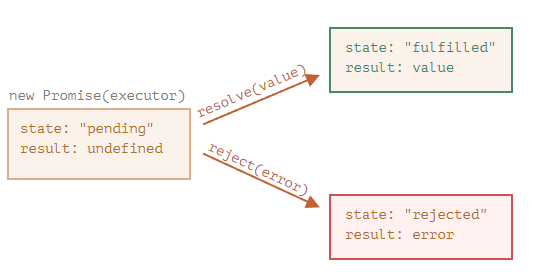
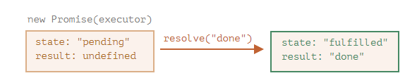
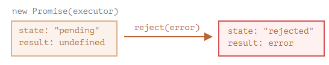

# 1102Promise

想象一下，你是一位顶尖歌手，粉丝没日没夜地询问你下首歌什么时候发。

为了从中解放，你承诺（promise）会在单曲发布的第一时间发给他们。你给了粉丝们一个列表。他们可以在上面填写他们的电子邮件地址，以便当歌曲发布后，让所有订阅了的人能够立即收到。即便遇到不测，例如录音室发生了火灾，以致你无法发布新歌，他们也能及时收到相关通知。

每个人都很开心：你不会被任何人催促，粉丝们也不用担心错过歌曲发行。

这是我们在编程中经常遇到的事儿与真实生活的类比：

1. “生产者代码（producing code）”会做一些事儿，并且会需要一些时间。例如，通过网络加载数据的代码。它就像一位“歌手”。
2. “消费者代码（consuming code）”想要在“生产者代码”完成工作的第一时间就能获得其工作成果。许多函数可能都需要这个结果。这些就是“粉丝”。
3. **Promise** 是将“生产者代码”和“消费者代码”连接在一起的一个特殊的 JavaScript 对象。用我们的类比来说：**这就是就像是“订阅列表”**。**“生产者代码”花费它所需的任意长度时间来产出所承诺的结果，而 “promise” 将在它（译注：指的是“生产者代码”，也就是下文所说的 executor）准备好时，将结果向所有订阅了的代码开放**。

这种类比并不十分准确，因为 JavaScipt 的 promise 比简单的订阅列表更加复杂：它们还拥有其他的功能和局限性。但以此开始挺好的。

Promise 对象的构造器（constructor）语法如下：
```js
let promise = new Promise(function(resolve, reject) {
  // executor（生产者代码，“歌手”）
});
```

**传递给 new Promise 的函数被称为 executor。当 new Promise 被创建，executor 会自动运行。它包含最终应产出结果的生产者代码。按照上面的类比：executor 就是“歌手”。**

它的参数 resolve 和 reject 是由 JavaScript 自身提供的回调。我们的代码仅在 executor 的内部。

**当 executor 获得了结果**，无论是早还是晚都没关系，它应该调用以下回调之一：

* resolve(value) —— 如果任务成功完成并带有结果 value。
* reject(error) —— 如果出现了 error，error 即为 error 对象。

**所以总结一下就是：executor 会自动运行并尝试执行一项工作。尝试结束后，如果成功则调用 resolve，如果出现 error 则调用 reject。**

由 new Promise 构造器返回的 **promise 对象具有以下内部属性**：
* state —— 最初是 "pending"，然后在 resolve 被调用时变为 "fulfilled"，或者在 reject 被调用时变为 "rejected"。
* result —— 最初是 undefined，然后在 resolve(value) 被调用时变为 value，或者在 reject(error) 被调用时变为 error。



稍后我们将看到“粉丝”如何订阅这些更改。

下面是一个 promise 构造器和一个简单的 executor 函数，该 executor 函数具有包含时间（即 setTimeout）的“生产者代码”：
```js
let promise = new Promise(function(resolve, reject) {
  // 当 promise 被构造完成时，自动执行此函数

  // 1 秒后发出工作已经被完成的信号，并带有结果 "done"
  setTimeout(() => resolve("done"), 1000);
});
```

通过运行上面的代码，我们可以看到两件事儿：

1. executor **被自动且立即调用**（通过 new Promise）。

2. executor 接受两个参数：resolve 和 reject。**这些函数由 JavaScript 引擎预先定义，因此我们不需要创建它们**。我们只需要在准备好（译注：指的是 executor 准备好）时**调用**其中之一即可。

经过 1 秒的“处理”后，executor 调用 resolve("done") 来产生结果。这将改变 promise 对象的状态：



这是一个成功完成任务的例子，一个“成功实现了的诺言”。

下面则是一个 executor 以 error 拒绝 promise 的示例：
```js
let promise = new Promise(function(resolve, reject) {
  // 1 秒后发出工作已经被完成的信号，并带有 error
  setTimeout(() => reject(new Error("Whoops!")), 1000);
});
```



总而言之，executor 应该执行一项工作（通常是需要花费一些时间的事儿），然后调用 resolve 或 reject 来改变对应的 promise 对象的状态。

与最初的 “pending” promise 相反，一个 resolved 或 rejected 的 promise 都会被称为 “settled”。

### 这只能有一个结果或一个 error
executor 只能调用一个 resolve 或一个 reject。任何状态的更改都是最终的。

所有其他的再对 resolve 和 reject 的调用都会被忽略：
```JS
let promise = new Promise(function(resolve, reject) {
  resolve("done");

  reject(new Error("…")); // 被忽略
  setTimeout(() => resolve("…")); // 被忽略
});
```

这的宗旨是，一个被 executor 完成的工作只能有一个结果或一个 error。

并且，resolve/reject **只需要一个参数（或不包含任何参数），并且将忽略额外的参数**。

### 以 Error 对象 reject
如果什么东西出了问题，executor 应该调用 reject。这可以使用任何类型的参数来完成（就像 resolve 一样）。但建议使用 Error 对象（或继承自 Error 的对象）。这样做的理由很快就会显而易见。

### resolve/reject 可以立即进行
实际上，executor 通常是异步执行某些操作，并在一段时间后调用 resolve/reject，但这不是必须的。我们还可以立即调用 resolve 或 reject，就像这样：
```JS
let promise = new Promise(function(resolve, reject) {
  // 不花时间去做这项工作
  resolve(123); // 立即给出结果：123
});
```

例如，当我们开始做一个任务时，但随后看到一切都已经完成并已被缓存时，可能就会发生这种情况。

这挺好。我们立即就有了一个 resolved 的 promise。

### state 和 result 都是内部的
Promise 对象的 state 和 result 属性都是内部的。**我们无法直接访问**它们。但我们可以对它们使用 **.then/.catch/.finally** 方法。我们在下面对这些方法进行了描述。

## 消费者：then，catch
Promise 对象充当的是 executor（“生产者代码”或“歌手”）和消费函数（“粉丝”）之间的连接，后者将接收结果或 error。可以通过使用 .then 和 .catch 方法注册消费函数。

### 最重要最基础的一个就是 .then。

语法如下：
```js
promise.then(
  function(result) { /* handle a successful result */ },
  function(error) { /* handle an error */ }
);
```

.then 的第一个参数是一个函数，该函数将在 promise resolved 且接收到结果后执行。

.then 的第二个参数也是一个函数，该函数将在 promise rejected 且接收到 error 信息后执行。

例如，以下是对成功 resolved 的 promise 做出的反应：
```js
let promise = new Promise(function(resolve, reject) {
  setTimeout(() => resolve("done!"), 1000);
});

// resolve 运行 .then 中的第一个函数
promise.then(
  result => alert(result), // 1 秒后显示 "done!"
  error => alert(error) // 不运行
);
```

第一个函数被运行了。

在 reject 的情况下，运行第二个：
```js
let promise = new Promise(function(resolve, reject) {
  setTimeout(() => reject(new Error("Whoops!")), 1000);
});

// reject 运行 .then 中的第二个函数
promise.then(
  result => alert(result), // 不运行
  error => alert(error) // 1 秒后显示 "Error: Whoops!"
);
```

如果我们只对成功完成的情况感兴趣，那么我们可以只为 .then 提供一个函数参数：
```js
let promise = new Promise(resolve => {
  setTimeout(() => resolve("done!"), 1000);
});

promise.then(alert); // 1 秒后显示 "done!"
```

### catch
如果我们只对 error 感兴趣，那么我们可以使用 null 作为第一个参数：.then(null, errorHandlingFunction)。或者我们也可以使用 .catch(errorHandlingFunction)，其实是一样的：
```js
let promise = new Promise((resolve, reject) => {
  setTimeout(() => reject(new Error("Whoops!")), 1000);
});

// .catch(f) 与 promise.then(null, f) 一样
promise.catch(alert); // 1 秒后显示 "Error: Whoops!"
```

**.catch(f) 调用是 .then(null, f) 的完全的模拟，它只是一个简写形式。**

## 