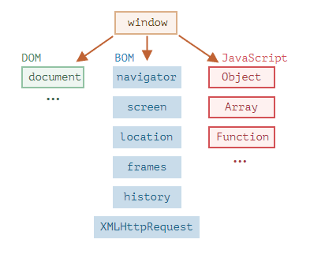

# 1501浏览器环境，规格

主机，主机环境。

下面时JavaScript在浏览器中运行时的鸟瞰示意图：



## window
有一个叫做 window 的“根”对象。它有两个角色：

1. 首先，它是 JavaScript 代码的全局对象，如 全局对象 一章所述。
2. 其次，它代表“浏览器窗口”，并提供了控制它的方法。

例如，我们可以将它用作全局对象：
```js
function sayHi() {
  alert("Hello");
}

// 全局函数是全局对象的方法：
window.sayHi();
```

并且我们可以将它用作浏览器窗口，以查看窗口高度：
```js
alert(window.innerHeight); // 内部窗口高度
```

还有更多窗口特定的方法和属性，我们稍后会介绍。

## DOM

文档对象模型（Document Object Model），简称 DOM，将所有页面内容表示为可以修改的对象。

document 对象是页面的主要“入口点”。我们可以使用它来更改或创建页面上的任何内容。

例如：
```js
// 将背景颜色修改为红色
document.body.style.background = "red";

// 在 1 秒后将其修改回来
setTimeout(() => document.body.style.background = "", 1000);
```

在这里，我们使用了 document.body.style，但还有很多很多其他的东西。规范中有属性和方法的详细描述：[DOM Living Standard](https://dom.spec.whatwg.org/)。

### DOM 不仅仅用于浏览器
DOM 规范解释了文档的结构，并提供了操作文档的对象。有的非浏览器设备也使用 DOM。

例如，下载 HTML 文件并对其进行处理的服务器端脚本也可以使用 DOM。但它们可能仅支持部分规范中的内容。

### 用于样式的 CSSOM
另外也有一份针对 CSS 规则和样式表的、单独的规范 CSS Object Model (CSSOM)，这份规范解释了如何将 CSS 表示为对象，以及如何读写这些对象。

当我们修改文档的样式规则时，CSSOM 与 DOM 是一起使用的。但实际上，很少需要 CSSOM，因为我们很少需要从 JavaScript 中修改 CSS 规则（我们通常只是添加/移除一些 CSS 类，而不是直接修改其中的 CSS 规则），但这也是可行的。

## 浏览器对象模型（BOM）
浏览器对象模型（Browser Object Model），简称 BOM，表示由浏览器（主机环境）提供的用于处理文档（document）之外的所有内容的其他对象。

例如：

* navigator 对象提供了有关浏览器和操作系统的背景信息。navigator 有许多属性，但是最广为人知的两个属性是：navigator.userAgent —— 关于当前浏览器，navigator.platform —— 关于平台（有助于区分 Windows/Linux/Mac 等）。
* location 对象允许我们读取当前 URL，并且可以将浏览器重定向到新的 URL。

这是我们可以如何使用 location 对象的方法：
```js
alert(location.href); // 显示当前 URL
if (confirm("Go to Wikipedia?")) {
  location.href = "https://wikipedia.org"; // 将浏览器重定向到另一个 URL
}
```

这是我们可以如何使用 location 对象的方法：
```js
alert(location.href); // 显示当前 URL
if (confirm("Go to Wikipedia?")) {
  location.href = "https://wikipedia.org"; // 将浏览器重定向到另一个 URL
}
```

### 规范
BOM 是通用 HTML 规范 的一部分。

是的，你没听错。在 https://html.spec.whatwg.org 中的 HTML 规范不仅是关于“HTML 语言”（标签，特性）的，还涵盖了一堆对象、方法和浏览器特定的 DOM 扩展。这就是“广义的 HTML”。此外，某些部分也有其他的规范，它们被列在 https://spec.whatwg.org 中。

## 总结
说到标准，我们有：

DOM 规范
描述文档的结构、操作和事件，详见 https://dom.spec.whatwg.org。
CSSOM 规范
描述样式表和样式规则，对它们进行的操作，以及它们与文档的绑定，详见 https://www.w3.org/TR/cssom-1/。
HTML 规范
描述 HTML 语言（例如标签）以及 BOM（浏览器对象模型）— 各种浏览器函数：setTimeout，alert，location 等，详见 https://html.spec.whatwg.org。它采用了 DOM 规范，并使用了许多其他属性和方法对其进行了扩展。
此外，某些类被分别描述在 https://spec.whatwg.org/。

请注意这些链接，因为要学的东西太多了，所以不可能涵盖并记住所有内容。

当你想要了解某个属性或方法时，Mozilla 手册 https://developer.mozilla.org/en-US/ 是一个很好的资源，但对应的规范可能会更好：它更复杂，且阅读起来需要更长的时间，但是会使你的基本知识更加全面，更加完整。

要查找某些内容时，你通常可以使用互联网搜索 “WHATWG [term]” 或 “MDN [term]”，例如 https://google.com?q=whatwg+localstorage，https://google.com?q=mdn+localstorage。

现在，我们开始学习 DOM，因为文档在 UI 中扮演着核心角色。