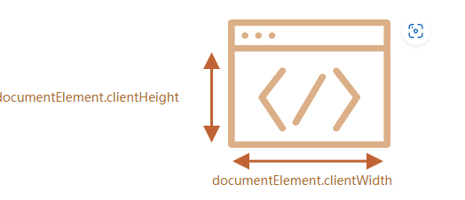

# Window 大小和滚动

我们如何找到浏览器窗口（window）的宽度和高度呢？我们如何获得文档（document）的包括滚动部分在内的完整宽度和高度呢？我们如何使用 JavaScript 滚动页面？

对于此类信息，我们可以使用与 `<html>` 标签相对应的根文档元素 `document.documentElement`。但是还有其他方法和特性需要考虑。

## 窗口的 width/height

为了获取窗口（window）的宽度和高度，我们可以使用 `document.documentElement` 的 `clientWidth/clientHeight`：



```online
例如，这个按钮会显示窗口的高度：

<button onclick="alert(document.documentElement.clientHeight)">alert(document.documentElement.clientHeight)</button>
```

````warn header="不是 `window.innerWidth/innerHeight`"
浏览器也支持像 `window.innerWidth/innerHeight` 这样的属性。它们看起来像我们想要的，那为什么不使用它们呢？

如果这里存在一个滚动条，并且滚动条占用了一些空间，那么 `clientWidth/clientHeight` 会提供没有滚动条（减去它）的 width/height。换句话说，它们返回的是可用于内容的文档的可见部分的 width/height。

`window.innerWidth/innerHeight` 包括了滚动条。

如果这里有一个滚动条，它占用了一些空间，那么这两行代码会显示不同的值：
```js run
alert( window.innerWidth ); // 整个窗口的宽度
alert( document.documentElement.clientWidth ); // 减去滚动条宽度后的窗口宽度
```

在大多数情况下，我们需要 **可用** 的窗口宽度以绘制或放置某些东西。也就是说，在滚动条内（如果有）。所以，我们应该使用 `documentElement.clientHeight/clientWidth`。
````

```warn header="`DOCTYPE` 很重要"
请注意：当 HTML 中没有 `<!DOCTYPE HTML>` 时，顶层级（top-level）几何属性的工作方式可能就会有所不同。可能会出现一些稀奇古怪的情况。

在现代 HTML 中，我们始终都应该写 `DOCTYPE`。
```

## 文档的 width/height

从理论上讲，由于根文档元素是 `document.documentElement`，并且它包围了所有内容，因此我们可以通过使用 `documentElement.scrollWidth/scrollHeight` 来测量文档的完整大小。

但是在该元素上，对于整个文档，这些属性均无法正常工作。在 Chrome/Safari/Opera 中，如果没有滚动条，`documentElement.scrollHeight` 甚至可能小于 `documentElement.clientHeight`！很奇怪，对吧？

为了可靠地获得完整的文档高度，我们应该采用以下这些属性的最大值：

```js run
let scrollHeight = Math.max(
  document.body.scrollHeight, document.documentElement.scrollHeight,
  document.body.offsetHeight, document.documentElement.offsetHeight,
  document.body.clientHeight, document.documentElement.clientHeight
);

alert('Full document height, with scrolled out part: ' + scrollHeight);
```

为什么这样？最好不要问。这些不一致来源于远古时代，而不是“聪明”的逻辑。

## 获得当前滚动 [#page-scroll]

DOM 元素的当前滚动状态在其 `scrollLeft/scrollTop` 属性中。

对于文档滚动，在大多数浏览器中，我们可以使用 `document.documentElement.scrollLeft/scrollTop`，但在较旧的基于 WebKit 的浏览器中则不行，例如在 Safari（bug [5991](https://bugs.webkit.org/show_bug.cgi?id=5991)）中，我们应该使用 `document.body` 而不是 `document.documentElement`。

幸运的是，我们根本不必记住这些特性，因为我们可以从 `window.pageXOffset/pageYOffset` 中获取页面当前滚动信息：

```js run
alert('当前已从顶部滚动：' + window.pageYOffset);
alert('当前已从左侧滚动：' + window.pageXOffset);
```

这些属性是只读的。

```smart header="我们也可以从 `window` 的 `scrollX` 和 `scrollY` 属性中获取滚动信息"
由于历史原因，存在了这两种属性，但它们是一样的：
- `window.pageXOffset` 是 `window.scrollX` 的别名。
- `window.pageYOffset` 是 `window.scrollY` 的别名。
```

## 滚动：scrollTo，scrollBy，scrollIntoView [#window-scroll]

```warn
必须在 DOM 完全构建好之后才能通过 JavaScript 滚动页面。

例如，如果我们尝试通过 `<head>` 中的脚本滚动页面，它将无法正常工作。
```

可以通过更改 `scrollTop/scrollLeft` 来滚动常规元素。

我们可以使用 `document.documentElement.scrollTop/scrollLeft` 对页面进行相同的操作（Safari 除外，而应该使用 `document.body.scrollTop/Left` 代替）。

或者，有一个更简单的通用解决方案：使用特殊方法 [window.scrollBy(x,y)](mdn:api/Window/scrollBy) 和 [window.scrollTo(pageX,pageY)](mdn:api/Window/scrollTo)。

- 方法 `scrollBy(x,y)` 将页面滚动至 **相对于当前位置的 `(x, y)` 位置**。例如，`scrollBy(0,10)` 会将页面向下滚动 `10px`。

    ```online
    下面这个按钮演示了这个方法：

    <button onclick="window.scrollBy(0,10)">window.scrollBy(0,10)</button>
    ```
- 方法 `scrollTo(pageX,pageY)` 将页面滚动至 **绝对坐标**，使得可见部分的左上角具有相对于文档左上角的坐标 `(pageX, pageY)`。就像设置了 `scrollLeft/scrollTop` 一样。

    要滚动到最开始，我们可以使用 `scrollTo(0,0)`。

    ```online
    <button onclick="window.scrollTo(0,0)">window.scrollTo(0,0)</button>
    ```

这些方法适用于所有浏览器。

## scrollIntoView

为了完整起见，让我们再介绍一种方法：[elem.scrollIntoView(top)](mdn:api/Element/scrollIntoView)。

对 `elem.scrollIntoView(top)` 的调用将滚动页面以使 `elem` 可见。它有一个参数：

- 如果 `top=true`（默认值），页面滚动，使 `elem` 出现在窗口顶部。元素的上边缘将与窗口顶部对齐。
- 如果 `top=false`，页面滚动，使 `elem` 出现在窗口底部。元素的底部边缘将与窗口底部对齐。

```online
下面这个按钮会滚动页面，以使其自身定位在窗口顶部：

<button onclick="this.scrollIntoView()">this.scrollIntoView()</button>

下面这个按钮会滚动页面，以使其自身定位在窗口底部：

<button onclick="this.scrollIntoView(false)">this.scrollIntoView(false)</button>
```

## 禁止滚动

有时候我们需要使文档“不可滚动”。例如，当我们需要用一条需要立即引起注意的大消息来覆盖文档时，我们希望访问者与该消息而不是与文档进行交互。

要使文档不可滚动，只需要设置 `document.body.style.overflow = "hidden"`。该页面将“冻结”在其当前滚动位置上。

```online
试一试：

<button onclick="document.body.style.overflow = 'hidden'">document.body.style.overflow = 'hidden'</button>

<button onclick="document.body.style.overflow = ''">document.body.style.overflow = ''</button>

第一个按钮用于冻结滚动，第二个按钮则用于恢复滚动。
```

我们还可以使用相同的技术来冻结其他元素的滚动，而不仅仅是 `document.body`。

这个方法的缺点是会使滚动条消失。如果滚动条占用了一些空间，它原本占用的空间就会空出来，那么内容就会“跳”进去以填充它。

这看起来有点奇怪，但是我们可以对比冻结前后的 `clientWidth`。如果它增加了（滚动条消失后），那么我们可以在 `document.body` 中滚动条原来的位置处通过添加 `padding`，来替代滚动条，这样这个问题就解决了。保持了滚动条冻结前后文档内容宽度相同。

## 总结

几何：

- 文档可见部分的 width/height（内容区域的 width/height）：`document.documentElement.clientWidth/clientHeight`
- 整个文档的 width/height，其中包括滚动出去的部分：

    ```js
    let scrollHeight = Math.max(
      document.body.scrollHeight, document.documentElement.scrollHeight,
      document.body.offsetHeight, document.documentElement.offsetHeight,
      document.body.clientHeight, document.documentElement.clientHeight
    );
    ```

滚动：

- 读取当前的滚动：`window.pageYOffset/pageXOffset`。
- 更改当前的滚动：

    - `window.scrollTo(pageX,pageY)` —— 绝对坐标，
    - `window.scrollBy(x,y)` —— 相对当前位置进行滚动，
    - `elem.scrollIntoView(top)` —— 滚动以使 `elem` 可见（`elem` 与窗口的顶部/底部对齐）。