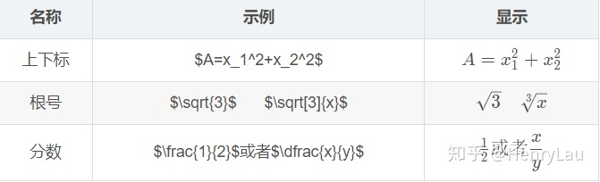
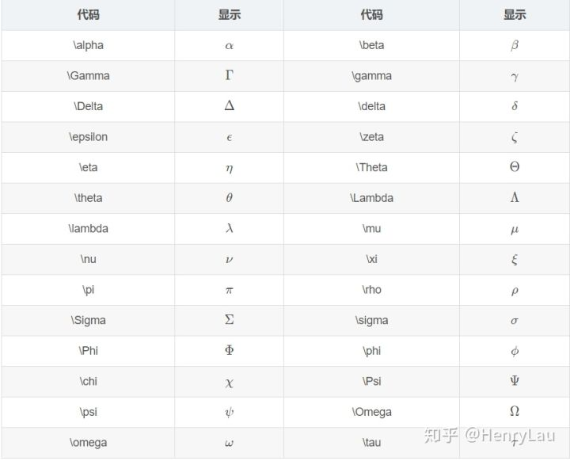
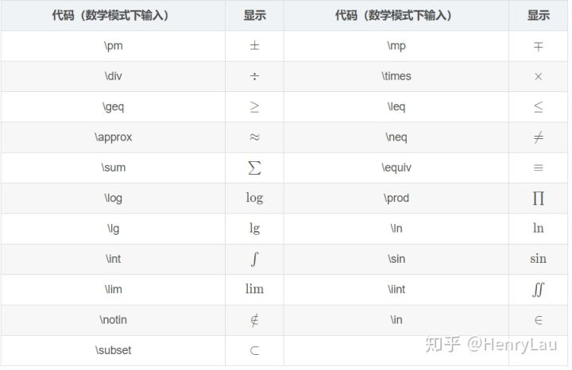

# markdown

## 表格
* 居左居中居右
```
| | |
|:-:|:-|-:|
|||
```


* 不要表头
```html
<table>
<tr>
	<td>a</td><td>a</td>
</tr>
</table>
```

## 数学公式
[Markdown语言——数学公式](https://zhuanlan.zhihu.com/p/138532124)

* `$$` 单独一行

  
* `$..$`嵌入行内

  
* 常用符号


* 特殊运算符号


* 希腊字母


### 求和
`\sun_{1}^{2}`

#### 积分
`\int_{1}^{2}`

#### 且 或
`A\land B`
`A\vee B`

#### 交集 并集
`A\cap B`
`A\cup B`

## markdown 写ppt
### slidev
[Slidev 中文文档](https://cn.sli.dev/guide/why.html)

#### 创建
cmd进入要创建项目的文件夹

已尝试：
```
npm init slidev@latest
```

未尝试：
```
npm init slidev
```

会创建一个slidev文件夹包含很多东西，其中slides.md为默认写ppt文件

#### 本地运行
```
npm run dev
```

#### build
```
npm run build
```

##### 上传到 github pages
1. build完进入dist文件夹，将index.html, 404.html中 `"/asset` 改为 `"./asset`
2. `/asset/index.****.js` 中将 `/静态文件` 改为 `repo_name/静态文件`，比如'/2022'改为'/slidev/2022'

#### 其他命令
可在 package.json 中自定义
```json
  "scripts": {
    "build": "slidev build",
    "dev": "slidev --open",
    "export": "slidev export"
  },
```

