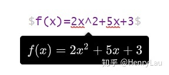

# markdown

## 表格
* 居左居中居右
```
| | |
|:-:|:-|-:|
|||
```


* 不要表头
```html
<table>
<tr>
	<td>a</td><td>a</td>
</tr>
</table>
```

## 数学公式
[Markdown语言——数学公式](https://zhuanlan.zhihu.com/p/138532124)

* `$$` 单独一行

  
* `$..$`嵌入行内

  
* 常用符号


* 特殊运算符号


* 希腊字母

