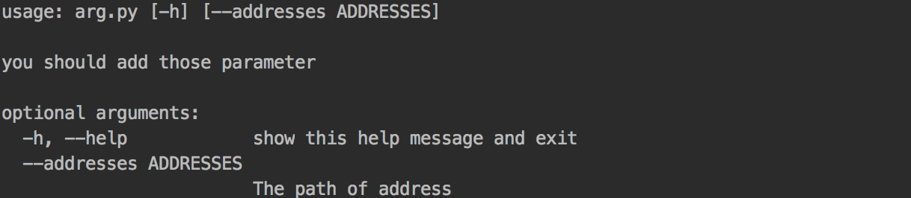

# argparse自定义命令行参数

1：import argparse

2：parser = argparse.ArgumentParser()

3：parser.add_argument()

4：parser.parse_args()

```python
import argparse   #步骤一

def parse_args():
    """
    :return:进行参数的解析
    """
    parser = argparse.ArgumentParser(description="you should add those parameter")        # 这些参数都有默认值，当调用parser.print_help()或者运行程序时由于参数不正确(此时python解释器其实也是调用了pring_help()方法)时，                                                                     # 会打印这些描述信息，一般只需要传递description参数，如上。
    parser.add_argument('--addresses',default="sipingroad", help = "The path of address")
    parser.add_argument('--gpu', default=0)# 步骤二，后面的help是我的描述
    args = parser.parse_args()                                       # 步骤三
    return args

if __name__ == '__main__':
    args = parse_args()
    print(args.addresses)            #直接这么获取即可。
```

```bash
python arg.py -h 
```



我们可以直接通过args.addresses获得它的参数值。

当我们敲入python arg.py --addresses this-is-parameter-of-addresses 命令时

会输出this-is-parameter-of-addresses

## nargs
```
值  含义
N   参数的绝对个数（例如：3）
?   0或1个参数
*   0或所有参数
+   所有，并且至少一个参数
```

```
import argparse

parser = argparse.ArgumentParser()

parser.add_argument('--three', nargs=3)
parser.add_argument('--optional', nargs='?')
parser.add_argument('--all', nargs='*', dest='all')
parser.add_argument('--one-or-more', nargs='+')

print parser.parse_args()
```

解析器强制执行参数计数指令，生成一个精确的语法图作为命令帮助文本的一部分。
```bash
$ python argparse_nargs.py -h

usage: argparse_nargs.py [-h] [--three THREE THREE THREE]
                     [--optional [OPTIONAL]] [--all [ALL [ALL ...]]]
                     [--one-or-more ONE_OR_MORE [ONE_OR_MORE ...]]
```