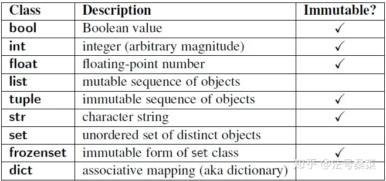

# mutable immutable

mutable就是创建后可以修改，immutable就是创建后不能修改的。（一般的user defined class都是mutable，当然想要immutable的可以专门搜索一下“python custom immutable class”）


## immutable
Immutable，拿int举例。
```py
>>> a = 0
>>> b = a
>>> id(a) == id (b)
True
>>> id(b)
4424877440
>>> b += 1
>>> id(b)  # b is 1
4424877472
>>> id(a) # a is still 0
4424877440
```

```python
>>> a, b = 0, 0
>>> id(a) == id(b)
True
>>> a,b = 1000000,1000000
>>> id(a) == id(b)
False
```

其实就是换值后，新的值不是在原来地方改的

## mutable
mutable，拿list举例。
```py
>>> l1 = []
>>> l2 = l1
>>> id(l1) == id(l2)
True
>>> l1.append(1)
>>> l2
[1]
>>> id(l1) == id(l2)
True
```
其实就是换值后还在那儿。


