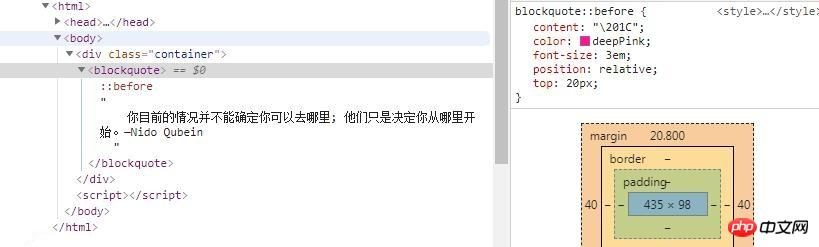

# css
[css知识积累](css知识积累/_KnowledgeAccumulation_css.md)

1. [overflow](#overflow)
2. [display](#display)
   1. [flex](#flex)
      1. [flex-wrap](#flex-wrap)
   2. [block](#block)
   3. [inline](#inline)
   4. [inline-block](#inline-block)
3. [position](#position)
   1. [fixed](#fixed)
   2. [relative](#relative)
4. [clip 和 clippath](#clip-和-clippath)
   1. [clip](#clip)
   2. [clippath](#clippath)
5. [overflow](#overflow-1)
   1. [溢出隐藏](#溢出隐藏)
   2. [清除浮动](#清除浮动)
   3. [外边距塌陷](#外边距塌陷)
6. [float](#float)
7. [transition和animation](#transition和animation)
8. [margin, border, padding](#margin-border-padding)
9. [子元素选择器](#子元素选择器)
10. [ul偏右](#ul偏右)
11. [井号，点，不加 选择器](#井号点不加-选择器)
12. [@规则](#规则)
   1. [常规规则](#常规规则)
   2. [嵌套规则](#嵌套规则)
      1. [@media](#media)
13. [background](#background)
   1. [background-size](#background-size)
   2. [background-attachment](#background-attachment)
14. [vh vw](#vh-vw)
15. [transform](#transform)
   1. [scale 放大缩小](#scale-放大缩小)
16. [font](#font)
   1. [行距 line-height](#行距-line-height)
17. [border](#border)
   1. [border-image-source 设置边框具体样式](#border-image-source-设置边框具体样式)
   2. [设置某方向的边框](#设置某方向的边框)
18. [a 连接](#a-连接)
19. [伪](#伪)
   1. [伪类](#伪类)
   2. [伪元素](#伪元素)
      1. [::before](#before)
      2. [::before 和 :before](#before-和-before)
      3. [before 和 after](#before-和-after)
   
## overflow
内容溢出元素框时的布局设置

## display
### flex
[浅谈CSS3中display属性的Flex布局 - 孙冠醇 - 博客园](https://www.cnblogs.com/sunwk/p/9049384.html)

[display-flex详解](https://blog.csdn.net/idealistic/article/details/79955806)
```css
/*关键样式代码*/
#father{
        display: flex;
        justify-content: center;
        align-items: center;
        flex-wrap: wrap;
}
```
#### flex-wrap
wrap 值可实现拆行或拆列

### block
默认就是block

设置width和height的特性

### inline
不换行

### inline-block
设置了inline-block属性的元素既拥有了block元素可以设置width和height的特性，又保持了inline元素不换行的特性。

## position
### fixed
使元素不动

### relative
相对正常位置进行调整, 如下就会让元素向正常位置左侧移动20px
```css
position: relative;
left: -20px;
```

## clip 和 clippath
### clip
已经落后并取消
clip: rect()

### clippath
clip-path: polygon(0 0, 100% 0, 100% 100%, 0 100%); 剪了一个长方形

## overflow
溢出隐藏、清除浮动、解决外边距塌陷等等
### 溢出隐藏
遇到 position:fixed 时应使用clip-path来代替

### 清除浮动
父元素没有高度，小叔叔元素从下面顶上来作为了子元素的背景

### 外边距塌陷
子元素设置了margintop使父元素上边框也跟着向下，导致上面有空白

## float
块靠哪里浮动，左/右

## transition和animation
transition只有两个关键帧，animation有多个
`transition: property duration timing-function delay;`

1. linear相同速度开始到结束
2. ease慢速开始变快慢速结束
3. ease-in慢速开始
4. ease-out慢速结束
5. ease-in-out
6. cubic-bezier(n,n,n,n)

## margin, border, padding
由外向里的三层

由内到外各个部分的含义如下：
* content - 内容部分。文本或者图片
* padding - 边框到内容中间的部分。透明的、不可见
* border - 边框。围绕着padding和content，如果设置了宽度则可见
* margin - 边框以外的区域。透明不可见

## 子元素选择器
father>child

也可以直接空格隔开

## ul偏右
```css
#leftbar>ul{
	margin-left: 10%;
	margin-top: 50px;
	padding: 0;
}
```

## 井号，点，不加 选择器
* `#`对应id
* `.`对应class
* 不加则对应标签

## @规则
[CSS @规则（详细）](http://c.biancheng.net/css3/at-rule.html)
在 CSS 中包含两种语法规则：
* 普通规则：由选择器、属性和值构成，在之前的学习中我们主要使用的就是这种规则；
* @规则：以@开头后面跟随一个关键字的形式构成，也被称为“AT规则”，根据使用方法的不同又可以分为：
  * “常规规则”
  * “嵌套规则”

### 常规规则
```
@[KEYWORD] (RULE);
```

### 嵌套规则
@规则后面需要跟随一个花括号{ }，其中包含了一些其它的规则声明
```
@[KEYWORD] {
    /* 嵌套语句 */
}
```
#### @media
@media 用来根据一个或多个媒体查询的结果来应用样式表的某一部分（**花括号中的样式信息**），使用 @media 您可以指定一组媒体查询和一个 CSS 样式块，**当且仅当媒体查询与正在使用的设备匹配时，指定的 CSS 样式才会应用于文档**。


*媒体查询是用于判断设备信息的一组条件，如设备的宽高值，宽高比，颜色，分辨率等，当条件匹配时，才会执行其内嵌套的样式信息。*


@media 可以放置在样式表中的任意位置，也可以放置于其它 @规则中，示例代码如下：
```css
@media all and (min-width: 1280px) {
    /* 宽度大于1280 */
}
@media
(-webkit-min-device-pixel-ratio: 1.5),
(min-resolution: 2dppx) {
    /* Retina屏幕 */
}
@media print {
    /* 打印 */
}
@media \0screen\,screen\9 {
    /* IE7,IE8 */
}
@media screen\9 {
    /* IE7*/
}
```

## background
```css
body{
    margin: 0;
    padding: 0;
    background-image: url("../img/bg.png");
    background-attachment: fixed; 
    background-repeat: no-repeat;
    background-size: cover;
    background-position: center;
    overflow-x: hidden;
}
```
### background-size
* cover 放大到覆盖整个屏幕
* contain 使得被图片能够全部显示

### background-attachment
scroll:默认值，背景图相对于元素固定，背景随页面滚动而移动，即背景和内容绑定。

fixed：背景图相对于视口固定，所以随页面滚动背景不动，相当于背景被设置在了body上。

local：背景图相对于元素内容固定

## vh vw
按照view屏幕的 height 和 width

## transform
### scale 放大缩小
`transform: scale(1.05);`


## font
### 行距 line-height

## border
### border-image-source 设置边框具体样式
语法：
`border-image-source [border-image-width]{1,4} [border-image-repeat]{0,2}`

border-image-source 设置背景图片 可以使用绝对或相对URL地址指定边框的背景图片

border-image-width 设置边框图片的宽度。 可以是具体的像素（px），也可以是百分比（%）

border-image-repeat 设置背景图片的铺放方式 平铺(repeated)、铺满(rounded)或拉伸(stretched)

例如：border-image:url(border.png) 27 repeat;，指的就是图片(url(border.png))，剪裁位置(27)，重复方式(repeat)。

### 设置某方向的边框
```css
border-top:2px dotted #185598;
none：无样式；dotted：点线；dashed：虚线；solid：实线；
double：双线；groove：槽线；ridge：脊线；inset：内凹；outset：外凸;groove 上颜色  skyblue 下颜色。
.style-one /*内嵌水平线*/
.style-two /*透明渐变水平线*/
.style-three/*渐变*/
```

## a 连接
值 描述
none 默认。定义标准的文本。
underline 定义文本下的一条线。
overline 定义文本上的一条线。
line-through 定义穿过文本下的一条线。
blink 定义闪烁的文本。
inherit 规定应该从父元素继承 text-decoration 属性的值。

```css
a:link{
	text-decoration:none;   /* 指正常的未被访问过的链接*/ 
}
a:visited{
	text-decoration:none; /*指已经访问过的链接*/
}
a:hover{
	text-decoration:none;/*指鼠标在链接*/
}
a:active{
	text-decoration:none;/* 指正在点的链接*/
}
```

## 伪
### 伪类
常见伪类——:hover,:link,:active,:target,:not(),:focus。
### 伪元素
[原生js获取css伪类元素并设置属性](../JavaScript和TypeScript/JavaScript/知识积累/原生js获取css伪类元素并设置属性.md)
常见伪元素——::first-letter,::first-line,::before,::after,::selection。

&::before 和  &::after都不是CSS中的内容，而是Sass和SCSS中的属性, 通常可以写成这样：test.scss
```css
li{
   /*  some style 1   */
  &::after{
     /* some style 2  */  
    }
}
```

它经过使用gulp进行编译后，就会生成test.css文件，如下test.css
```css

li { /*  some style 1 */}

li::after {/* some style 2 */}
```

由于使用伪元素插入的内容未插入到DOM内，因此通常无法使用浏览器的开发者工具查看和检查插入的内容。但是，Chrome 32+和Firebug for Firefox允许你查看伪元素在DOM中的位置，通过选择它，你可以在CSS面板中查看与其相关联的样式。在Chrome的开发工具中检查上述演示会显示以下结果：


说明：

1. 伪类元素要配合content属性一起使用
2. 伪类元素是css渲染层加入的，不能通过js来操作
3. 伪类对象特效通常通过：hover伪类样式来激活

#### ::before
在css中，::before 是一个伪类元素，代表生成的内容元素，表示相应元素的可抽象样式的第一个子元素，即：所选元素的第一个子元素。

利用::before可以把需插入的内容插入到元素的其他内容之前，并且默认内联显示。::before需要使用content属性来指定内容的值。

#### ::before 和 :before

相同点：

1. 伪类对象，用来设置对象前的内容

2. ::before和:before写法是等效的

不同点：

1. :befor是Css2的写法，::before是Css3的写法

2. :before的兼容性要比::before好 ，不过在H5开发中建议使用::before比较好

#### before 和 after
before 生成在前面
after 生成在后面


