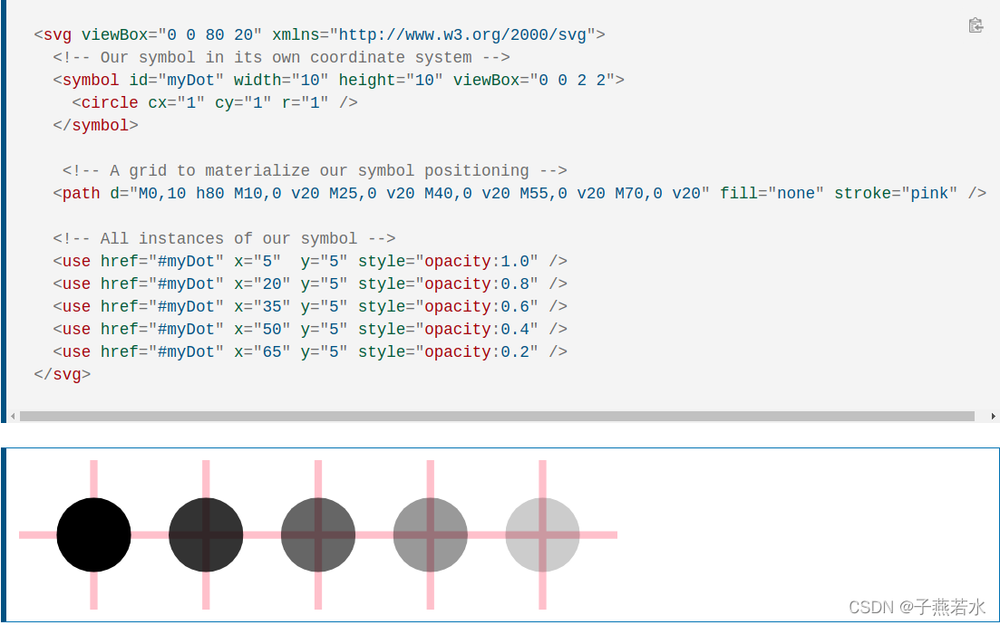

# html

1. [html5标记](#html5标记)
2. [head](#head)
   1. [base](#base)
   2. [link](#link)
   3. [style](#style)
   4. [meta](#meta)
      1. [各种meta的属性](#各种meta的属性)
   5. [header](#header)
3. [section](#section)
4. [div\\section\\article](#divsectionarticle)
5. [div和span的区别](#div和span的区别)
6. [button和input type button区别](#button和input-type-button区别)
7. [input](#input)
   1. [autofocus](#autofocus)
   2. [autocomplete](#autocomplete)
8. [title属性](#title属性)
9. [key属性](#key属性)
10. [align](#align)
11. [audio](#audio)
12. [邮箱 mailto](#邮箱-mailto)
13. [data-属性](#data-属性)
14. [svg](#svg)
    1. [symbol 和 use](#symbol-和-use)
    2. [xlink:href](#xlinkhref)
    3. [颜色属性](#颜色属性)
15. [form](#form)
    1. [案例](#案例)
    2. [method](#method)
       1. [GET](#get)
       2. [POST](#post)
    3. [input](#input-1)
       1. [name属性](#name属性)
       2. [radio 单选](#radio-单选)
       3. [checkbox 多选](#checkbox-多选)
          1. [checked属性](#checked属性)

## html5标记
<!DOCTYPE html>

## head
### base
`<base>` 标签描述了基本的链接地址/链接目标，该标签作为HTML文档中所有的链接标签的默认链接:

```html
<head>
<base href="http://www.runoob.com/images/" target="_blank">
</head>
```

### link
`<link>` 标签定义了文档与外部资源之间的关系。

`<link>` 标签通常用于链接到样式表:

```html
<head>
<link rel="stylesheet" type="text/css" href="mystyle.css">
</head>
```

### style
`<style>` 标签定义了HTML文档的样式文件引用地址.

在`<style>` 元素中你也可以直接添加样式来渲染 HTML 文档:

```html
<head>
<style type="text/css">
body {background-color:yellow}
p {color:blue}
</style>
</head>
```

### meta
HTML `<meta>` 元素
meta标签描述了一些基本的元数据。

`<meta>` 标签提供了元数据.元数据也不显示在页面上，但会被浏览器解析。

META 元素通常用于指定网页的描述，关键词，文件的最后修改时间，作者，和其他元数据。

元数据可以使用于浏览器（如何显示内容或重新加载页面），搜索引擎（关键词），或其他Web服务。

`<meta>` 一般放置于 `<head>` 区域

#### 各种meta的属性
[Meta标签的详细解释 - 神经蛙 - 博客园](https://www.cnblogs.com/shenjingwa/p/14073341.html)


### header
header标签定义文档的页眉。

## section
[【HTML】section标签理解_炒米像啥的博客-CSDN博客_html section](https://blog.csdn.net/chaomi_didi/article/details/108215920)

* section 不是一个专用来做容器的标签，如果仅仅是用于设置样式或脚本处理，专用的是 div
* section 里应该有 标题（h1~6），但文章中推荐用 article 来代替
* 一条简单的准则是，只有元素内容会被列在文档大纲中时，才适合用section元素。
* section的作用是对页面上的内容进行分块，如各个有标题的版块、功能区或对文章进行分段，不要与有自己完整、独立内容的article混淆。

比较生动的比喻
拿报纸举个例子：
一份或一张报纸有很多个版块，有头版、国际时事版块、体育版块、娱乐版块、文学版块等等，像这种有版块标题的、内容属于一类的版块就可以用section包起来。
然后在各个版块下面，又有很多文章、报道，每篇文章都有自己的文章标题、文章内容。这个时候用article就最好。如果一篇报道太长，分好多段，每段都有自己的小标题，这时候又可以用section把段落包起来。

## div\section\article
div充当容器的角色，用来设置某一块的总体属性（一个div里面可能包含多个section）；

section用于强调某一个模块，强调模块本身是作为一个整体的；

article用于强调某一段独立的内容，强调内容的独立性。

## div和span的区别
div和span的区别是：
* div标签是块级元素，每个div标签都会从新行开始显示，占据一行；div标签内可以添加其他的标签元素（行内元素、块级元素都行）。
* span标签是行内元素，会在一行显示；span标签内只能添加行内元素的标签或文本。

## button和input type button区别
[https://www.jianshu.com/p/14f18aad2d2f](https://www.jianshu.com/p/14f18aad2d2f)

* 差别1
button 默认和 type="submit" 一样，点击后会自动提交，但是最好还是写上type属性
button type="button", 按了什么都没有，要自己绑定click函数之类的

input type="button" 跟 button type="button" 差不多，都需要自定义

* 差别2
button 有 `<button>****</button>` 闭合标签
input 只有 `<input>` 但是可以属性 `value=`

## input
不写type属性默认是文本框

### autofocus
页面加载后，input自动获得焦点，是布尔值属性，但实际上不管你填什么，只要有这个属性就会自动聚焦

### autocomplete
自动补全

## title属性
```html
    <div id="app">
        
        <br>
        
    </div>

    <script>
        var app = new Vue({
            el:"#app",
            data:{
                imgSrc:"http://127.0.0.1:5500//计算机/前端学习/Vue/Vue知识积累/2022-08-12-17-42-50.png",
                imgTitle:"嘿嘿"
            }
        })
    </script>
```

鼠标悬浮到图片上会有提示字出现，是title的内容

## key属性
key 属性是对这个元素的唯一标识

## align
align 属性规定元素的对齐方式。
```html
<p align="center">这是一个段落。</p>
```

## audio
可以播放音乐

## 邮箱 mailto
`<a href="mailto:chnliuyifei@gmail.com" title="E-Mail → mailto:chnliuyifei@gmail.com" rel="noopener" target="_blank"><i class="fa fa-envelope fa-fw"></i>E-Mail</a>`

## data-属性
使用 data-* 属性来嵌入自定义数据
```html
<ul>
<li data-animal-type="鸟类">喜鹊</li>
<li data-animal-type="鱼类">金枪鱼</li> 
<li data-animal-type="蜘蛛">蝇虎</li> 
</ul>
```

css种获取案例：[attr()获取属性值配合data-](css知识积累/attr()获取属性值配合data-.md)

## svg 

### symbol 和 use

`<use>` 元素从 SVG 文档中获取节点，并在其他地方复制它们。




### xlink:href
动态赋值svg图片

### 颜色属性
fill

## form
### 案例
```html
<!DOCTYPE html>
<html>
  <head>
    <meta charset="UTF-8">
  </head>
  <body>
    <form action="http://localhost:8080/predict" method="POST" target="result-frame">
      <label for="input1">Age:</label>
      <input type="text" id="input1" name="Age" value=32><br><br>
      <label for="input2">Height(cm):</label>
      <input type="text" id="input2" name="Height(cm)" value=175><br><br>
      <label for="input1">Weight(kg):</label>
      <input type="text" id="input3" name="Weight(kg)" value="70"><br><br>
      <label for="input2">Occupation:</label>
      <input type="text" id="input4" name="Occupation" value="SoftwareEngineer"><br><br>
      <label for="input1">Education Level:</label>
      <input type="text" id="input5" name="EducationLevel" value="Master'sDegree"><br><br>
      <label for="input2">Marital Status:</label>
      <input type="text" id="input6" name="MaritalStatus" value="Married"><br><br>
      <label for="input1">Income(USD):</label>
      <input type="text" id="input7" name="Income(USD)" value=75000><br><br>
      <label for="input2">Favorite Color:</label>
      <input type="text" id="input8" name="FavoriteColor" value="Blue"><br><br>
      <input type="submit"/>
    </form>
    <iframe name="result-frame" width="100%" height="300"></iframe>
  </body>
</html>
```

### method
[HTML &lt;form&gt; 标签的 method 属性](https://www.w3school.com.cn/tags/att_form_method.asp)

method 属性规定如何发送表单数据（表单数据发送到 action 属性所规定的页面）。

表单数据可以作为 URL 变量（method="get"）或者 HTTP post （method="post"）的方式来发送。

```html
<form class="modal-content animate" action="/register" method="post">
<div class="imgcontainer">
<span onclick="document.getElementById('id02').style.display='none'" class="close" title="Close Modal">&times;</span>

</div>
<div class="container">
<label for="uname"><b>Username</b></label>
<input type="text" placeholder="Enter Username" name="uname" required>
<label for="psw"><b>Password</b></label>
<input type="password" placeholder="Enter Password" name="psw" required>
<button type="submit">Register</button>
</div>
<div class="container" style="background-color:#f1f1f1">
<button type="button" onclick="document.getElementById('id02').style.display='none'" class="cancelbtn">Cancel</button>
</div>
</form>
```

#### GET
相当于`<a href="http://www.example.com/example/program?x=28&y=66">`

唯一的问题是，分隔参数所用的 & 符号也是字符实体中的插入符号。如果在 `<a>` 标签的 href 属性中放入一个 & 符号，浏览器就会将其后面的字符替换成相应的字符实体。

为了防止出现这种情况，我们必须用它的实体对等物来替换 & 符号，也就是用 `&#38;` 或 `&amp;` 来替换。替换之后，上面的那个引用服务器应用程序的非表单示例将如下所示：

`<a href="http://www.example.com/example/program?x=28&amp;y=66">`

再就是一般的用IIS（非法关键字过滤器）过滤器的只接受get参数，这就是为什么那些大型搜索引擎后面都是一大堆的内容了，因为post不能发过去，只能用get。看看Goole或是yahoo等知道了！

#### POST
就是加到http header里发送post的正常post请求

### input

#### name属性
比如单选多选时，相同name就会是同一个问题下的。
例：
```html
	<label for="fd1">carnivore</label>
	<input id="fd1" name="fd" type="radio" value="carnivore" v-model="foodType"/>
	<br/>
	<label for="fd2">herbivore</label>
	<input id="fd2" name="fd" type="radio" value="herbivore" v-model="foodType"/>
	<br/>
	<label for="fd3">omnivore</label>
	<input id="fd3" name="fd" type="radio" value="omnivore" v-model="foodType"/>
```

#### radio 单选
```html
	<label for="fd1">carnivore</label>
	<input id="fd1" name="fd" type="radio" value="carnivore" v-model="foodType"/>
	<br/>
	<label for="fd2">herbivore</label>
	<input id="fd2" name="fd" type="radio" value="herbivore" v-model="foodType"/>
	<br/>
	<label for="fd3">omnivore</label>
	<input id="fd3" name="fd" type="radio" value="omnivore" v-model="foodType"/>
```

#### checkbox 多选

##### checked属性
`checkboxObject.checked = true|false`